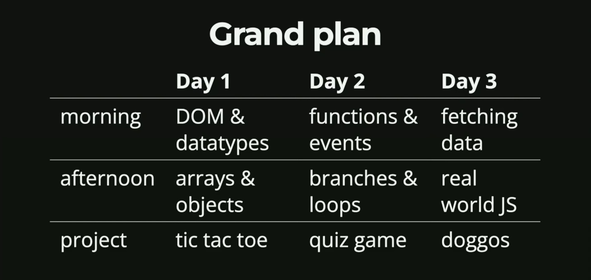
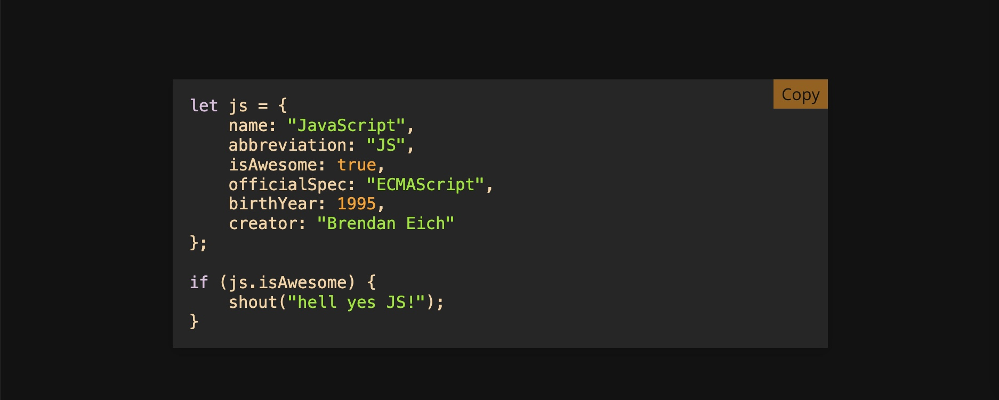
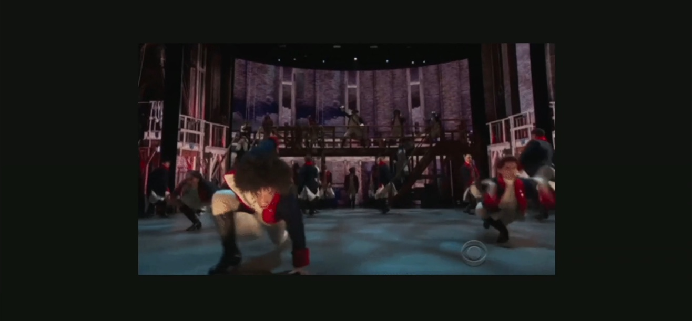
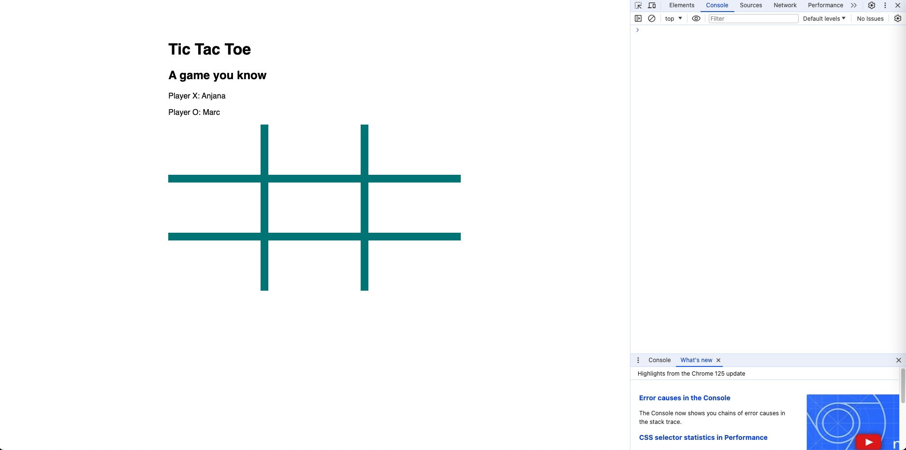

### Section 1: Introduction
#### 1. About the course
#### 2. Course Overviews
#### 3. What is JavaScripts
#### 4. Where to Write JavaScripts

===========================

#### 1. About the course
- Taking our *first step* is an infinite journey 
    - Provide an accessible solid foundations for all-level learners.
    - whether you are coming from another program languages or you are brand new in programming.
- Hands-on projects
- *Just-in-time* vs. *just-in-case* learning
    - *just-in-case*: You learned something interesting but there is a small chance that someone will ever ask you about that knowledge.
    - *just-in-time*: When you are trying to do something and you want to *learn what you need* at that point in time in order to do that thing.

**Goal:** We are going to focus more on *just-in-time* learning, we are going to try to focus on the practical needs that we have and learning things as we need them.

**About Anjana**: 
Anjana does not have a traditional Computer Science education, she majored in Philosophy and Linguistic yet now she is a software developer. She started out working at <a href="https://www.recurse.com/">The Recurse Center</a>, the retreat where curious programmers recharge and grow. Anjana was exposed to JavaScript and found herself interested in "Functional Programming".

For more information about Anjana's <a href="https://frontendmasters.com/courses/functional-first-steps/">Functional JavaScript First Steps</a>.

To learn more about <a href="https://www.recurse.com/blog/180-anjana-vakil-teacher-to-computational-linguist-to-software-engineer-conference-speaker-and-developer-relations-consultant">Anjana's story at Recurse</a>.
 

#### 2. Course Overviews

- Overviews

  

- Ground rules
    - Everyone belongs here!
    - There are no "dumb" questions!
    - Growth > Goalposts
 

#### 3. What is JavaScripts
- JavaScript is "script" that lets us modify websites and makes them interactive.
- Places to run JavaScript
    - In the browser.
    - On server (node.js)
    - Embedded devices (Internet of Things devices)

 

#### 4. Where to Write JavaScripts
- The relationship between HTML, CSS, JS
    - Explanation 1:
        - HTML: The noun
        - CSS: The adjective
        - JS: The verb
    - Explanation 2 (from Anjana):
    
        - HTML: Actors on stage, props, context
        - CSS: Costumes, set design, lighting, style
        - JS: Choreography, dancing, moving
- Places to run JavaScript (a little recap)
    - The browser's JS console
    - Local text file in editor, e.g. TextEditor, VSCode
    - Online playground e.g. CodePen, CodeSandbox
 

Below is the example of the browser's JS console
