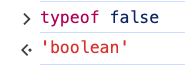
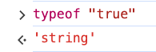
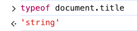
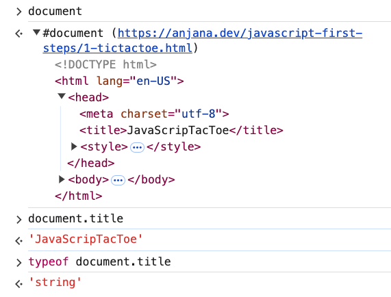
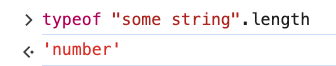
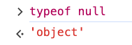

# 2. Values & Data Types Exercise

Link: [https://frontendmasters.com/courses/javascript-first-steps/values-data-types-exercise/](https://frontendmasters.com/courses/javascript-first-steps/values-data-types-exercise/)

Question: Which data type is each of these values?

- false
- “true”
- document.title
- “some string”.length
- null

Guess first then use “[typeof](https://developer.mozilla.org/en-US/docs/Web/JavaScript/Reference/Operators/typeof)” to check!

Answer:

- false - ‘boolean’
    
    
    
- “true” - ‘string’
    
    
    
- document.title - ‘string’
    
    
    
    
    
- “some string”.length - ‘number’
    
    
    
- null - ‘object’
    
    