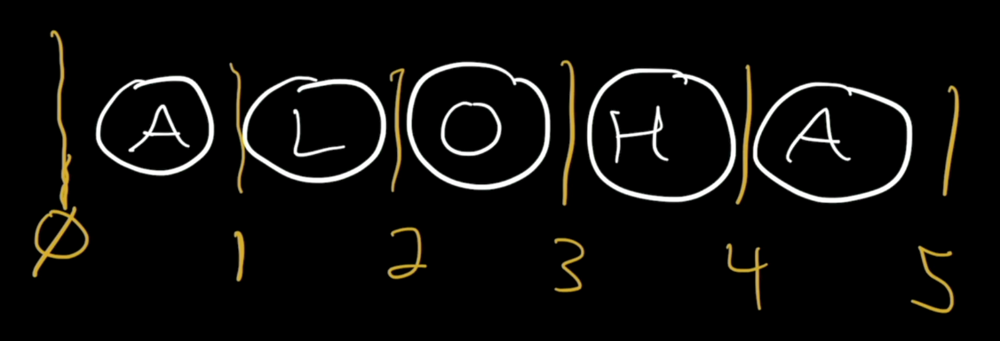
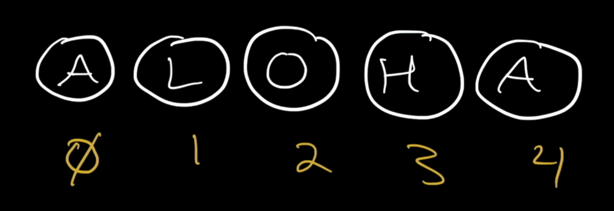

# 3. Strings

Link: [https://frontendmasters.com/courses/javascript-first-steps/strings/](https://frontendmasters.com/courses/javascript-first-steps/strings/)



The string “ALOHA” is 5 characters long, it has 5 characters



The indices of the characters in the string “ALOHA”

```jsx
"ALOHA"[0] // 'A'
"ALOHA"[1] // 'L'
```