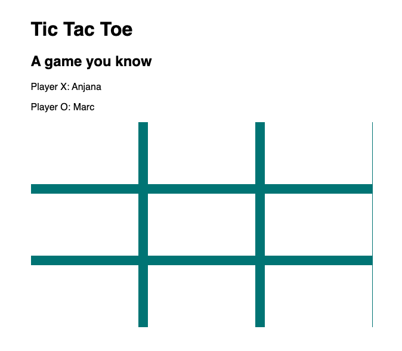
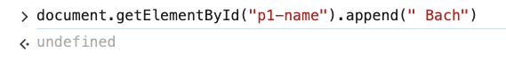
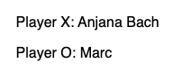
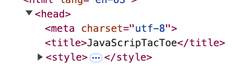
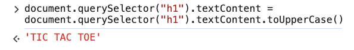
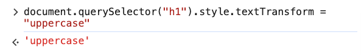

# 5. Working with Strings Exercise

Link: [https://frontendmasters.com/courses/javascript-first-steps/working-with-strings-exercise/](https://frontendmasters.com/courses/javascript-first-steps/working-with-strings-exercise/)



- Requirements
    - Add your last name in the players listing
    - Retrieve the first "T" in the page title
    - Answer whether the page title contains the string "JavaScript"
    - Capitalize the heading "Tic Tac Toe"
- Answer
    - Add your last name in the players listing
        
        ```jsx
        document.getElementById("p1-name").append(" Bach")
        ```
        
        
        
        
        
    - Retrieve the first "T" in the page title
        
        ```jsx
        document.querySelector("h1").textContent[0] // 'T'
        ```
        
    - Answer whether the page title contains the string "JavaScript"
        
        ```jsx
        document.title.includes("JavaScript") // false
        ```
        
        Why?
        
        
        
    - Capitalize the heading "Tic Tac Toe"
        - Using “toUpperCase()”
            
            ```jsx
            document.querySelector("h1").textContent = document.querySelector("h1").textContent.toUpperCase()
            ```
            
            
            
        - Using “style”
            
            ```jsx
            document.querySelector("h1").style.textTransform = "uppercase"
            ```
            
            
            
        
        
        
        