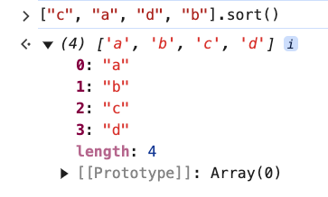
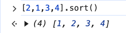
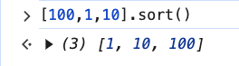
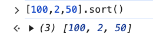
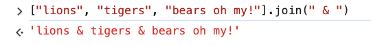
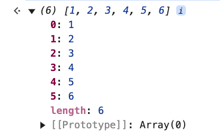
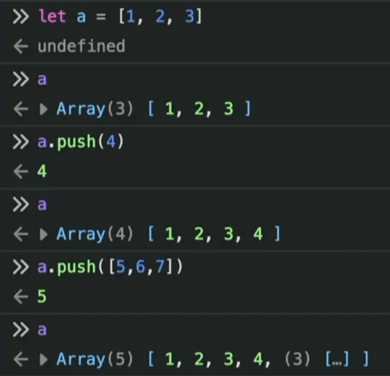
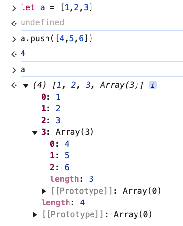

# 2. Useful Array Methods

Link: [https://frontendmasters.com/courses/javascript-first-steps/useful-array-methods/](https://frontendmasters.com/courses/javascript-first-steps/useful-array-methods/)

1. sort()
    - Alphabetical characters
        
        ```jsx
        ["c", "a", "d", "b"].sort() // ['a', 'b', 'c', 'd']
        ```
        
        
        
    - Numerical digits
        - Single digit
            
            ```jsx
            [2,1,3,4].sort() // [1,2,3,4]
            ```
            
            
            
        - Multiple digits
            
            ```jsx
            [100,1,10].sort() // [1,10,100]
            ```
            
            
            
            ```jsx
            [100,2,50].sort() // [100,2,50]
            ```
            
            
            
            Explanation:
            
            - **Why does `[100,1,10].sort()` return `[1,10,100]`?**
                - JavaScript converts numbers to **strings** before sorting.
                - The default `.sort()` method sorts values **lexicographically (dictionary order)**, not numerically.
                - When sorting as strings:
                    - `"1"` comes before `"10"`, which comes before `"100"` (because `"1"` is smaller than `"10"` when compared character by character).
                    - Thus, the sorted result is `[1, 10, 100]`.
            - **Why does `[100,2,50].sort()` return `[100,2,50]`?**
                - Here, JavaScript **also** sorts the numbers as strings:
                    - `"100"` remains first because it starts with `"1"`.
                    - `"2"` comes next because `"2"` is smaller than `"5"` (from `"50"`).
                    - `"50"` stays last.
                - So the final array stays `[100, 2, 50]`.
            - **How to Sort Numerically?**
                
                To sort numbers correctly in ascending order, pass a **comparison function** to `.sort()`:
                
                ```jsx
                [100, 1, 10].sort((a, b) => a - b); // [1, 10, 100]
                [100, 2, 50].sort((a, b) => a - b); // [2, 50, 100]
                ```
                
            - **Explanation of `(a, b) => a - b`:**
                - If `a - b` is **negative**, `a` comes before `b`.
                - If `a - b` is **positive**, `b` comes before `a`.
                - If `a - b` is **zero**, their order remains unchanged.
                
                This ensures proper numerical sorting instead of lexicographic sorting
                
            
            Summary: For multiple digits sort between numbers. They will always be sorted **lexicographically**. 
            
            - The first digits will be compared at first
            - If all the first digits are equalled, the “numbers” will be sorted based on their lengths.
2. join()
    
    ```jsx
    ["lions", "tigers", "bears oh my!"].join(" & ") // 'lions & tigers & bears oh my!'
    ```
    
    
    
3. concat()
    
    ```jsx
    [1, 2, 3].concat([4, 5, 6])
    ```
    
    
    
4. push()
    
    ```jsx
    let a = [1,2,3];
    a // [1,2,3]
    a.push(4) // 4
    a // [1,2,3,4]
    a.push([5,6,7]) // 5
    a // [1,2,3,4,[5,6,7]]
    ```
    
    
    
    push() returns the new length of the array
    
5. The difference between concat() and push()
    - concat(): When concat two arrays together, the new array is created with the length as the combined length of the two original arrays
        
        ```jsx
        [1, 2, 3].concat([4, 5, 6]) // [1,2,3,4,5,6] => length of 6 characters
        ```
        
    - push(): When you push a new array into an existing array, that new array will be nested within the existing array. The new length that push() returns for the existing array will be the original length incremented by one.
        
        ```jsx
        [1,2,3].push([4,5,6]) // 4
        ```
        
        push() returns 4 as the new length of the array
        
        ```jsx
        let a = [1,2,3]
        a.push([4,5,6]) // 4
        a // (4) [1, 2, 3, Array(3)]
        ```
        
        