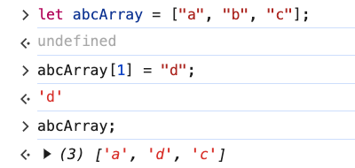
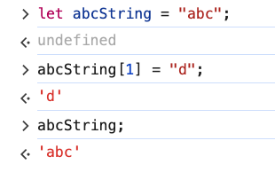

# 3. Mutability

Link: [https://frontendmasters.com/courses/javascript-first-steps/mutability/](https://frontendmasters.com/courses/javascript-first-steps/mutability/)

1. Example 1
    
    ```jsx
    let abcArray = ["a", "b", "c"];
    abcArray[1] = "d";
    abcArray;
    ```
    
    
    
2. Example 2
    
    ```jsx
    let abcString = "abc";
    abcString[1] = "d";
    abcString;
    ```
    
    
    
    Even though this line of code `abcString[1] = "d";`  does not actually do anything yet JavaScript does not throw any error neither because JavaScript is quite loosey goosey sometimes.
    
3. Summary:
    
    Mutable vs. Immutable
    
    - “Mutable” data can be edited (e.g. Arrays)
    - “Immutable” data always stays the same (e.g. strings & other primitives)
    
    JavaScript [primitive](https://developer.mozilla.org/en-US/docs/Glossary/Primitive) data types include
    
    - string
    - number
    - bigint
    - boolean
    - undefined
    - symbol
    - null