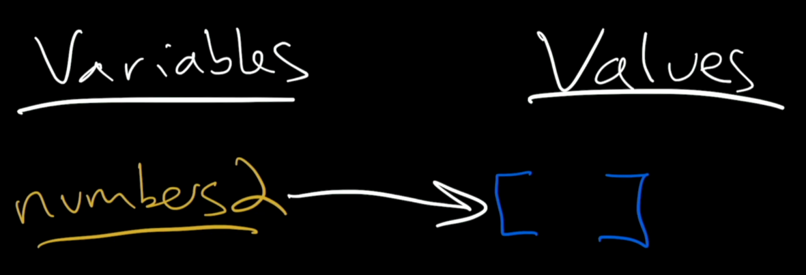
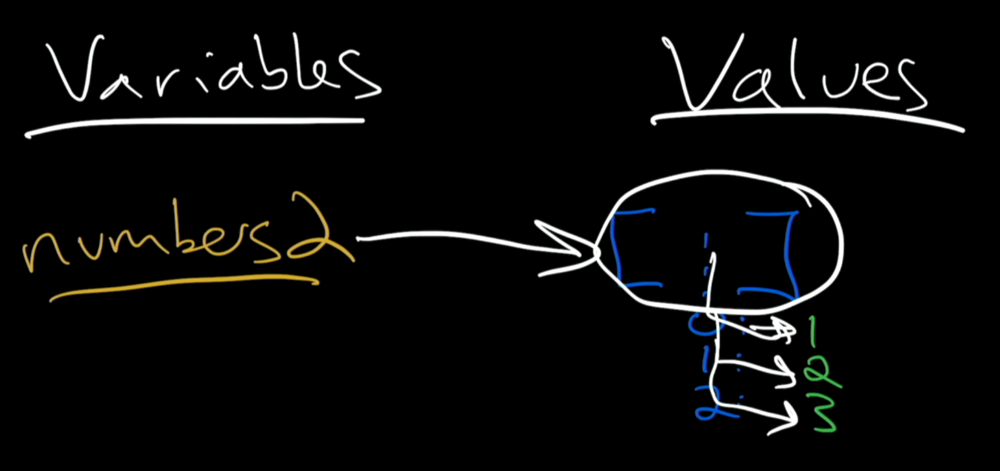
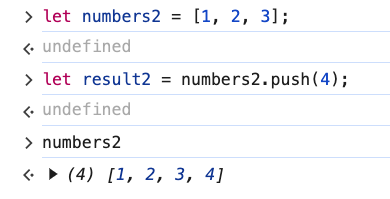
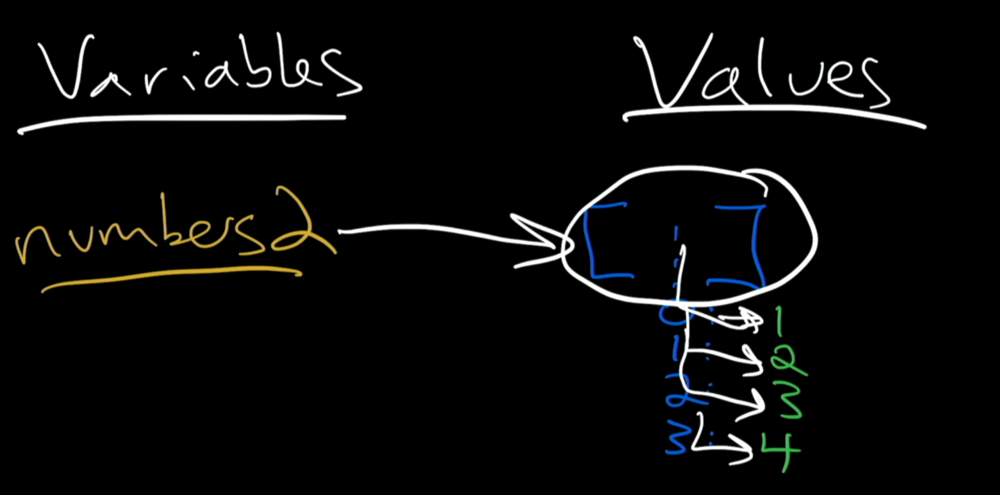
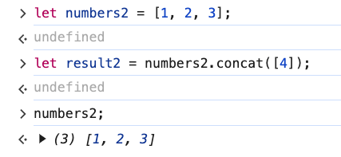
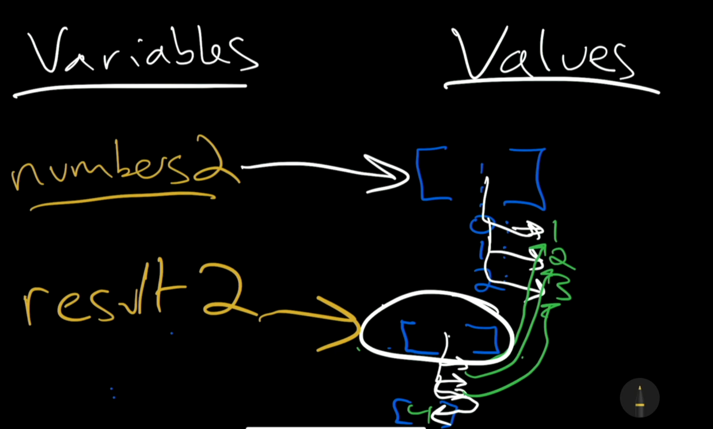
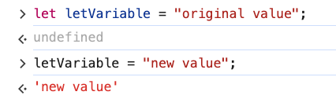
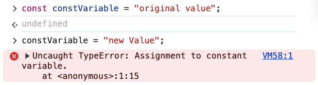

# 4. Mutable & Immutable Data Exercise

Link: [https://frontendmasters.com/courses/javascript-first-steps/mutable-immutable-data-exercise/](https://frontendmasters.com/courses/javascript-first-steps/mutable-immutable-data-exercise/)

1. What happens when we create a variable and we assign an array to that variable?
    
    ```jsx
    let numbers2 = []
    ```
    
    
    
    The variable is going to point to the array
    
    When we create an array [1,2,3]
    
    ```jsx
    let numbers2 = [1, 2, 3]
    ```
    
    We have indices that point to those numbers
    
    
    
    JavaScript sees the array as one mutable value that can be changed.
    
    - push()
        
        ```jsx
        let numbers2 = [1, 2, 3];
        let result2 = numbers2.push(4);
        numbers2;
        ```
        
        
        
        Explanation:
        
        
        
        - `numbers2.push(4);`  will add on a new index that inserts the reference to the new value that we just pushed on.
        - “numbers2” still points to the same array, we just changed the values inside the array
        
        Furthermore, the value of “result2” is “4” which is the new length of the array
        
        ```jsx
        result2 // 4
        ```
        
    - concat()
        
        ```jsx
        let numbers2 = [1, 2, 3];
        let result2 = numbers2.concat([4]);
        numbers2;
        ```
        
        
        
        Explanation:
        
        
        
        - `numbers2.concat();`  JavaScript “concat()” will create a new array with all the indices that were there before in the “numbers2” array and then those indices will point to the values that were also there before in the “numbers2” array.
        - `numbers2.concat([4]);`  we are going to concatenate the new array that JavaScript just created with the array that we just created which only has “4” in it. JavaScript then will point the new array that we created with “concat()” to the new array that only has “4” in it.
        - At the end, we have the new array with indices 0,1,2,3 and values 1,2,3,4
        - `let result2 = numbers2.concat([4]);`  “result2” is going to reference the new object that JavaScript created.
        
        Summary:
        
        - Some actions "mutate" an array (e.g. `oldArray.push(newValue)`) aka change the array *in-place*
        - Other actions do *not* mutate the original array, but instead create a new copy (e.g. oldArray.concat(otherArray))
2. Variables themselves can also be (im)mutable
    - let
        
        ```jsx
        let letVariable = "original value";
        letVariable = "new value";
        ```
        
        
        
        
        
        
        
        You can reassign the variable (declared) with “let”
        
        “let” is *mutable*
        
    - const
        
        Remember: For “const” we need to *declare* and *assign* the variable at **the same time**!
        
        ```jsx
        const constVariable = "original value";
        constVariable = "new Value";
        ```
        
        
        
        
        
        You can **not** reassign the variable (declared) with “const”.
        
        Once you assign something to the “const” variable, it becomes an indelible fact about that variable.
        
        “const” is *immutable*