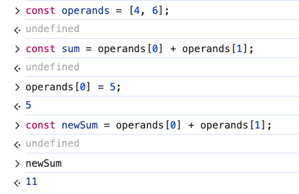

# 5. Immutable Variables & Values

Link: [https://frontendmasters.com/courses/javascript-first-steps/immutable-variables-values/](https://frontendmasters.com/courses/javascript-first-steps/immutable-variables-values/)

```jsx
const operands = [4, 6];
const sum = operands[0] + operands[1];
operands[0] = 5;
const newSum = operands[0] + operands[1];
```



- Explanation:
    
    
    
    - We have the “operands” variable pointing to the array with indices 0,1 pointing to values 4,6 at first
    - Then we mutate the index 0 by pointing it to a new value “5”. The old value “4” is going to be forgotten!
    - The “operands” variable is immutable (it was declared with “const”) so it will always point to that particular array. The array itself is mutable, we can always mess with what is inside of it.
- Summary:
    - It is possible to have an immutable reference, immutable pointer to a mutable value so we can mess with the thing (the array)
    - If you have the choice, using *immutable* data & variables is usually best ⇒ Keep things immutable!
    Why? If an underlined value changes and you did not expect it to change because you thought that it would stay that way forever and you go ahead and change it ⇒ You are going to mess things up and you will end up with unexpected bugs and “undefined” error!