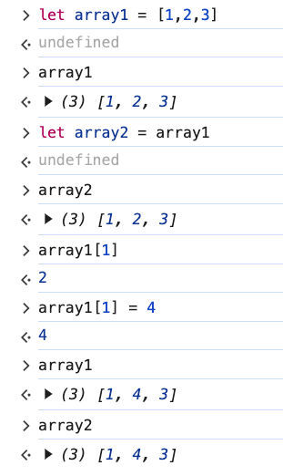
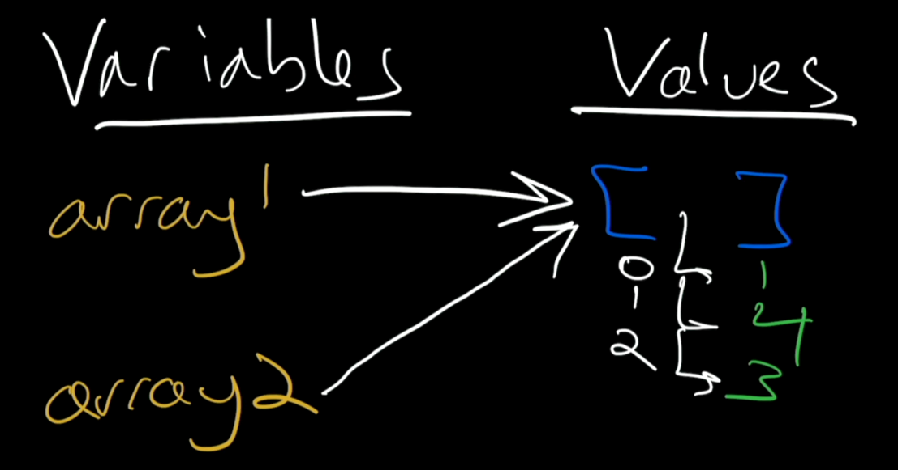
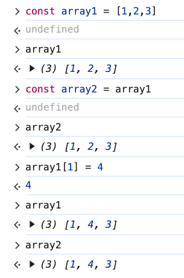

# 6. Variables & Arrays

Link: [https://frontendmasters.com/courses/javascript-first-steps/variables-arrays/](https://frontendmasters.com/courses/javascript-first-steps/variables-arrays/)

1. Example
    
    
    
    Explanation
    
    
    
    - We have two variables pointing at the same array
    - `array1[1] = 4`  is going to change the value at index 1 to “4” instead of “2” in the same array. The number “2” is going to be forgotten.
    - Since “array2” is still pointing at that same array that we have just messed with so the array that “array2” is pointing to will be [1,4,3] same with “array1”

1. Question and Answer
    - Question 1:
        
        Would there be anything different to the array elements if instead of using “let” now we use “const” for the two variables?
        
        Answer:
        
        Since the two variables are pointing at the same array, even if we change to declaring those two variables with “const” and we change the array element then the same thing that happened when we declared the two variables with “let” will still be the true as two variables are still pointing at the same array.
        
        
        
        Summary: Either you declare the variables with “let” (mutable) or “const” (immutable), as long as they are still pointing at the same array, the array is mutable, you can always change the value inside the array and the change is the same for both variables.
        
    - Question 2:
        
        Should we always use “const” for array?
        
        Answer:
        
        The thing about “let” and “const” only affects the arrow, the pointer, it does not affect what they point to.
        
        Regardless of the fact that there is no general rule for when to use “let” or “const” for the variable pointing to the array (or string or whatever), unless you have a very good reason say you want to change where the arrows point to further down the road, otherwise you should use “let” and *not* “const”.
        
        In JavaScript it does not care where those pointers are pointing to, what type of thing it is, what it does care is whether or not you will need to change those arrows later.
        
        ⇒ Use “const” and make those arrows permanent, make them immutable!