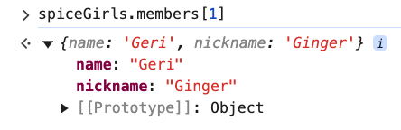

# 5. Object Methods Exercise

Link: [https://frontendmasters.com/courses/javascript-first-steps/object-methods-exercise/](https://frontendmasters.com/courses/javascript-first-steps/object-methods-exercise/)

From the ”spiceGirls” object, how can we retrieve:

1. "Girl Power"
2. The object representing Ginger Spice
3. "Spiceworld"
4. "Victoria"

Given

```jsx
const spices = [
    {name: "Emma", nickname: "Baby"},
    {name: "Geri", nickname: "Ginger"},
    {name: "Mel B", nickname: "Scary"},
    {name: "Mel C", nickname: "Sporty"},
    {name: "Victoria", nickname: "Posh"}
];
const spiceGirls = {
    albums: ["Spice", "Spiceworld", "Forever"],
    motto: "Girl Power",
    members: spices
};
```

Coding Work:

1. "Girl Power"
    
    ```jsx
    spiceGirls.motto // 'Girl Power'
    ```
    
2. The object representing Ginger Spice
    
    ```jsx
    spiceGirls.members[1]
    ```
    
    
    
3. "Spiceworld"
    
    ```jsx
    spiceGirls.albums[1] // 'Spiceworld'
    ```
    
4. "Victoria"
    
    ```jsx
    spiceGirls.members[4].name // 'Victoria'
    ```