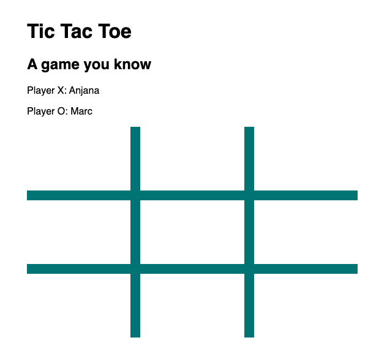
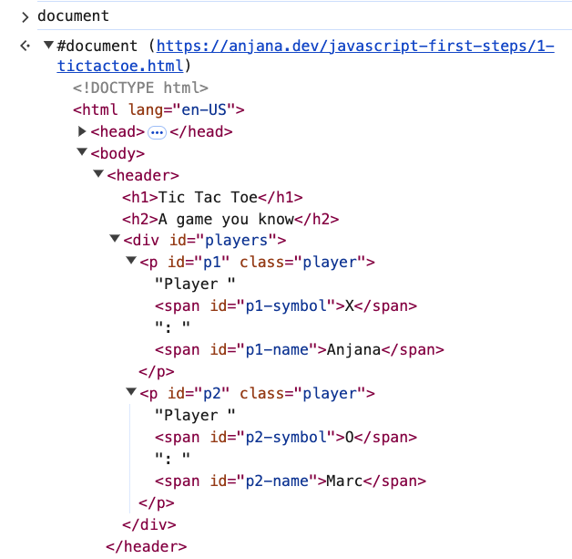
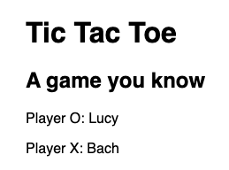
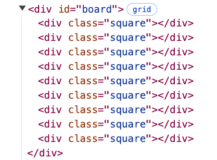
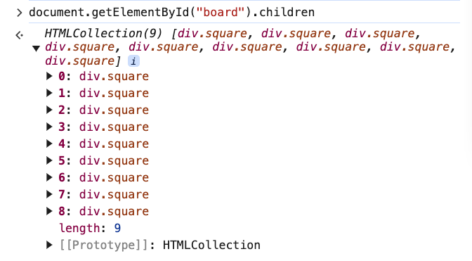
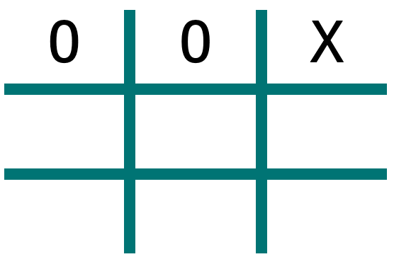

# 7. Tic Tac Toe Demo

Link: [https://frontendmasters.com/courses/javascript-first-steps/tic-tac-toe-demo/](https://frontendmasters.com/courses/javascript-first-steps/tic-tac-toe-demo/)

Instruction:

1. Set up the players
    - Create a `players` array containing 2 objects, one representing each player
    - Each object should store the player's `name` and `symbol` (X or O)
    - Display each player's name in the appropriate element in the page
2. Play!
    - Take turns placing symbols in the board
    - On each turn:
        - Retrieve the square you want to play in
        - Set the square's text to your player's symbol

Page



DOM:



Coding practices

1. Set up the players
    
    Code:
    
    Changing the player’s name and symbol
    
    ```jsx
    // Create a players array containing 2 objects, one representing each player
    const players = [
    		// Each object should store the player's name and symbol (X or O)
        {name: "Bach", symbol: "X"},
        {name: "Lucy", symbol: "O"}
    ]
    // Display each player's name in the appropriate element in the page
    document.getElementById("p1-name").textContent = players[1].name
    document.getElementById("p1-symbol").textContent = players[1].symbol
    document.getElementById("p2-name").textContent = players[0].name
    document.getElementById("p2-symbol").textContent = players[0].symbol
    ```
    
    Players’ names and symbols
    
    
    

1. Play!
    
    DOM
    
    
    
    Code:
    
    Input “X” and “O” in the board
    
    Using “[children](https://developer.mozilla.org/en-US/docs/Web/API/Document/children)” property of document
    
    ```jsx
    document.getElementById("board").children
    ```
    
    
    
    ```jsx
    document.getElementById("board").children[0].textContent = players[1].symbol // O
    document.getElementById("board").children[1].textContent = players[1].symbol // O
    document.getElementById("board").children[2].textContent = players[0].symbol // X
    ```
    
    Page
    
    Before
    
    
    
    After
    
    