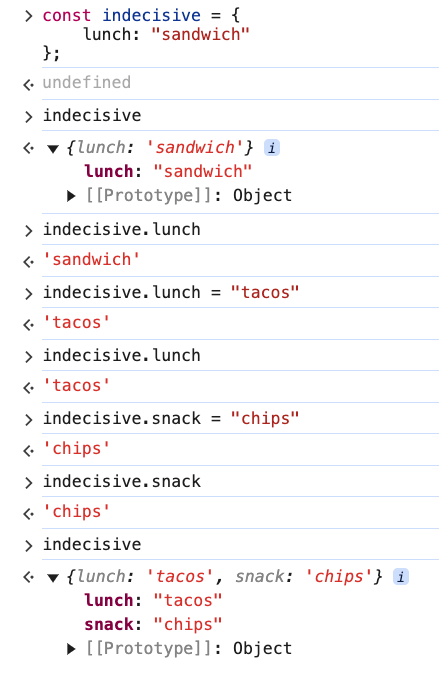

# 1. Objects & Property Access

Link: [https://frontendmasters.com/courses/javascript-first-steps/objects-property-access/](https://frontendmasters.com/courses/javascript-first-steps/objects-property-access/)

```jsx
const js = {
    name: "JavaScript",
    abbreviation: "JS",
    isAwesome: true,
    officialSpec: "ECMAScript",
    birthYear: 1995,
    creator: "Brendan Eich"
};
```

Objects collect multiple values together to describe more complex data.

Similar to how we can *point at* **different values** using *variables* in our code,

objects let us *point at* **related values** using *properties* in the object.

1. Getting property values
    
    ```jsx
    js.name // 'JavaScript'
    js.isAwesome // true
    ```
    
2. Object can be written on separate lines or on one line
    
    ```jsx
    const js = { name: "JavaScript", abbreviation: "JS", birthYear: 1995 }
    ```
    
3. Using property values
    
    ```jsx
    js.name.startsWith("Java") // true
    let age = 2022 - js.birthYear; // 27
    ```
    
4. Setting property values
    
    ```jsx
    const indecisive = {
        lunch: "sandwich"
    };
    indecisive.lunch = "tacos";
    indecisive.snack = "chips";
    ```
    
    We can use the “dot” notation on the **left-hand** side of an equal sign to
    
    - reassign the property to point to a different value.
    - assign a new property on an existing object.
    
    
    
    Object is Mutable!