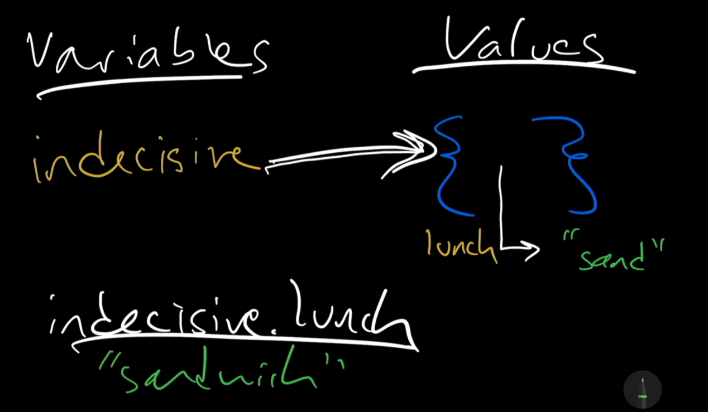
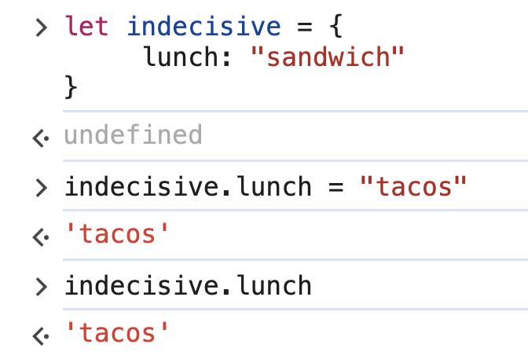
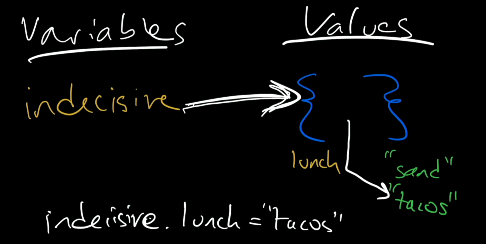
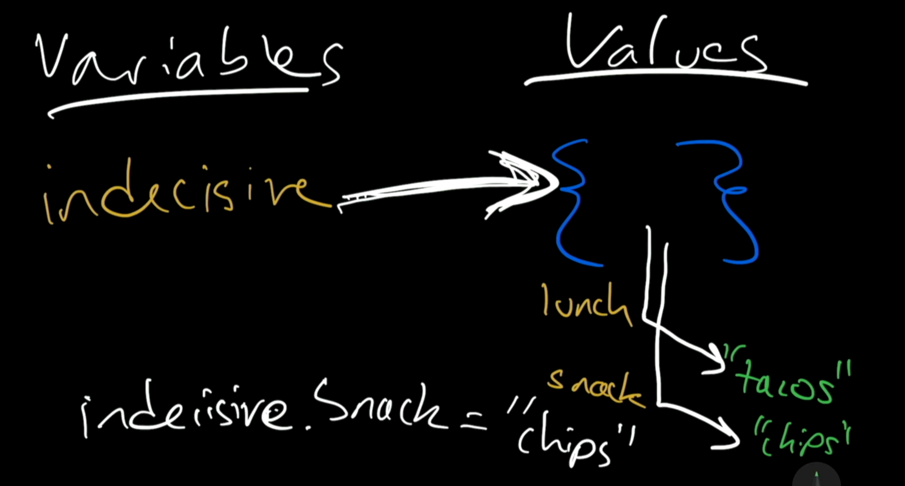
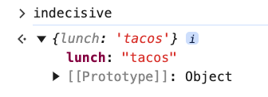
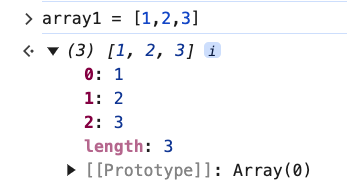

# 2. Visualizing Object Access

Link: [https://frontendmasters.com/courses/javascript-first-steps/visualizing-object-access/](https://frontendmasters.com/courses/javascript-first-steps/visualizing-object-access/)

1. Example 1
    
    ```jsx
    let indecisive = {
    	 lunch: "sandwich"
    }
    ```
    
    Explanation:
    
    
    
    - `let indecisive = {}`  variable “indecisive” is created which points to an “object” value
    - The “lunch” property, a pseudo variable within the object, that points at a certain value, “sandwich”
    
    What we have here
    
    ```jsx
    let indecisive = {
    	 lunch: "sandwich"
    }
    ```
    
    A reference from our *variable* “indecisive” to an *object* value and that object has some pointers, in this case the pointer that named “lunch” that points to a string value that is “sandwich”.
    

1. Example 2
    
    ```jsx
    let indecisive = {
    	 lunch: "sandwich"
    }
    indecisive.lunch = "tacos"
    ```
    
    
    
    Explanation:
    
    
    
    In this code
    
    ```jsx
    indecisive.lunch = "tacos"
    ```
    
    JavaScript follows the arrow from the variable “indecisive” to the “object” value, down to “lunch” and then changes the arrow that calls “lunch” to point to “tacos”. The old value “sandwich” is forgotten.
    

1. Example 3
    
    ```jsx
    let indecisive = {
    	lunch: "tacos"
    }
    indecisive.snack = "chips"
    ```
    
    Explanation:
    
    
    
    JavaScript will follow the arrow from the variable “indecisive” pointing to the “object” value, it then will create a new arrow that we’ll name “snack”, JavaScript conjures (generate) the value “chips” and point the arrow at that value.
    

1. Array and Object look similar. Is array also an object?
    
    ```jsx
    typeof {snack: "chips"} // 'object'
    typeof ["chips"] // 'object'
    ```
    
    In JavaScript, anything that is not a primitive value is an object!
    
    Array is a special kind of object that has certain built-in properties.
    
    - length
        
        ```jsx
        ["chips"].length // 1
        ```
        
    - Accessing the value
        
        We can access the value within the array and the object both using square brackets with a slightly different syntaxes
        
        - Array: The value can be accessed using the indices
            
            ```jsx
            ["chips", "tacos"][0] // 'chips'
            ```
            
            Under the hood, JavaScript has an object with a pointer called 0 (“zero”) points to the first thing in the array.
            
        - Object: The value can be accessed using the property name
            
            ```jsx
            indecisive["lunch"] // 'tacos'
            ```
            
            If you want to get the property “lunch” in the object “indecisive” using a numerical index, you will get “undefined”
            
            ```jsx
            indecisive[0] // undefined
            ```
            
            The reason is because there is no property named “0” inside the object “indecisive”
            
        
        Summary:
        
        - This is the look inside of an object
            
            
            
        - This is the look inside of an array
            
            