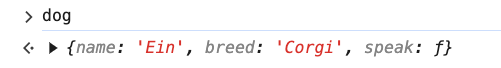
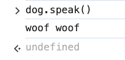
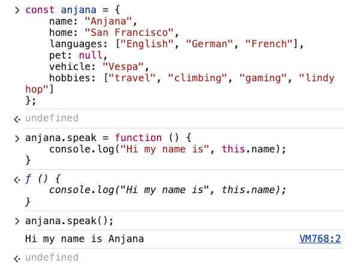
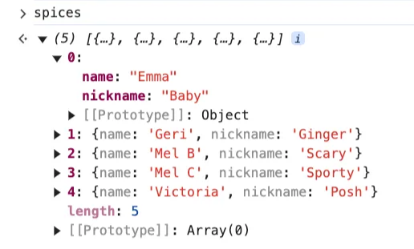
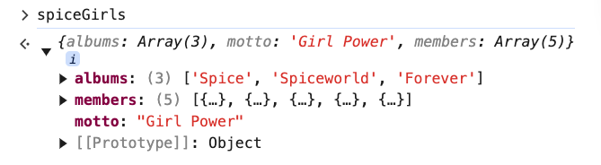

# 4. Object Methods

Link: [https://frontendmasters.com/courses/javascript-first-steps/object-methods/](https://frontendmasters.com/courses/javascript-first-steps/object-methods/)

1. Properties can point to functions too
    
    We call function-properties "methods" on objects
    
    ```jsx
    const dog = {
        name: "Ein",
        breed: "Corgi",
        speak: function () {
            console.log("woof woof");
        }
    }
    dog.speak();
    ```
    
    
    
    ```jsx
    dog.speak(); // woof woof
    ```
    
    
    
    “speak()” is a method - this is a special type of property that it does not evaluate to a value. It calls a function that does something.
    
2. **this**
    
    [**this**](https://developer.mozilla.org/en-US/docs/Web/JavaScript/Reference/Operators/this) in a method lets us reference other properties on the object
    
    Given the object
    
    ```jsx
    const anjana = {
        name: "Anjana",
        home: "San Francisco",
        languages: ["English", "German", "French"],
        pet: null,
        vehicle: "Vespa",
        hobbies: ["travel", "climbing", "gaming", "lindy hop"]
    };
    ```
    
    Using “this” for the property in the object
    
    ```jsx
    anjana.speak = function () {
        console.log("Hi my name is", this.name);
    }
    anjana.speak();
    ```
    
    
    
    **this** is within method (speak()) for us to refer back to the object that this method lives on so that we can access properties of that object.
    
    Note: The speak() function-property method was not originally there yet you created it with the “dot” notation from the object.
    
3. Nested objects
    
    ```jsx
    const menu = {
        lunch: {
            appetizer: "salad",
            main: "spaghetti",
            dessert: "tiramisu"
        },
        dinner: {
            appetizer: "samosa",
            main: "saag paneer",
            dessert: "gulab jamun"
        }
    };
    const tiramisu = menu.lunch.dessert;
    ```
    
    We can have *objects* as *values* of *properties* within objects.
    
    Above we are creating the “menu” object with two properties, “lunch” and “dinner”, and each of those properties points to another object with three properties - “appetizer”, “main” and “dessert”
    
4. Objects in Arrays & Objects
    
    ```jsx
    const spices = [
        {name: "Emma", nickname: "Baby"},
        {name: "Geri", nickname: "Ginger"},
        {name: "Mel B", nickname: "Scary"},
        {name: "Mel C", nickname: "Sporty"},
        {name: "Victoria", nickname: "Posh"}
    ];
    const spiceGirls = {
        albums: ["Spice", "Spiceworld", "Forever"],
        motto: "Girl Power",
        members: spices
    };
    ```
    
    - We have an array of “spices”, each element inside of the array is an object, each object has a “name” and “nickname”.
    - We can also have a “spiceGirls” object with an “albums” property that has an array of their albums, a “motto”, and a “members” property which points to the array that we have declared earlier as the value of the “spices”.
    
    Console:
    
    - spices
        
        ```jsx
        const spices = [
            {name: "Emma", nickname: "Baby"},
            {name: "Geri", nickname: "Ginger"},
            {name: "Mel B", nickname: "Scary"},
            {name: "Mel C", nickname: "Sporty"},
            {name: "Victoria", nickname: "Posh"}
        ];
        ```
        
        
        
    - spiceGirls
        
        ```jsx
        const spiceGirls = {
            albums: ["Spice", "Spiceworld", "Forever"],
            motto: "Girl Power",
            members: spices
        };
        ```
        
        