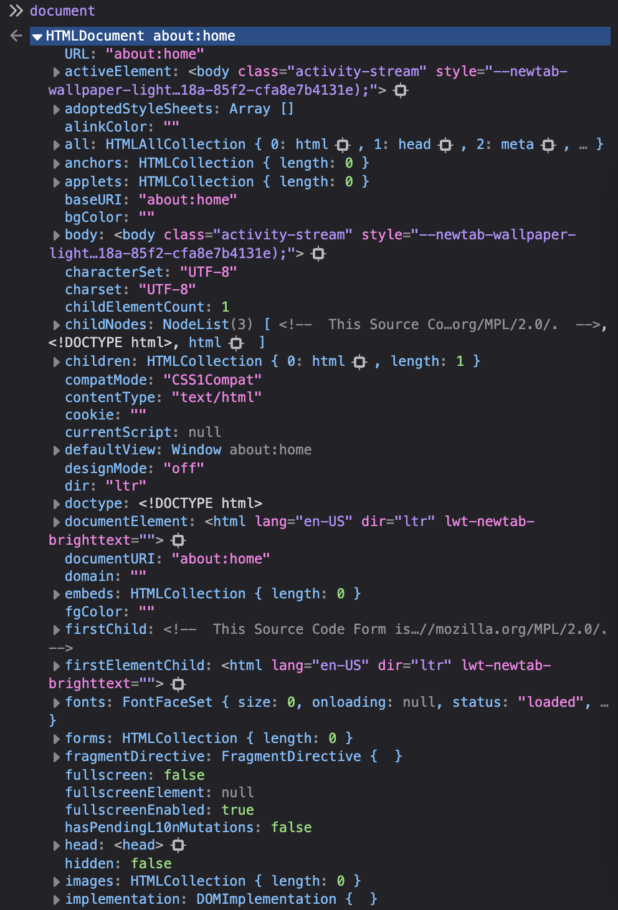
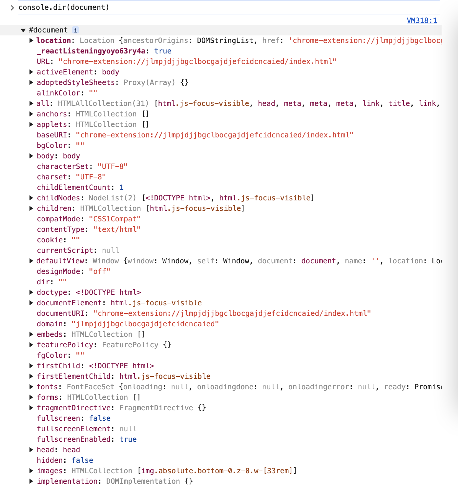
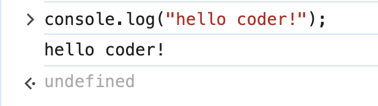
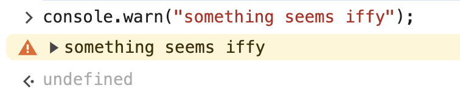
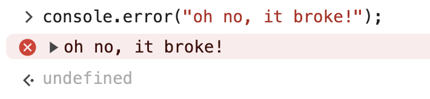
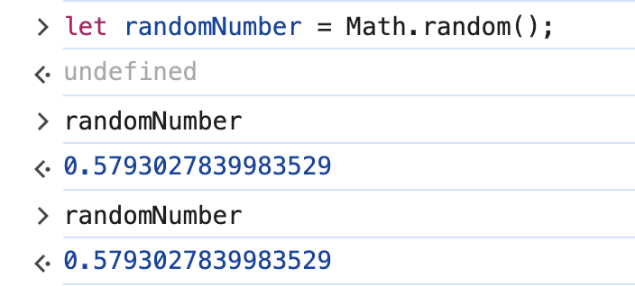
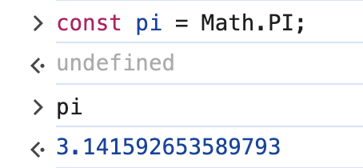
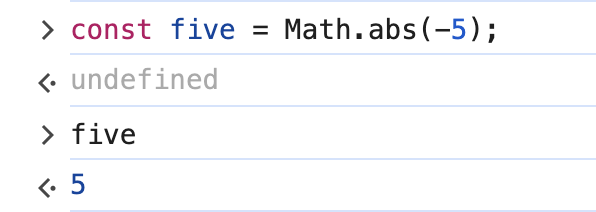

# 6. Built-In Objects

Link: [https://frontendmasters.com/courses/javascript-first-steps/built-in-objects/](https://frontendmasters.com/courses/javascript-first-steps/built-in-objects/)

1. **document** properties
    
    Here are some  we already used
    
    ```jsx
    document.title = "Tic Tac Toe";
    document.querySelector("h2").append(" and love");
    ```
    
    What other properties does **document** have?
    
    - Firefox
        
        
        
    - Chrome
        - How to get that same list of document properties in Firefox in Chrome?
            
            [console.dir()](https://developer.mozilla.org/en-US/docs/Web/API/console/dir_static)
            
        - Why do we have to use “console.dir(document)” instead of just “document”?
            
            It is just the different behaviors for different browser.
            
        
        
        
2. console
    - console.log()
        
        ```jsx
        console.log("hello coder!");
        ```
        
        
        
    - console.warn()
        
        ```jsx
        console.warn("something seems iffy");
        ```
        
        
        
    - console.error()
        
        ```jsx
        console.error("oh no, it broke!");
        ```
        
        
        
    - console.clear()
        
        ```jsx
        console.clear();
        ```
        
        
        
    
    What is the difference between `clear()` and `console.clear()` ?
    
    - **Key Differences**
        
        
        | Feature | `console.clear()` | `clear()` |
        | --- | --- | --- |
        | Works in JavaScript? | ✅ Yes | ❌ No (only in Chrome DevTools) |
        | Works in Chrome DevTools? | ✅ Yes | ✅ Yes |
        | Shows "Console was cleared" message? | ✅ Yes (in most cases) | ❌ No |
        | Available in Node.js? | ✅ Yes | ❌ No |
    - **Conclusion**
        - **For general JavaScript use:** ➝ Use `console.clear()`
        - **For quick console clearing in Chrome DevTools:** ➝ Use `clear()`
3. Math
    
    ```jsx
    let randomNumber = Math.random();
    ```
    
    
    
    ```jsx
    const pi = Math.PI;
    ```
    
    
    
    ```jsx
    const five = Math.abs(-5);
    ```
    
    
    
4. strings
    - Fact
        
        Strings are *primitive values* (not objects) and JS distinguishes primitive values from objects
        
        and yet if we do *string*.toUpperCase() or *string*.length, the “dot” means we have an object here.
        
        ```jsx
        const hello = "hello";
        console.log(hello.length);
        const yello = hello.toUpperCase();
        ```
        
    - Question: So are *string* objects or primitive values?
    - Answer: Both
    - Explanation: When *strings* are in quotes, they are primitive values. However, behind the scene, JS wraps that in an objective thing so that we can interact with this *string* using some methods and properties.
        
        ```jsx
        let s  = "stringy"
        s.toUpperCase() // STRINGY
        ```
        
        And since *strings* are *immutable*, therefore the original string remains unchanged
        
        ```jsx
        s // 'stringy'
        ```