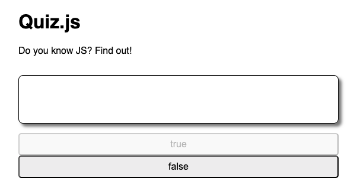
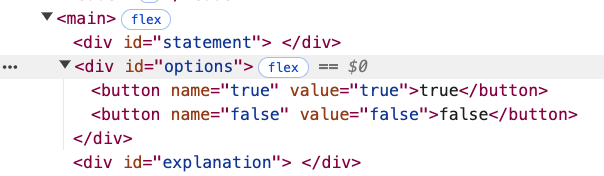
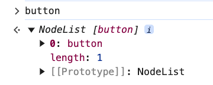
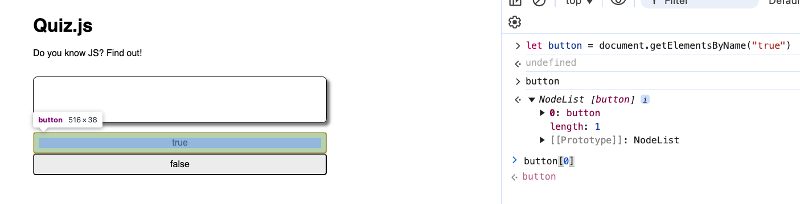
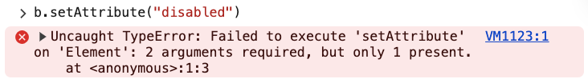
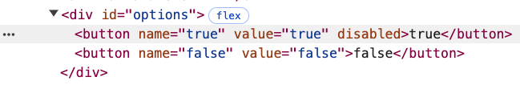
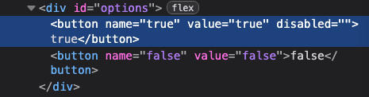
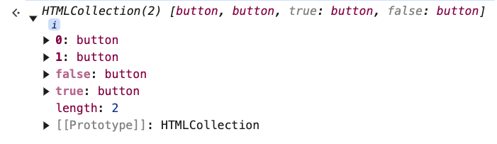
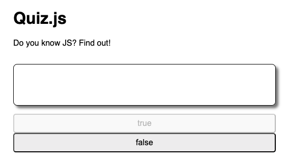
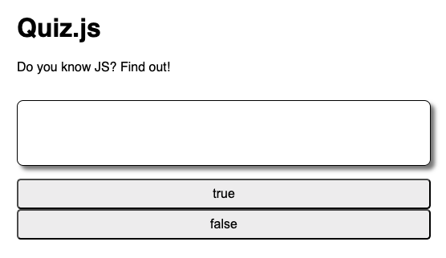

# 7. Quiz Project Disable & Enable Solution

Link: [https://frontendmasters.com/courses/javascript-first-steps/quiz-project-disable-enable-solution/](https://frontendmasters.com/courses/javascript-first-steps/quiz-project-disable-enable-solution/)

1. Requirements
    
    ```html
    // TODO 4: Declare disable & enable functions to set or remove the "disabled" attribute from a given button element
    // disable(button) should set the button element's attribute "disabled" to the value ""
    // enable(button) should remove the attribute "disabled" from the button element
    ```
    
2. Work
    - When a button is “disabled”, it is grayed out
        
        
        
    - Idea
        
        DOM
        
        
        
        - Goal: We want the “disable” function to take in the button itself (disable(button)) instead of picking out an element from the DOM.
        - Approach: We are going to pass in an inventory function, an element, in which we can then set the attribute to that element.
    - Code
        - Step 1: Get the button
            
            ```jsx
            let button = document.getElementsByName("true") // undefined
            ```
            
            
            
            ```jsx
            let b = button[0] // undefined
            b // <button name="true" value="true">true</button>
            ```
            
            
            
        - Step 2: [setAttribute()](https://developer.mozilla.org/en-US/docs/Web/API/Element/setAttribute)
            
            Sets the value of an attribute on the specified element.
            Syntax:
            `setAttribute(name, value)`
            
            ```jsx
            b.setAttribute("disabled", "")
            ```
            
            - What if we use the “setAttribute” without any value?
                
                Error
                
                
                
        - Step 3: [removeAttribute()](https://developer.mozilla.org/en-US/docs/Web/API/Element/removeAttribute)
            
            Removes the attribute with the specified name from the element
            
            Syntax:
            
            `removeAttribute(attrName)` 
            
            ```jsx
            b.removeAttribute("disabled")
            ```
            
        - Step 4: Check to see if the function written in the text editor works in the page
            - Text editor
                
                ```jsx
                // TODO 4: Declare disable & enable functions to set or remove the "disabled" attribute from a given button element
                // disable(button) should set the button element's attribute "disabled" to the value ""
                const disable = (button) => {
                    button.setAttribute("disabled", "")
                }
                // enable(button) should remove the attribute "disabled" from the button element
                const enable = (button) => button.removeAttribute("disabled")
                ```
                
        - Furthermore: Different behaviors for “disabled” attribute between Chrome and Firefox
            - Chrome
                
                “disabled” comes in as just an attribute itself
                
                
                
            - Firefox
                
                “disabled” comes with a value of an empty string in which you can put in “true” or “false”
                
                However, either does not have any effect on the status of the button, as long as the “disabled” attribute is still attached on the button, the button will still show as “disabled”
                
                
                
    - Test
        
        Earlier we created the variable “optionButtons”
        
        ```jsx
        const optionButtons = document.getElementById("options").children
        ```
        
        
        
        - Access the button
            
            We can access the buttons using the square brackets
            
            ```jsx
            optionButtons[0] // <button name="true" value="true">true</button>
            ```
            
        - Now we can pass the buttons inside the “enable” and “disable” functions we wrote earlier in the lesson
            - disable
                
                ```jsx
                disable(optionButtons[0]) // undefined
                ```
                
                
                
            - enable
                
                ```jsx
                enable(optionButtons[0]) // undefined
                ```
                
                