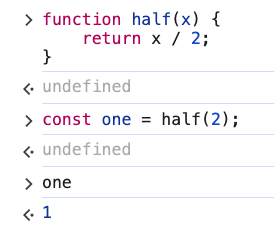
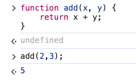
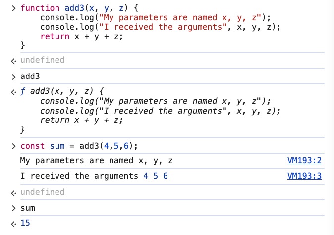
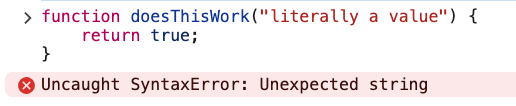
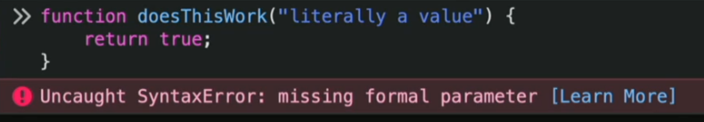
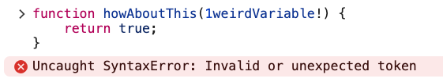
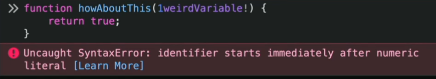
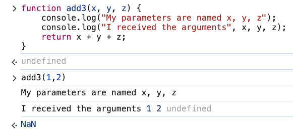
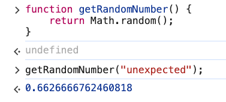

# 1. Functions, Parameters, & Arguments

Link: [https://frontendmasters.com/courses/javascript-first-steps/functions-parameters-arguments/](https://frontendmasters.com/courses/javascript-first-steps/functions-parameters-arguments/)

Concept:

> values *are* things
variables *point to* things
functions *do* things
> 
1. Function
    - Declaring (creating) a function
        
        ```jsx
        function half(x) {
            return x / 2;
        }
        ```
        
    - Calling (using) a function
        
        ```jsx
        const one = half(2);
        ```
        
    - Declaring and calling a function
        
        
        
2. Parameters & Argument
    - Some functions need more than one value to work
        
        ```jsx
        function add(x, y) {
            return x + y;
        }
        add(2,3);
        ```
        
        
        
    - Some functions don’t even need any values
        
        ```jsx
        function getRandomNumber() {
            return Math.random();
        }
        getRandomNumber();
        ```
        
        This function has no parameters, when we declare it we put nothing between the parenthesis.
        
        When we call it, we put nothing between the parenthesis.
        
    - *parameters* are the inputs a function expects
        
        ```jsx
        function add3(x, y, z) {
            console.log("My parameters are named x, y, z");
            console.log("I received the arguments", x, y, z);
            return x + y + z;
        }
        const sum = add3(4,5,6);
        ```
        
        *arguments* are the actual values the function is called with
        
        
        
        Explanation: The function is going to do a few things
        
        - Logging out the names of the parameters
            
            ```jsx
            console.log("My parameters are named x, y, z");
            ```
            
        - Logging out the values of the actual arguments
            
            ```jsx
            console.log("I received the arguments", x, y, z);
            ```
            
        - Returning a value in which we were able to capture by assigning it to a variable
            
            ```jsx
            const sum = add3(4,5,6);
            ```
            
    - Questions and Answers
        - Naming variables
            
            Parameters should be named like variables, and behave like variables within the function body
            
            - Example 1
                
                ```jsx
                function doesThisWork("literally a value") {
                    return true;
                }
                ```
                
                Chrome error
                
                
                
                Firefox error
                
                
                
                Reason:
                
                JS is actually looking for variable names between those parenthesis when we declare a function.
                
                So if we try to give in an actual value there instead of the name for a value that might get passed in as an argument for the function, JS does not like it.
                
            - Example 2:
                
                ```jsx
                function howAboutThis(1weirdVariable!) {
                    return true;
                }
                ```
                
                Chrome error
                
                
                
                Firefox error
                
                
                
                Reason: JS cannot even parse this as a name for a parameter.
                
                It is seeing the number “1” and it actually thinks it is the literal “1” and then it is confused about what happened ⇒ This does not work!
                
        - What happens if we don’t call a function with the intended argument(s)
            - Example 1
                
                ```jsx
                function add3(x, y, z) {
                    console.log("My parameters are named x, y, z");
                    console.log("I received the arguments", x, y, z);
                    return x + y + z;
                }
                const sum = add3(1,2);
                ```
                
                
                
                Explanation:
                
                JS does not mind if we call the function with the wrong number of arguments. It will still run with no error yet it will show the third argument as “*undefined*” since the third argument “z” is not passed in.
                
                ```jsx
                1 + 2 + undefined // NaN
                ```
                
                “*NaN*” is actually type “number”
                
                JS will not throw an error but rather “*NaN*” as the result for a math that does not work out
                
                ```jsx
                typeof NaN // 'number'
                ```
                
            - Example 2:
                
                ```jsx
                function getRandomNumber() {
                    return Math.random();
                }
                getRandomNumber("unexpected");
                ```
                
                
                
                Explanation:
                
                “*Math.random()*” can do its job of generating numbers without any arguments at all.
                
                In this case, we gave JS an extra value “unexpected” which JS did not need so it just ignored the extra value. JS will not throw any error, either!
                
            
            Summary:
            
            JS is very loosey-goosey when it comes to (missing/extra) function arguments.