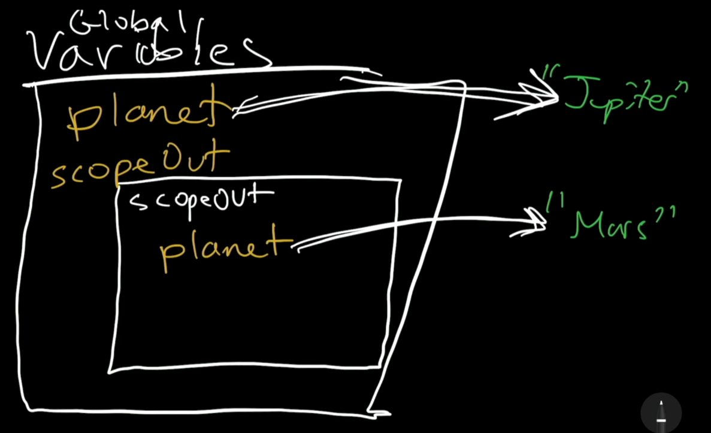

# 10. Scope

Link: [https://frontendmasters.com/courses/javascript-first-steps/scope/](https://frontendmasters.com/courses/javascript-first-steps/scope/)

> In JS it doesn't just matter *what* variables we declare
It also matters *where* we declare them
*Scope* determines where variables are "in play"
“Where” and “when” a variable can be accessed by its name and what is it going to point to
> 

Example 1:

```jsx
function declareBankruptcy() {
    let bankruptcy = true;
}
declareBankruptcy(); // undefined
console.log(bankruptcy); // bankruptcy is not defined
```


Question:

- Why *declareBankruptcy()* does not return anything when we call it?
- Because we do not return anything within the function *declareBankruptcy*.

If we were to return something (return *true*) within the scope of the function

```jsx
function declareBankruptcy() {
	return true
}
declareBankruptcy(); // true
console.log(bankruptcy); // bankruptcy is not defined
```

When we call the function *declareBankruptcy()* from outside of the function, it will return *true* as the value that we ask the function to return.

Summary:

- Scopes are *nested* within the program
- The widest scope is the **global** scope
- Each function gets its own new scope within the scope where it was declared

Example 2:

```jsx
let planet = "Jupiter";
function scopeOut() {
    let planet = "Mars";
    console.log("Inner planet:", planet);
}
scopeOut();
console.log("Outer planet:", planet);
```




Summary:

- Within each scope, you can access variables declared in a *wider* scope (e.g. global scope)
- But not those declared in a *narrower* scope (e.g. function scope)

Example 3:

```jsx
let globalVariable = "I live in global scope"; 
function narrowerScope() {
    console.log(globalVariable);
    let localVariable = "I live in the function scope";
}
narrowerScope(); // "I live in global scope"
console.log(localVariable); // localVariable is not defined
```

