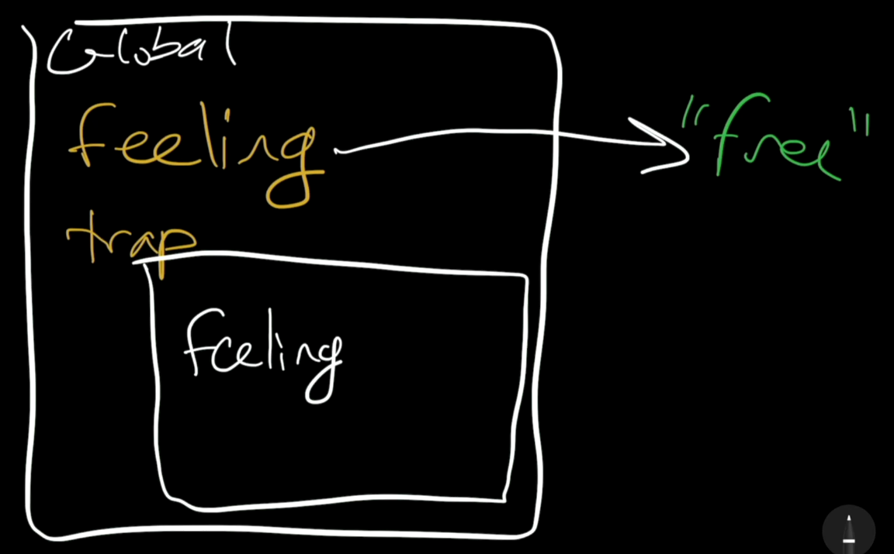
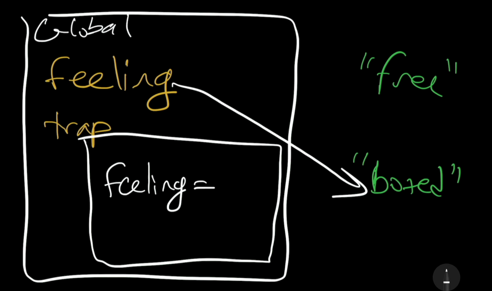
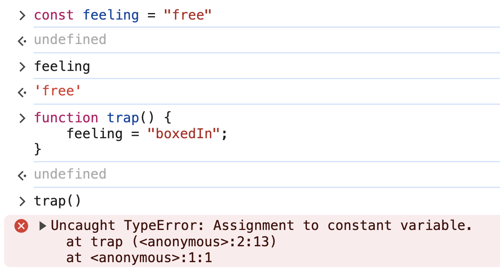
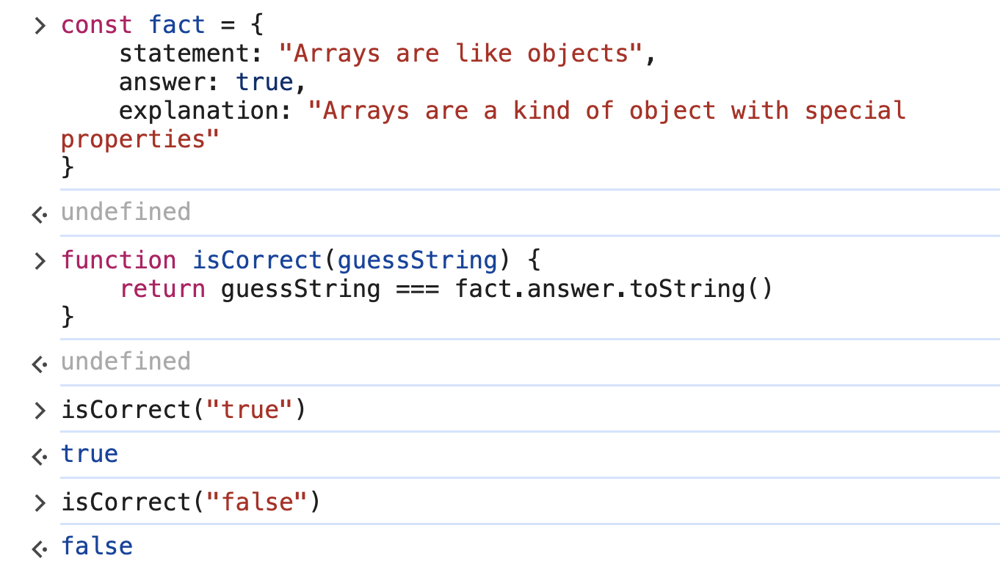
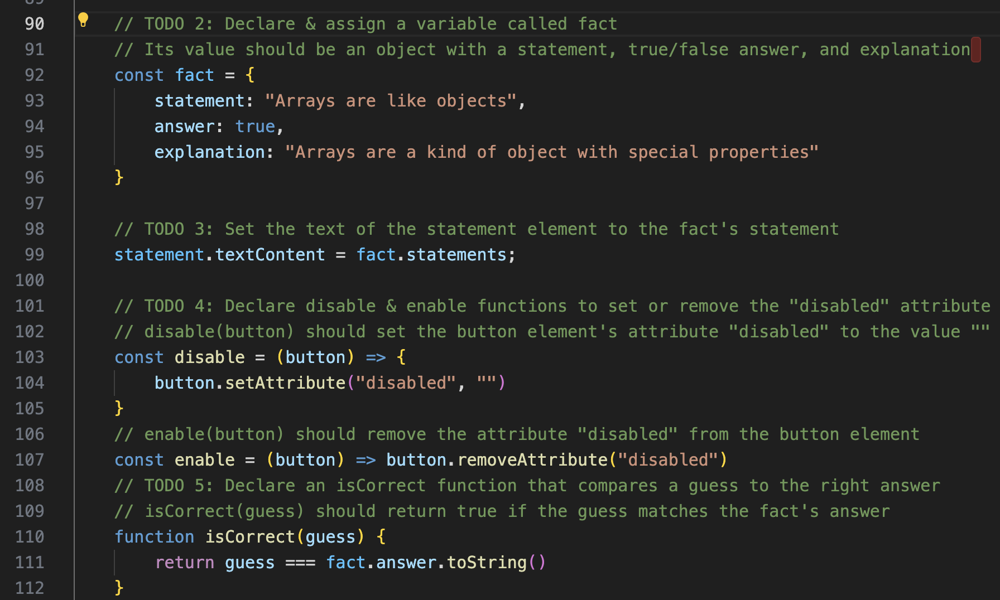

# 11. let & Scope

Link: [https://frontendmasters.com/courses/javascript-first-steps/let-scope/](https://frontendmasters.com/courses/javascript-first-steps/let-scope/)

> Variables declared with `let` can be modified from within a narrower scope
> 
> 
> This can be useful, but also dangerous!
> 

- Example 1:
    
    ```jsx
    let feeling = "free";
    function trap() {
        feeling = "boxedIn";
    }
    trap(); // undefined
    console.log(feeling); // boxedIn
    ```
    
    - Explanation:
        - Step 1:
            
            ```jsx
            let feeling = "free";
            ```
            
            
            
        - Step 2:
            
            Within the function “*trap()*”
            
            `feeling = "boxedIn";` 
            
            
            
            We are able to change the value that the variable “feeling” is pointing to, within the *trap* function, because the variable is declared with *let*.
            
    - Question 1: What if we were to declare the variable “feeling” with *const*?
        
        
        
        Answer: Calling the function *trap* will return an error
        
    - Question 2: Is string not *immutable*? Why were we able to modify the string “free”?
        
        Answer: We did not modify any string at all. What we actually did was that we changed the destination (value) that the arrow of the variable “feeling” was pointing to (from “free” to “boxedIn”)
        
- Example 2:
    
    ```jsx
    const fact = {
        statement: "Arrays are like objects",
        answer: true,
        explanation: "Arrays are a kind of object with special properties"
    }
    ```
    
    ```jsx
    function isCorrect(guessString) {
    	return guessString === fact.answer.toString()
    }
    ```
    
    
    
    We are able to evaluate *fact* because it is a variable declared in the wider context, not inside of a function
    
    