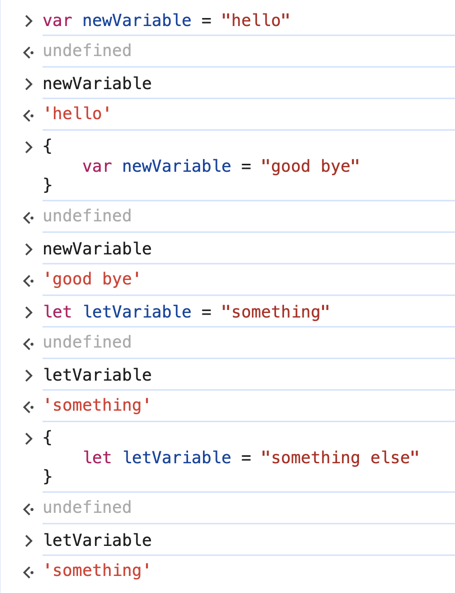
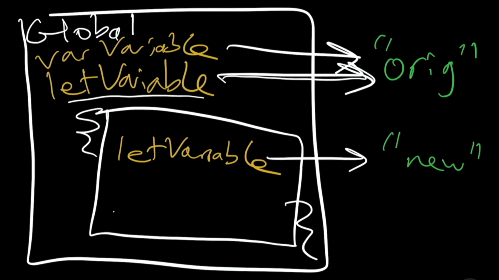
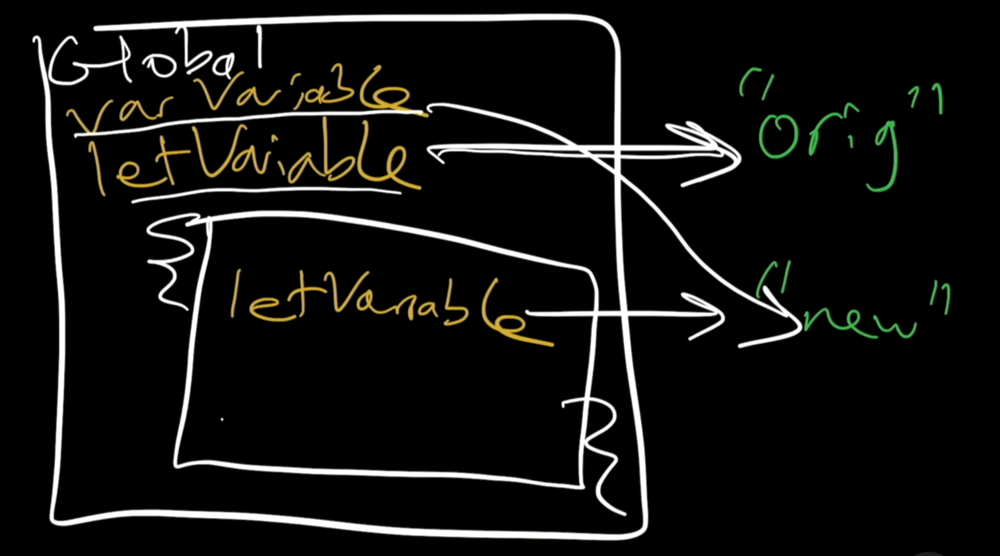

# 12. var vs let

Link: [https://frontendmasters.com/courses/javascript-first-steps/var-vs-let/](https://frontendmasters.com/courses/javascript-first-steps/var-vs-let/)

Just like with “let”, “var” is reassignable

- As a variable
    
    ```jsx
    var newVariable = "hello"
    newVariable // 'hello'
    newVariable = "good bye"
    newVariable // 'good bye'
    ```
    
- Function scope
    
    ```jsx
    function messWith () {
    	newVariable = "messed"
    }
    messWith() // undefined
    newVariable // 'messed'
    ```
    
- Block scope
    - var
        
        ```jsx
        newVariable // 'messed'
        {
        	var newVariable = "more messed";
        }
        // undefined
        ```
        
        ```jsx
        newVariable // 'more messed'
        ```
        
        *var* does not care if you keep re-declaring the same variable over and over again
        
    - let
        
        ```jsx
        let letVariable = "original" // undefined
        {
        	let letVariable = "new"
        }
        // undefined
        ```
        
        ```jsx
        letVariable // 'original'
        ```
        
    - Explanation:
        
        
        
        Inside of the curly braces, we created a new scope that is as far as *let* is concerned but not as far as *var* is concerned.
        
        - When using `let`, the block `{}` **creates a new, isolated scope** for that variable.
        - When using `var`, the block `{}` **does NOT create a new scope**, and the variable still belongs to the surrounding function or global scope.
        
        Why is it?
        
        - var
            - `var` **is function-scoped**, not block-scoped.
            - Even though `x` is declared inside the `{}`, it is still **accessible outside the block**.
        - let
            - **`let` is block-scoped.**
            - The variable `y` **only exists inside the `{}`** and cannot be accessed outside of it.
    - Illustration
        
        
        
        
        
        The curly braces create (an anonymous) new block scope with no name
        
        - let Variable
            
            Say we declare and point the *let Variable* to “orig” from outside of the scope and point it to a different value “new” within the scope.
            
            When we ask for the value of the *let Variable* from outside of the scope, JS will give us the value “orig”.
            
        - var Variable
            
            Say we declare and point the *var Variable* to “orig” from outside of the scope and point it to a different value “new” within the scope.
            
            Inside of the block, even though we use the keyword *var* again, we did not create a new variable, instead what we did is we looked up the old variable in the outer scope, we gave it a new arrow pointing to a new value and we actually changed the value of the variable in the global scope.