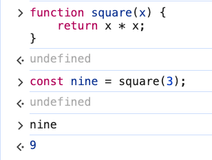
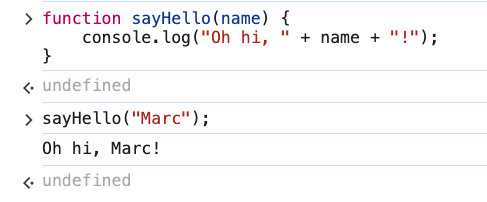
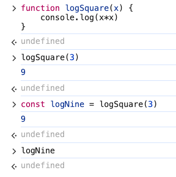
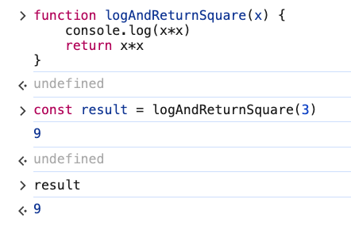
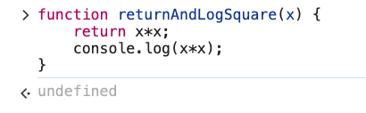
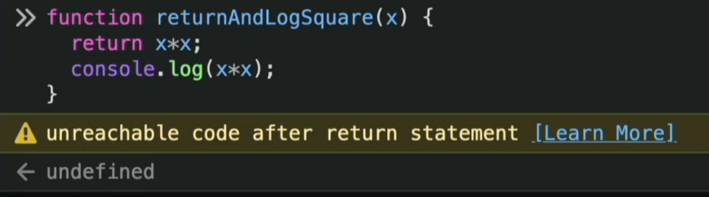

# 2. Function Return Values

Link: [https://frontendmasters.com/courses/javascript-first-steps/function-return-values/](https://frontendmasters.com/courses/javascript-first-steps/function-return-values/)

- When a function returns something
    
    A *return* statement specifies the function's output value
    
    ```jsx
    function square(x) {
        return x * x;
    }
    const nine = square(3);
    ```
    
    
    
    The *return* statement
    
    ```jsx
    return x * x;
    ```
    
    JS will make the value evaluated by the *expression* once the function maps the received argument into the parameter the output value of the function.
    
- Some functions don’t *return* anything
    - Sample
        
        ```jsx
        function sayHello(name) {
            console.log("Oh hi, " + name + "!");
        }
        ```
        
        ```jsx
        sayHello("Marc");
        ```
        
        
        
        Expected: “Oh hi, Marc” 
        
    - Example 1:
        
        What if we don’t return but we console.log()?
        
        ```jsx
        function logSquare(x) {
            console.log(x*x);
        }
        logSquare(3) // 9
        const logNine = logSquare(3) // 9
        logNine // undefined
        ```
        
        
        
        “*logSquare(3)*” is a function that does **not** return anything
        
        In JS, if a function does not have a *return* statement, we get *undefined* as the default return value of the function, unless you specify the value it should return.
        
        The value of “logNine” is whatever the value the “logSquare(3)” evaluates to which is the return value of the function, in this case it is *undefined*.
        
    - Example 2:
        
        ```jsx
        function logAndReturnSquare(x) {
        	console.log(x*x);
        	return x*x;
        }
        const result = logAndReturnSquare(3) // 9
        ```
        
        
        
        This line of code
        
        ```jsx
        const result = logAndReturnSquare(3)
        ```
        
        will print out “9”
        
        and *undefined* is the value of the whole function “statement” which does not have a value in JS
        
        ```jsx
        function logAndReturnSquare(x) {
        	console.log(x*x);
        	return x*x;
        }
        ```
        
        But if we ask for “result” it did indeed capture the return value of “9”
        
        Summary: If you want the function to give you a value that you can use later, you want a “return” statement.
        
    - Example 3:
        
        ```jsx
        function returnAndLogSquare(x) {
        	return x*x;
        	console.log(x*x);
        }
        ```
        
        Chrome
        
        
        
        Firefox
        
        
        
        If we try to capture “returnAndLogSquare(3)”, we did not see the “9” printed out like we did before in Example 2
        
        ```jsx
        const attempt = returnAndLogSquare(3) // undefined
        ```
        
        In this case, we are seeing the “9” because it is the value returned which was the value that we called in “attempt”. But we did not see the two “9” which is what we had before in “logAndReturnSquare()”
        
        ```jsx
        returnAndLogSquare(3) // 9
        ```
        
        The reason for “*unreachable code after return statement”* is because JS stops running your code inside of the function body once it hits the *return* statement
        
        So the line
        
        ```jsx
        console.log(x*x);
        ```
        
        is never going to run
        
        Summary: The *return* statement exits the function after sending out the returned value