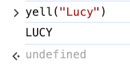

# 3. Creating Functions Exercise

Link: [https://frontendmasters.com/courses/javascript-first-steps/creating-functions-exercise/](https://frontendmasters.com/courses/javascript-first-steps/creating-functions-exercise/)

- Exercise:
    
    In the console, declare the following functions:
    
    - `multiply`: given 2 numbers, return their product
    - `yell`: given a lowercase string, log it in all caps to the console
    - `longerThan`: given 2 arrays, return whether the first is longer than the second

- Code
    - `multiply`: given 2 numbers, return their product
        
        ```jsx
        function multiply (x,y) {
        	return x * y
        }
        multiply(2,3) // 6
        ```
        
    - `yell`: given a lowercase string, log it in all caps to the console
        
        ```jsx
        function yell (str) {
        	console.log(str.toUpperCase())
        }
        yell("Lucy")
        ```
        
        
        
    - `longerThan`: given 2 arrays, return whether the first is longer than the second
        - Solution 1:
            
            ```jsx
            function longerThan (a1,a2) {
            	if (a1.length > a2.length) {
            		return true;
            	} else {
            		return false;
            	}
            }
            longerThan([1,2,3],[1,2,3,4]) // false
            ```
            
        - Solution 2
            
            ```jsx
            function longerThan2 (a1,a2) {
            	return a1.length > a2.length
            }
            longerThan([1,2,3],[1,2,3,4]) // false
            ```
            
            Return the value of this expression `a1.length > a2.length`  is going to be the same thing as the choices “true” and “false”.
            
        - Solution 3
            
            ```jsx
            const a = [1,2,3]
            const b = [1,2,3,4]
            
            function longerThan (a,b) {
            	if (a.length > b.length) {
            		return "Array 'a' is longer"
            	} else {
            		return "Array 'b' is longer"
            	}
            }
            longerThan(a,b) // "Array 'b' is longer"
            ```
            
            Note: We have not talked about “if else” just yet, this is the sneak peek for what we are about to learn later.