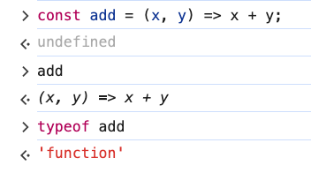
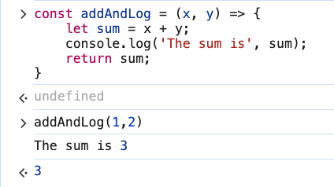

# 4. Arrow Functions

Link: [https://frontendmasters.com/courses/javascript-first-steps/arrow-functions/](https://frontendmasters.com/courses/javascript-first-steps/arrow-functions/)

- The => "fat arrow" lets us create an unnamed function without much code
    
    ```jsx
    (x, y) => x + y
    ```
    
    Since *arrow functions are expressions*, we can assign them to a variable
    
    ```jsx
    const add = (x, y) => x + y;
    add(1,2) // 3
    ```
    
    - Check if “add” is a function
        
        
        
    - Arrow function “add” breakdown
        - The arrow replaces the function keyword
        - The assignment to variable “add” does the naming work for the function
        - The parens to the left of the arrow function declare the parameters of the function
        - The right side of the arrow is the returned value which is usually just one expression in the arrow function
    - Parameter
        - For one-parameter functions, parentheses are optional
            
            `x => x*x`  instead of `(x) => x*x` 
            
        - For multiple parameters, parentheses are required
            
            `(firstName, lastName) ⇒ firstName + “ ” + lastName` 
            
            - Everything to the left of the arrow in the parens are the input parameters
            - Everything to the right of the arrow are the expressions we want JS to return the value of
    
    is equivalent to
    
    ```jsx
    function add(x, y) {
        return x + y;
    }
    ```
    
    Function “add” breakdown
    
    - The *name* of the function: add
    - The *parameters* in parens: x, y
    - The *curly* braces
    - The *return* keyword
    - The *expression* whose value we want returned
- If we need to do more than just return a value,
    
    we can use curly braces for a "normal" function body
    
    In that case, we still need a `return` 
    
    ```jsx
    const addAndLog = (x, y) => {
        let sum = x + y; 
        console.log('The sum is', sum);
        return sum;
    }
    ```
    
    