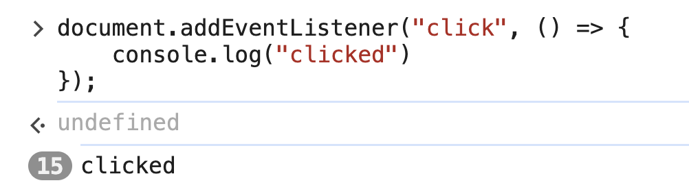

# 1. Event Listeners

Link: [https://frontendmasters.com/courses/javascript-first-steps/event-listeners/](https://frontendmasters.com/courses/javascript-first-steps/event-listeners/)

> The web browser fires *events* when certain things happen on the page
> 
> 
> For example, when the user clicks somewhere on the page, a `click` event is fired
> 

We can detect events with JS using an [*event listener*](https://developer.mozilla.org/en-US/docs/Web/API/EventTarget/addEventListener)

The `.addEventListener()` method lets us listen for events on a DOM element

```jsx
document.addEventListener("click", () => {
    console.log("clicked")
});
```



`.addEventListener()` takes 2 parameters:

- The name of the event to listen to (e.g. `"click"`)
- A *handler* function that JS calls when that event is fired on this element