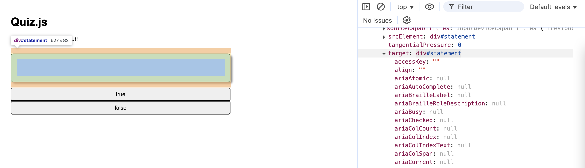
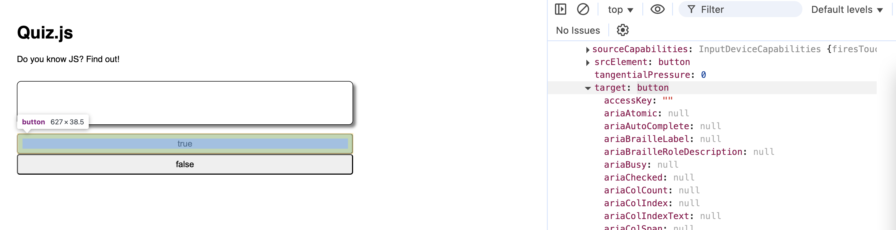
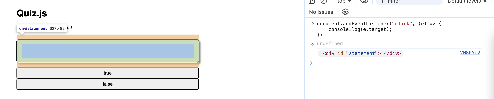
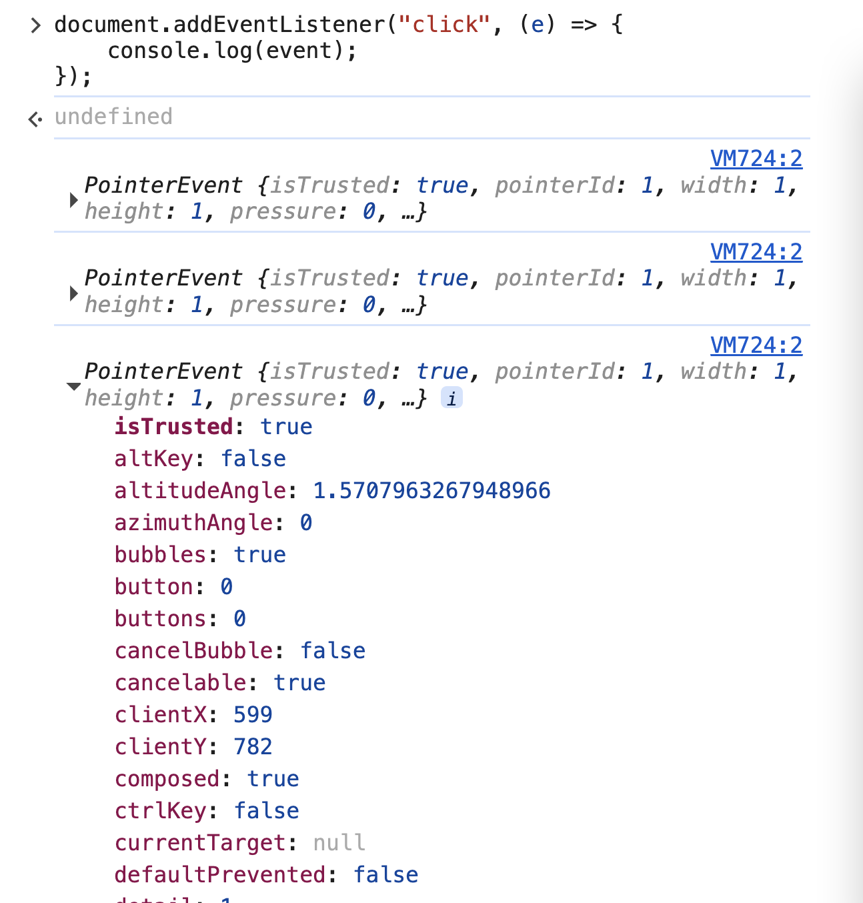

# 2. Event Object

Link: [https://frontendmasters.com/courses/javascript-first-steps/event-object/](https://frontendmasters.com/courses/javascript-first-steps/event-object/)

Read more:

- [https://developer.mozilla.org/en-US/docs/Web/Events/Creating_and_triggering_events](https://developer.mozilla.org/en-US/docs/Web/Events/Creating_and_triggering_events)
- [https://developer.mozilla.org/en-US/docs/Web/API/Event](https://developer.mozilla.org/en-US/docs/Web/API/Event)

> `.addEventListener()` takes 2 parameters:
> 
> - The name of the *event* to listen to (e.g. `"click"`)
> - A *handler* function that JS calls when that *event* is fired on this element

JS passes an `event` object to the *handler function* with information about the *event*

If we accept this as a parameter, we can use it to get details

```jsx
document.addEventListener("click", (event) => {
    console.log(event);
});
```

Sometimes the “*(event)*” can be abbreviated with the letter “*e*”

```jsx
document.addEventListener("click", (e) => {
    console.log(e);
});
```

We can have multiple *listeners* for the same *event* on the same *element* on the page


Adding another *listener* to the document that is also listening to the “click” *event*
Capturing the *event* as a parameter to our *handler* function

As we scroll down the list of the *event*, we can actually see the targeted element that was clicked on



Element *div#statement* was clicked on



*button* element was clicked on

In order to specify the element the *event* fired on, use [*event.target*](http://event.target) or *e.target*

```jsx
document.addEventListener("click", (e) => {
    console.log(e.target);
});
```



Notice: The argument that you pass inside the parameter and the argument that you pass into the console.log() do not have to be the same



["click"](https://developer.mozilla.org/en-US/docs/Web/API/Element/click_event) isn't the only type of event we can handle

- ["dblclick"](https://developer.mozilla.org/en-US/docs/Web/API/Element/dblclick_event)
- ["mouseover"](https://developer.mozilla.org/en-US/docs/Web/API/Element/mouseover_event)
- ["mouseout"](https://developer.mozilla.org/en-US/docs/Web/API/Element/mouseout_event)

...and *lots* [more](https://developer.mozilla.org/en-US/docs/Web/Events)!