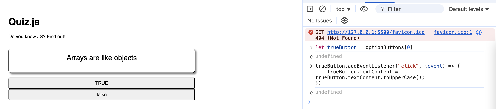
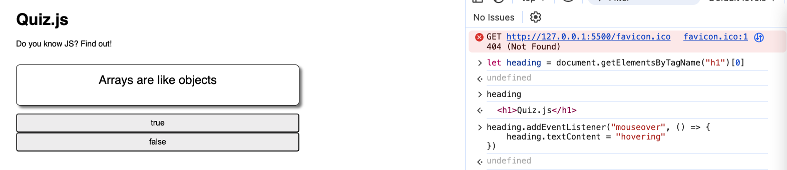
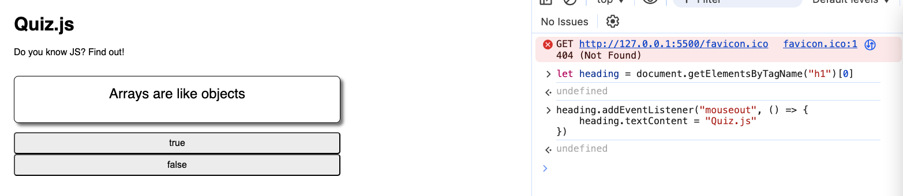
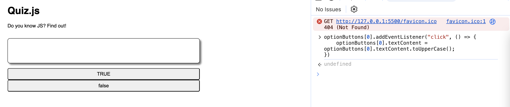
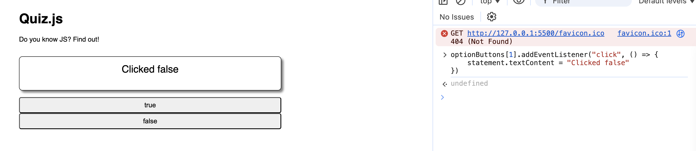

# 3. Events Exercise

Link: [https://frontendmasters.com/courses/javascript-first-steps/events-exercise/](https://frontendmasters.com/courses/javascript-first-steps/events-exercise/)

1. In the console, on our quiz add event listeners to:
- Capitalize the text of the “true” button when it is clicked
- Change the *h1* text to “hovering” when the mouse moves into the element
- Change the *h1* text to “Quiz.js” when the mouse moves out of the element
1. In the console, on our quiz add event listeners to the buttons so that:
- When the "true" button is clicked, the button's text becomes "clicked true"
- When the "false" button is clicked, the "explanation" div text becomes "clicked false"

Solutions:

1. In the console, on our quiz add event listeners to:
    - Capitalize the text of the “true” button when it is clicked
        
        ```jsx
        let trueButton = optionButtons[0]
        
        trueButton.addEventListener("click", (event) => {
            trueButton.textContent = trueButton.textContent.toUpperCase();
        })
        ```
        
        
        
    - Change the *h1* text to “hovering” when the mouse moves into the element
        
        ```jsx
        let heading = document.getElementsByTagName("h1")[0]
        
        heading.addEventListener("mouseover", () => {
            heading.textContent = "hovering"
        })
        ```
        
        
        
    - Change the *h1* text to “Quiz.js” when the mouse moves out of the element
        
        ```jsx
        let heading = document.getElementsByTagName("h1")[0]
        
        heading.addEventListener("mouseout", () => {
            heading.textContent = "Quiz.js"
        })
        ```
        
        
        
2. In the console, on our quiz add event listeners to the buttons so that:
    - When the "true" button is clicked, the button's text becomes "clicked true"
        
        ```jsx
        optionButtons[0].addEventListener("click", () => {
            optionButtons[0].textContent = optionButtons[0].textContent.toUpperCase();
        })
        ```
        
        
        
        Remember: Strings are **immutable**
        
    - When the "false" button is clicked, the "explanation" div text becomes "clicked false"
        
        ```jsx
        optionButtons[1].addEventListener("click", () => {
            statement.textContent = "Clicked false"
        })
        ```
        
        
        

Question:

- When changing the text for the “true” button and the “statement” elements
    - “true” button: I would need to reassign the button
        - to itself
            
            ```jsx
            optionButtons[0].addEventListener("click", () => {
                optionButtons[0].textContent = optionButtons[0].textContent.toUpperCase();
            })
            ```
            
        - to another variable
            
            ```jsx
            optionButtons[0].addEventListener("click", () => {
            		let trueButton = optionButtons[0]
            		trueButton.textContent = trueButton.textContent.toUpperCase();
            })
            ```
            
    - but for the “statement” I can use `textContent.toUpperCase()`  directly to it
        
        ```jsx
        optionButtons[1].addEventListener("click", () => {
            statement.textContent = "Clicked false"
        })
        ```
        
- What is the reason?
    
    Strings are **immutable**, their values cannot be changed after they are created.
    
    1. Using `toUpperCase()`
        
        ```
        trueButton.textContent = trueButton.textContent.toUpperCase();
        ```
        
        - `trueButton.textContent` gets the current text of the button (a string).
        - `.toUpperCase()` returns a **new** string in uppercase.
        - The original string **remains unchanged** (because strings are immutable).
        - We assign the **new string** back to `trueButton.textContent`.
    2. Assigning a new string directly
        
        ```
        trueButton.textContent = "something cool";
        ```
        
        - This simply **replaces** the old string with a new one.
        - `textContent` is a property that holds a string, so you can set it to any new string value.
- Why does `toUpperCase()` require reassignment?
    
    Because `toUpperCase()` (or any string method) **does not modify** the original string; instead, it creates a new one. If you don’t **explicitly assign** the new string back, the transformation is lost.
    
    This behavior is different from objects or arrays, which are **mutable** and can be modified in place.