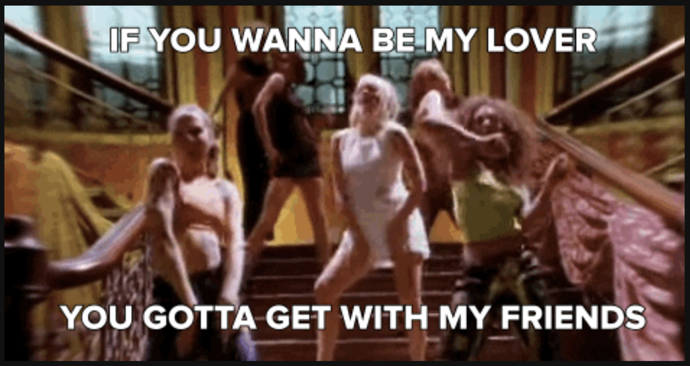
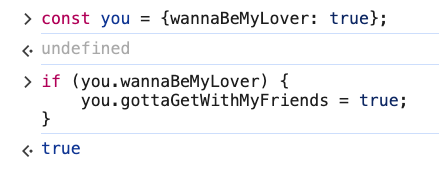
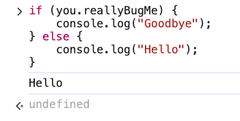
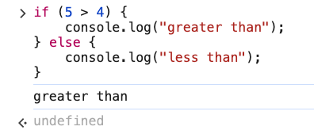
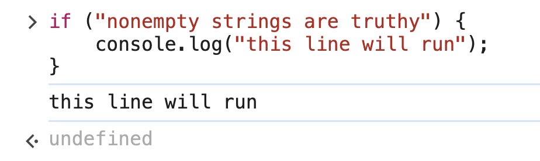
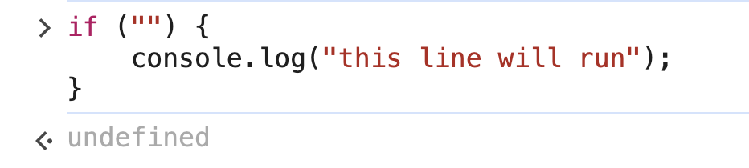
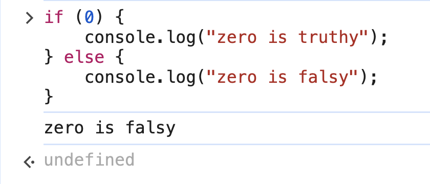

# 1. Conditionals

Link: [https://frontendmasters.com/courses/javascript-first-steps/conditionals/](https://frontendmasters.com/courses/javascript-first-steps/conditionals/)



- *if statements* let us execute code under a certain **condition**
    
    ```jsx
    const you = {wannaBeMyLover: true};
    if (you.wannaBeMyLover) {
        you.gottaGetWithMyFriends = true;
    }
    ```
    
    
    
    code in the *if* block only runs if the (*condition*) is *true*
    
    we can use *else* to run other code if (*condition*) is *false*
    
    ```jsx
    if (you.reallyBugMe) {
        console.log("Goodbye");
    } else {
        console.log("Hello");
    }
    ```
    
    
    
- What will happen when this code runs?
    
    ```jsx
    if (5 > 4) {
        console.log("greater than");
    } else {
        console.log("less than");
    }
    ```
    
    
    
- We can *chain* *else* and *if* blocks to account for *multiple conditions*
    
    ```jsx
    function compare(x, y) {
        if (x > y) {
            console.log(x, "is greater than", y);
        } else if (x < y) {
            console.log(x, "is less than", y);
        } else {
            console.log(x, "is equal to", y);
        }
    }
    ```
    
- The (*condition*) is usually an *expression* that evaluates to a *boolean*
    
    ```jsx
    if (forecast === "rain") {
        console.log("bring an umbrella");
    }
    ```
    
- Truthy and Falsey
    
    Strings in JavaScript are evaluated as truthy or falsy in a boolean context. An empty string (`""`) is falsy, while any non-empty string is truthy. However, they are still of type `string`, not `boolean`
    
    - Nonempty strings are [Truthy](https://developer.mozilla.org/en-US/docs/Glossary/Truthy)
        
        ```jsx
        if ("nonempty strings are truthy") {
            console.log("this line will run");
        }
        ```
        
        
        
        `"this line will run"`  is printed out to the console because the string `nonempty strings are truthy`  is evaluated to *truthy*
        
    - Empty strings are [Falsey](https://developer.mozilla.org/en-US/docs/Glossary/Falsy)
        
        ```jsx
        if ("") {
            console.log("this line will run");
        }
        ```
        
        
        
        `"this line will run"`  is NOT printed out to the console because the string `nonempty strings are truthy`  is evaluated to *falsey*
        
    - More example on *truthy* and *falsey*
        
        ```jsx
        if (0) {
            console.log("zero is truthy");
        } else {
            console.log("zero is falsy");
        }
        ```
        
        