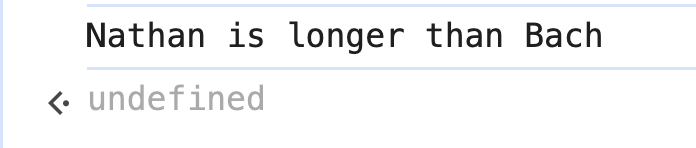
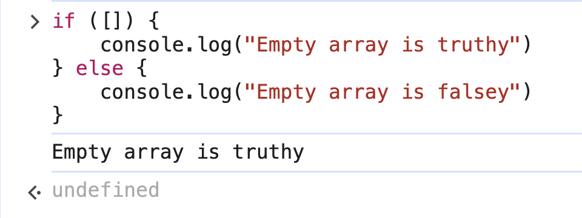
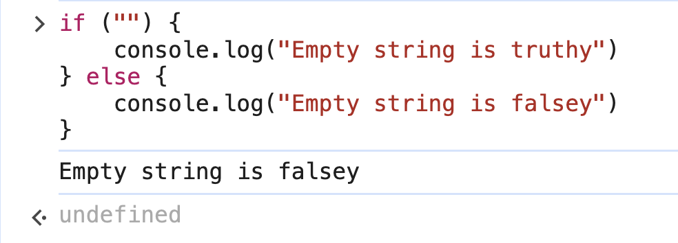
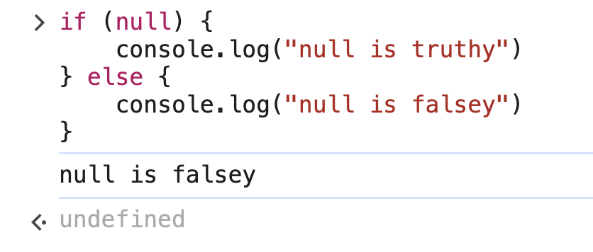
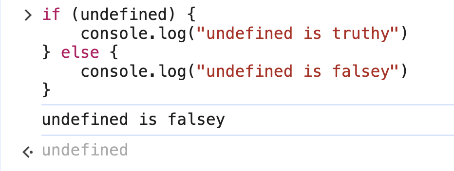
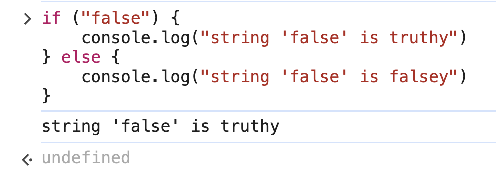

# 2. Conditionals Exercise

Link: [https://frontendmasters.com/courses/javascript-first-steps/conditionals-exercise/](https://frontendmasters.com/courses/javascript-first-steps/conditionals-exercise/)

## Exercises:

1. Write a conditional that logs a message saying whether your first name or last name is longer
2. Write a function `isEmpty(array)` that returns whether a given array is empty or not
3. Is an empty array truthy or falsy? Write a conditional to find out

## Solutions

1. Write a conditional that logs a message saying whether your first name or last name is longer
    - If the condition is *truthy*
        
        ```jsx
        let firstName = "Nathan"
        let lastName = "Bach"
        
        if (firstName.length > lastName.length) {
        	console.log(firstName, "is longer than", lastName)
        } else {
        	console.log(lastName, "is longer than", firstName)
        }
        ```
        
        
        
    - If the condition is *falsey*
        
        ```jsx
        let firstName = "Nhan"
        let lastName = "Bach"
        
        if (firstName.length > lastName.length) {
        	console.log("Your first name is longer")
        } else {
        	console.log("Your last name is longer")
        }
        ```
        
        
        
        The length for “Nhan” and “Bach” is the same, they are both 4 characters long.
        It is neither that “Nhan” nor “Bach” has more characters than the other, it is a tie, then JavaScript **automatically executes the `else` block**
        
2. Write a function `isEmpty(array)` that returns whether a given array is empty or not
    - Code sample 1 (Lecture code)
        
        ```jsx
        function isEmpty (array) {
        	if (array.length === 0) {
        		return true
        	} else {
        		return false
        	}
        }
        ```
        
        ```jsx
        isEmpty ([1,2,3]) // false
        isEmpty([]) // true
        ```
        
    - Code sample 2
        
        ```jsx
        const array1 = [1,2,3,4,5]
        
        const isEmpty = () => {
        	if (array1.length !== -1) {
        		return "The array1 is not empty"
        	} else {
        		return "The array1 is empty"
        	}
        }
        ```
        
        ```jsx
        isEmpty() // 'The array1 is not empty'
        ```
        
    - Further question from “Code sample 2”
        
        What is the difference between
        
        `array1.length !== -1` vs `!array1.length === -1` ?
        
        - `array1.length !== -1`
            
            The **length of an array is always 0 or a positive integer** (0, 1, 2, 3, ...).
            
            **Since array lengths can never be -1**, this ondition will always be **true**.
            
        - `!array1.length === -1`
            
            Why is this **incorrect?**
            
            This condition is **not** doing what you might expect due to **operator precedence**.
            
            Breakdown:
            
            1. `!array1.length` negates the **length** of the array.
                - If `array1.length = 0`, then `!array1.length` → `true` (because `!0` is `true`).
                - If `array1.length = 5`, then `!array1.length` → `false` (because `!5` is `false`).
            2. Now, it compares **`true === -1`** or **`false === -1`**, which is always **false** because:
                - `true` is not `-1`
                - `false` is not `-1`
            
            So the condition `!array1.length === -1` **will never be true**.
            
            If you intended to check **if an array length is NOT equal to -1**, use **parentheses** to make sure the negation is applied properly:
            
            ```jsx
            if (!(array1.length === -1)) {
                console.log("Condition met!");
            }
            ```
            
3. Is an empty array truthy or falsy? Write a conditional to find out
    
    ```jsx
    if ([]) {
    	console.log("Empty array is truthy")
    } else {
    	console.log("Empty array is falsey")
    }
    ```
    
    
    
    Since empty arrays are *truthy*, objects are also *truthy* because arrays are objects
    
4. Extra questions
    - Are empty strings *truthy* or *falsey*
        
        ```jsx
        if ("") {
        	console.log("Empty string is truthy")
        } else {
        	console.log("Empty string is falsey")
        }
        ```
        
        
        
    - Why empty array is *truthy* but empty string is *falsey*?
        - Empty array has indices and we can always push stuff in it
        - Strings are immutable, it can never be changed. An empty string is never going to have stuff in it.
    - null
        
        ```jsx
        if (null) {
        	console.log("null is truthy")
        } else {
        	console.log("null is falsey")
        }
        ```
        
        
        
    - undefined
        
        ```jsx
        if (undefined) {
        	console.log("undefined is truthy")
        } else {
        	console.log("undefined is falsey")
        }
        ```
        
        
        
    - String “false”
        
        ```jsx
        if ("false") {
        	console.log("string 'false' is truthy")
        } else {
        	console.log("string 'false' is falsey")
        }
        ```
        
        
        
        String “false” is *truthy* because it is not an empty string
        
    - Summary
        - **Non-primitive types** (Objects, Arrays, Functions) are ALWAYS *truthy*
        - **Primitive types** (String, Number, Boolean, Null, Undefined, Symbol, BigInt) are MOSTLY *truthy* except `"", 0, false, null, undefined, NaN`