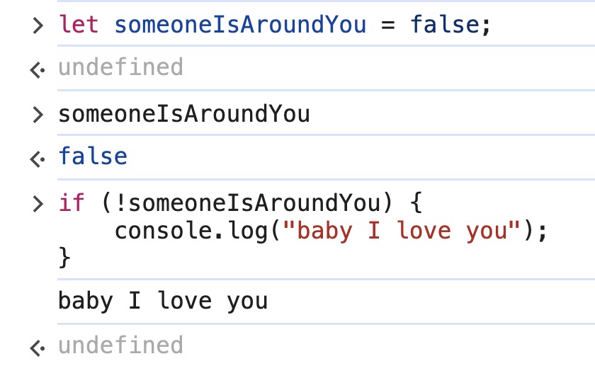
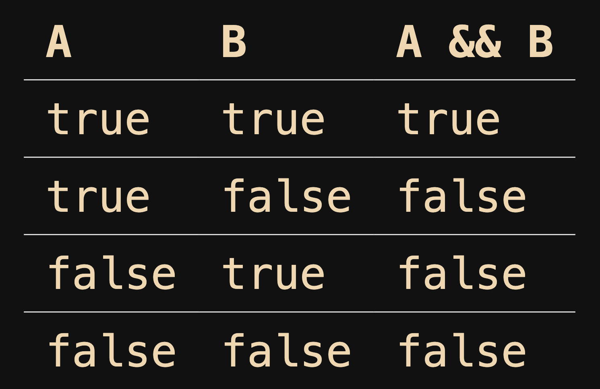
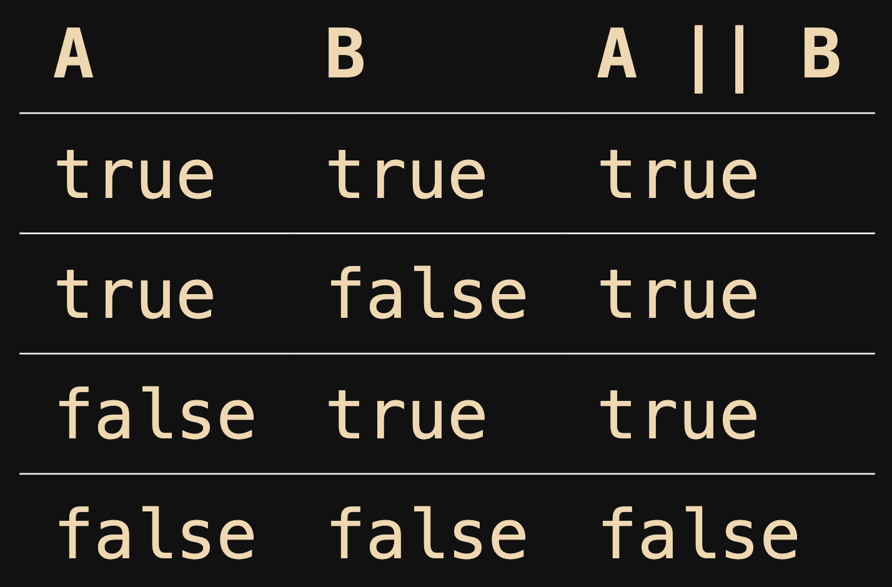
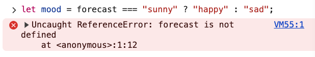
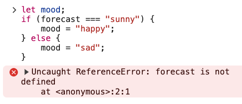
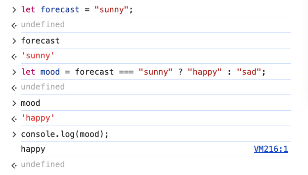

# 3. Logical & Ternary Operators

Link: [https://frontendmasters.com/courses/javascript-first-steps/logical-ternary-operators/](https://frontendmasters.com/courses/javascript-first-steps/logical-ternary-operators/)

**Boolean (logical) operators**

Sometimes we care about the *opposite* of a value

```jsx
let someoneIsAroundYou = false; 
if (!someoneIsAroundYou) {
    console.log("baby I love you");
}
```



- The `!`  (not) operator negates a boolean (gives its opposite)
    
    Sometimes we care about the *truthiness* of more than one value
    
    ```jsx
    if (you.happy && you.knowIt) {
        you.clapHands();
    }
    ```
    
- *Logical operators* let us make two boolean values become one
    
    
    
    - Logical "and" (&&) requires *both* values to be *truthy*
        
        
        
    - Logical "or" (||) requires only *one* value to be *truthy*
        
        
        
- Conditional ternary operator
    
    JS also has a "shortcut" operator for writing quick conditionals
    
    it needs 3 values to work:
    
    ```jsx
    condition ? valueIfTrue : valueIfFalse;
    ```
    
    - Example:
        
        ```jsx
        let mood = forecast === "sunny" ? "happy" : "sad";
        ```
        
        **Step 1: Condition Evaluation (`forecast === "sunny"`)**
        
        - The expression checks if the value of `forecast` is `"sunny"`.
        - This is a **comparison (`===`)** that returns either `true` or `false`.
        
        **Step 2: Ternary Operator (`? :`)**
        
        - **If `forecast === "sunny"` is `true`**, `"happy"` is assigned to `mood`.
        - **If `forecast === "sunny"` is `false`**, `"sad"` is assigned to `mood`.
        
        is equivalent to
        
        ```jsx
        let mood;
        if (forecast === "sunny") {
            mood = "happy";
        } else {
            mood = "sad";
        }
        ```
        
    - Question:
        
        Why do we have the error
        `Uncaught ReferenceError: forecast is not defined` 
        for both code?
        
        
        
        
        
        **Reason:** Because the variable `forecast` was not declared before using it
        
        **Solution:**
        
        Declare the variable before using it
        
        ```jsx
        let forecast = "sunny"; // Define the variable
        ```
        
        **Test:**
        
        ```jsx
        let forecast = "sunny";
        let mood = forecast === "sunny" ? "happy" : "sad";
        mood // 'happy'
        ```
        
        