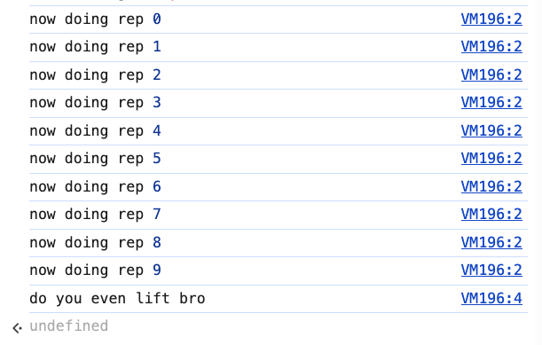
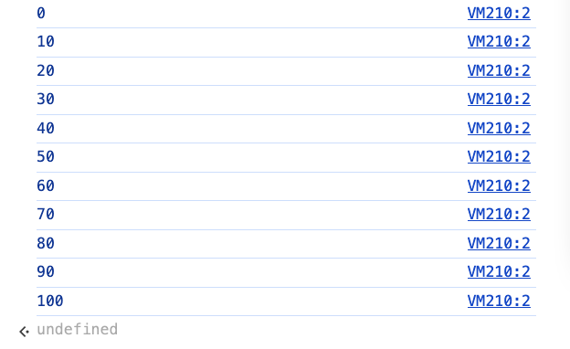
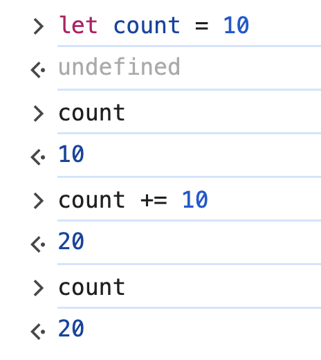
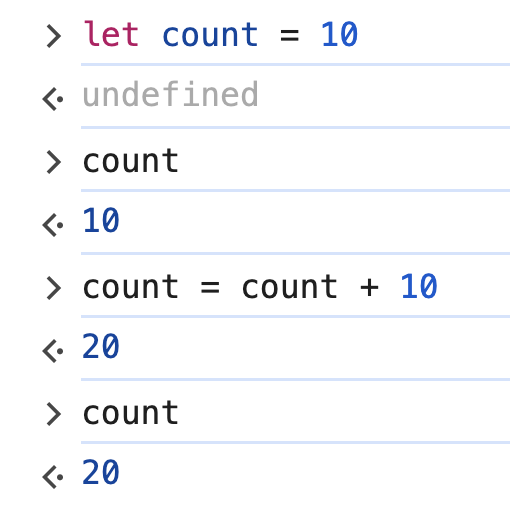
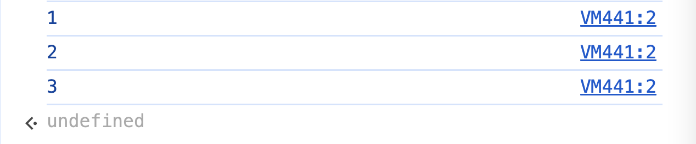
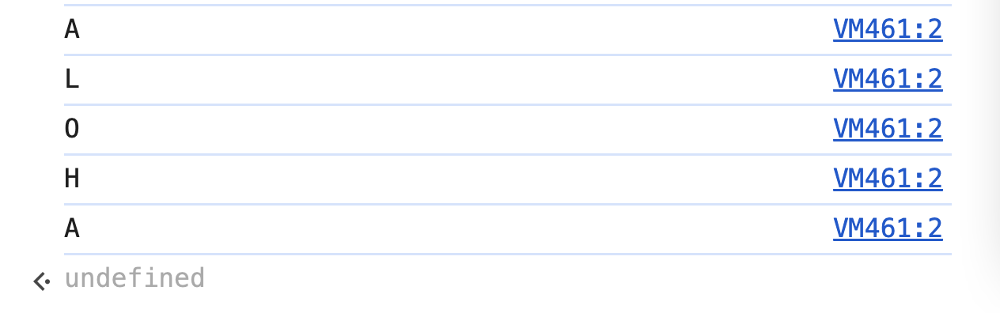
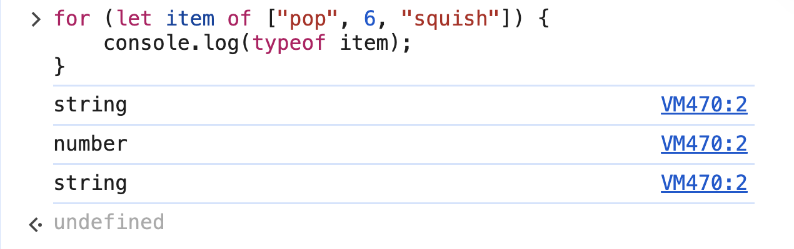

# 4. Loops

Link: [https://frontendmasters.com/courses/javascript-first-steps/loops/](https://frontendmasters.com/courses/javascript-first-steps/loops/)

**Loop and iteration:** [https://developer.mozilla.org/en-US/docs/Web/JavaScript/Guide/Loops_and_iteration](https://developer.mozilla.org/en-US/docs/Web/JavaScript/Guide/Loops_and_iteration)


- ***Loops*** let us run the same chunk of code multiple times
    
    ```jsx
    for (let rep = 0; rep < 10; rep += 1) {
        console.log("now doing rep", rep);
    }
    console.log("do you even lift bro");
    ```
    
    
    
    this is called ***iteration***
    
- [**for**](https://developer.mozilla.org/en-US/docs/Web/JavaScript/Reference/Statements/for) loops require us to:
    - declare & initialize a loop counter
    - give a condition for the loop to keep running
    - describe how to change (usually increment) the counter each time
    
    ```jsx
    for (let count = 0; count <= 100; count += 10) {
        console.log(count);
    }
    ```
    
    
    
    Incrementation:
    
    ```jsx
    count += 10 // count = count + 10
    ```
    
    
    
    is equivalent to
    
    ```jsx
    count = count + 10
    ```
    
    
    
- [**for ... of**](https://developer.mozilla.org/en-US/docs/Web/JavaScript/Reference/Statements/for...of) loops let us more easily iterate over items in a collection
    - For **array**
        
        ```jsx
        const numbers = [1,2,3];
        ```
        
        - Traditional **for** loop
            
            ```jsx
            for (let i = 0; i < numbers.length; i++) {
                console.log(numbers[i]);
            }
            ```
            
            
            
            
            
        - **for … of** loop
            
            ```jsx
            for (let n of numbers) {
                console.log(n);
            }
            ```
            
            
            
    - For **string**
        
        ```jsx
        for (let char of "ALOHA") {
            console.log(char);
        }
        ```
        
        
        
    - **Items** in an **array**
        
        ```jsx
        for (let item of ["pop", 6, "squish"]) {
            console.log(typeof item);
        }
        ```
        
        
        
    
    **strings** & **arrays** are **“iterables”**