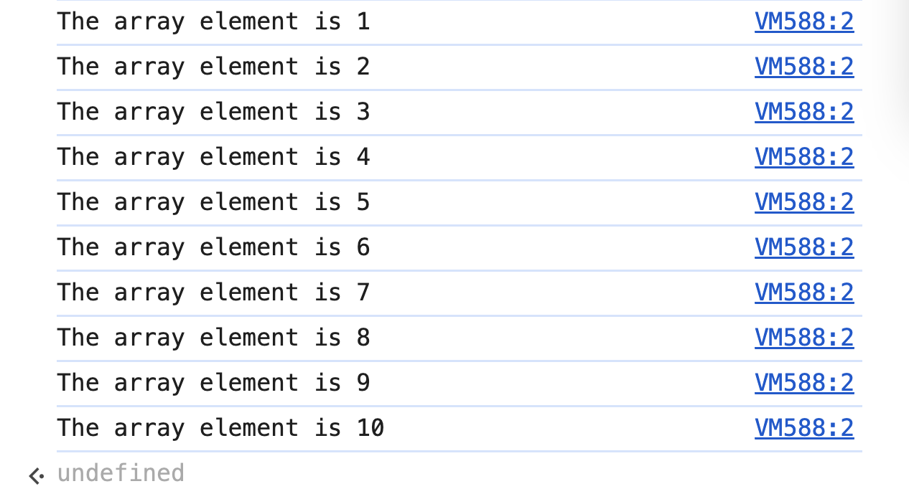
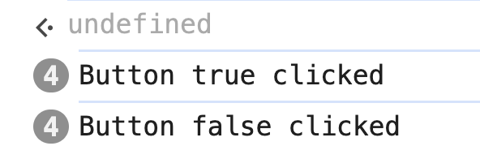
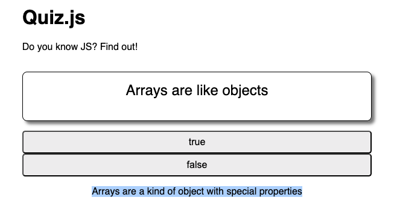
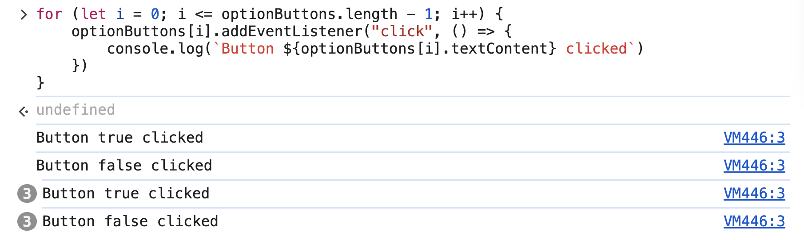

# 5. Explanation Loop Project Exercise

Link: [https://frontendmasters.com/courses/javascript-first-steps/explanation-loop-project-exercise/](https://frontendmasters.com/courses/javascript-first-steps/explanation-loop-project-exercise/)

How the **for** loop runs

- Given the array
    
    ```jsx
    const nums = [1,2,3,4,5,6,7,8,9,10]
    ```
    
- Print out all the elements in the array **nums** using **for** loop
    
    ```jsx
    for (let i = 0; i <= nums.length - 1; i++) {
    	console.log(`The array element is ${nums[i]}`)
    }
    ```
    
    
    
- Order of Execution
    
    1️⃣ **Initialization:** `let i = 0;` ****(Runs only once before the loop starts).
    
    2️⃣ **Condition Check:** `i <= nums.length - 1`  (If `true`, continue; if `false`, stop).
    
    3️⃣ **Loop Body Runs:** Executes `console.log(`The array element is ${nums[i]}`)`
    
    4️⃣ **Increment Happens:** `i++` ****(Increases `i` by `1`).
    
    5️⃣ **Go Back to Step 2:** Check the condition again.
    

## Exercise

In our quiz, follow TODOs 6 & 7 to

- Use a `for...of` loop to attach an event listener to each button
    
    ```jsx
    for (let button of optionButtons) {
        button.addEventListener("click", (event) => {
        })
    }
    ```
    
    
    
- Within the event handler, populate the `explanation` text in the given element
    
    We have the **fact** object
    
    ```jsx
    const fact = {
        statement: "Arrays are like objects",
        answer: true,
        explanation: "Arrays are a kind of object with special properties"
    }
    ```
    
    Show the *explanation* from **fact** object when clicking on the button
    
    ```jsx
    for (let button of optionButtons) {
        button.addEventListener("click", (event) => {
            explanation.textContent = fact.explanation
        })
    }
    ```
    
    
    
- Extra challenge, loop over the buttons using the traditional **for** loop
    
    ```jsx
    for (let i = 0; i <= optionButtons.length - 1; i++) {
        optionButtons[i].addEventListener("click", () => {
            console.log(`Button ${optionButtons[i].textContent} clicked`)
        })
    }
    ```
    
    