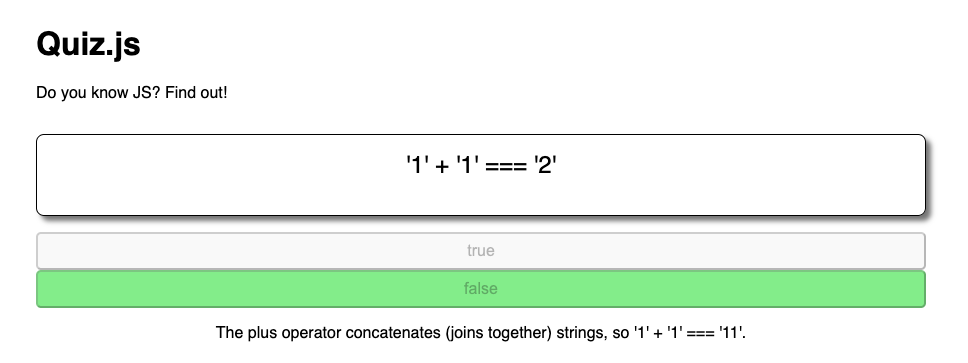
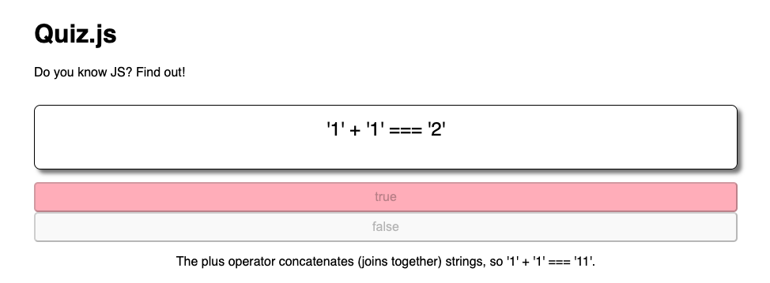
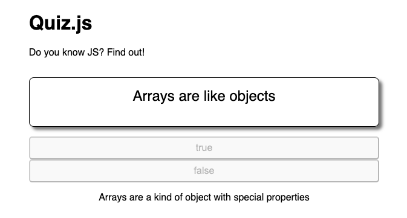
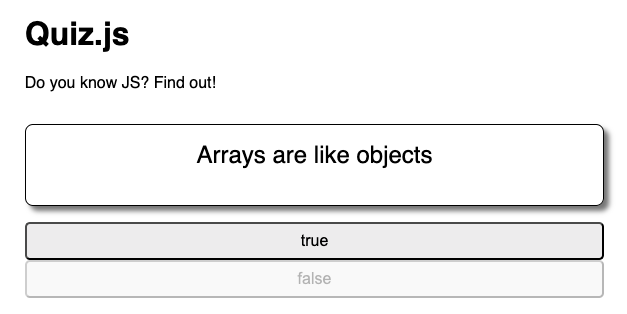

# 6. Disable Loop Project Exercise

Link: [https://frontendmasters.com/courses/javascript-first-steps/disable-loop-project-exercise/](https://frontendmasters.com/courses/javascript-first-steps/disable-loop-project-exercise/)

Event handling (overview): [https://developer.mozilla.org/en-US/docs/Web/Events/Event_handlers](https://developer.mozilla.org/en-US/docs/Web/Events/Event_handlers)

EventTarget: [https://developer.mozilla.org/en-US/docs/Web/API/EventTarget/addEventListener](https://developer.mozilla.org/en-US/docs/Web/API/EventTarget/addEventListener)

- Requirements
    - When the **guess** is *correct*
        
        
        
    - When the **guess** is *incorrect*
        
        
        
    
    Once the **guess** is *made*, all the **buttons** are *disabled*, no more **guess** can be made
    

- In our quiz, follow TODOs 6 & 7 to
    - Use a `for...of` loop to attach an event listener to each button - Done with this code
        
        ```jsx
        for (let button of optionButtons) {
        	button.addEventListener("click", (event) => {
        	})
        }
        ```
        
    - Within the event handler,
        - populate the `explanation` text in the given element - Done in the “5. Explanation Loop Project Exercise” lesson with the code below
            
            ```jsx
            for (let button of optionButtons) {
            	button.addEventListener("click", (event) => {
            		explanation.textContent = fact.explanation
            	})
            }
            ```
            
        - Use another `for...of` loop to disable all the buttons
            
            We are going to reuse the **disable** function that we created earlier
            
            ```jsx
            const disable = (button) => {
            	button.setAttribute("disabled", "")
            }
            ```
            
            Reuse the **disable** function for the buttons
            
            ```jsx
            for (let button of optionButtons) {
            	button.addEventListener("click", (event) => {
            		explanation.textContent = fact.explanation
            		
            		for (let disabledButton of optionButtons) {
            			disable(disabledButton)
            		}
            	})
            }
            ```
            
            
            

- Question 1:
    
    Why we declare the arrow function without any parentheses next to the function name but when we call the function on a variable we can pass the variable inside the parens next to the function name?
    
    Below is how we define an arrow function
    
    ```jsx
    const disable = (button) => {
    	button.setAttribute("disabled", "")
    }
    ```
    
    - Here, `button` is just a **placeholder**.
    - It doesn't have a value yet.
    
    When you **call** the function with an argument:
    
    ```jsx
    disable(disabledButton);
    ```
    
    `disabledButton` is **assigned** to `button`, and the function runs.
    
    **Answer:** This is just the different syntaxes between declaring and calling a function
    

- Question 2:
    
    Why this code snippet works on all the buttons while I only click on one button at a time?
    
    ```jsx
    for (let disabledButton of optionButtons) {
    	disable(disabledButton)
    }
    ```
    
    **Answer:**
    
    You’re only **clicking one button** at a time — **but** the code is **manually looping through and disabling all of them**, not just the one you clicked.
    
    The code **doesn’t care** which button you clicked.
    
    It simply says:
    
    > “Hey JavaScript, go through all the buttons in `optionButtons` one by one, and disable them all.”
    > 
    
    The full code
    
    ```jsx
    for (let button of optionButtons) {
    	button.addEventListener("click", (event) => {
    		for (let disabledButton of optionButtons) {
    			disable(disabledButton);
    		}
    	});
    }
    ```
    
    When **you click one button**, the click listener fires, and then that listener goes
    
    > “Okay, now disable every single button in optionButtons.”
    > 
    
    It doesn’t just act on the one you clicked — it acts on **all of them**, because the loop is explicitly telling it to.
    

- Question 3: Modify the code in Question 2 so that
    
    The program will only disable the button you clicked on
    
    You can try either of the code
    
    ```jsx
    for (let button of optionButtons) {
    	button.addEventListener("click", (event) => {
    		disable(event.currentTarget); // disables only the clicked one
    	});
    }
    ```
    
    or
    
    ```jsx
    for (let button of optionButtons) {
    	button.addEventListener("click", () => {
    		disable(button);
    	});
    }
    ```
    
    **Result:**
    
    