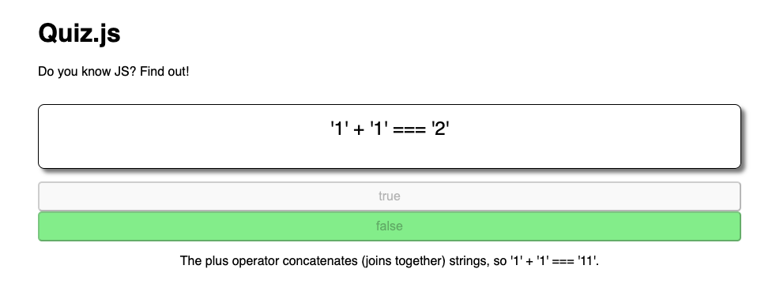
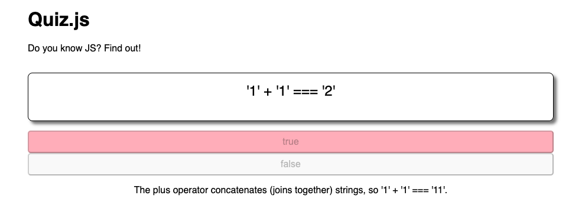
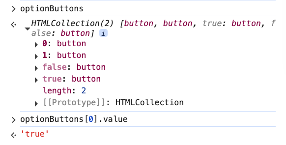
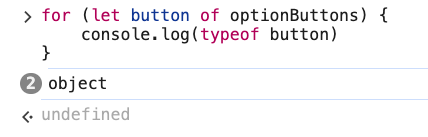
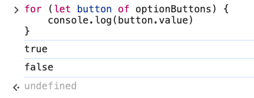

# 7. isCorrect Project Exercise

Link: [https://frontendmasters.com/courses/javascript-first-steps/iscorrect-project-exercise/](https://frontendmasters.com/courses/javascript-first-steps/iscorrect-project-exercise/)

- Exercise
    
    In our Quiz, follow TODO 8 to complete the event handler function:
    
    - Get the guessed value, i.e. value of whichever button was clicked
    - Compare the guessed value to the real answer using your `isCorrect` function
    - Use a conditional to add the "correct" or "incorrect" class to the clicked button
    
    `element.classList.add("classname")` lets you add a CSS class
    

- Requirements
    
    Tell the users whether or not they click on a correct value
    
    - Correct - Button goes green
        
        
        
    - Incorrect - Button goes red
        
        
        

- Solution:
    
    The program we are having
    
    ```jsx
    for (let button of optionButtons) {
    	button.addEventListener("click", () => {
    		explanation.textConent = fact.explanation // show explanation text from the "fact" object
    		
    		for (let disabledButton of optionButtons) {
    			disable(disabledButton) // Once one of the buttons is clicked, all buttons will be disabled
    		}
    	})
    }
    ```
    
    **Next tasks**
    
    - Get the guessed value, i.e. value of whichever button was clicked
        
        ```jsx
        button.value
        ```
        
        Explanation:
        
        In this **for** loop, we already have the variable **button** to be one of the buttons in the page
        
        ```jsx
        for (let button of optionButtons)
        ```
        
        And just like how we can access the property within each button as **optionButtons[0].value** and **optionButtons[1].value**.
        
        
        
        Each **button** is an object, we can access the object property using the “dot” notation
        
        
        
        
        
    - Compare the guessed value to the real answer using your `isCorrect` function
        
        This is the **isCorrect** function
        
        ```jsx
        function isCorrect(guess) {
            return guess === fact.answer.toString()
        }
        ```
        
        Using the **isCorrect** function for the comparison with the value of the button
        
        ```jsx
        for (let button of optionButtons) {
        	button.addEventListener("click", () => {
        		explanation.textConent = fact.explanation // show explanation text from the "fact" object
        		
        		for (let disabledButton of optionButtons) {
        			disable(disabledButton) // Once one of the buttons is clicked, all buttons will be disabled
        		}
        		
        		if (isCorrect(button.value)) {
        			// TODO if correct answer
        		} else {
        			// TODO if incorrect answer
        		}
        	})
        }
        ```
        
    - Use a conditional to add the "correct" or "incorrect" class to the clicked button 
    `element.classList.add("classname")` lets you add a CSS class
        
        This is the styling
        
        ```jsx
        .correct {
            background-color: lightgreen;
        }
        .incorrect {
            background-color: lightpink;
        }
        ```
        
        This is the full code
        
        ```jsx
        for (let button of optionButtons) {
        	button.addEventListener("click", () => {
        		explanation.textConent = fact.explanation // show explanation text from the "fact" object
        		
        		for (let disabledButton of optionButtons) {
        			disable(disabledButton) // Once one of the buttons is clicked, all buttons will be disabled
        		}
        		
        		if (isCorrect(button.value)) {
        			// TODO if correct answer
        			button.classList.add("correct")
        		} else {
        			// TODO if incorrect answer
        			button.classList.add("incorrect")
        		}
        	})
        }
        ```
        
    
    **The approach:**
    
    - Step 1: We need to understand which button the user just clicked.
    - Step 2: Determining whether the user’s guess is correct or not using the **isCorrect** program we wrote.
    - Step 3: Use the conditional to change the style of the button using the property **classList**
    `element.classList.add("classname")`  using the styling we’re having