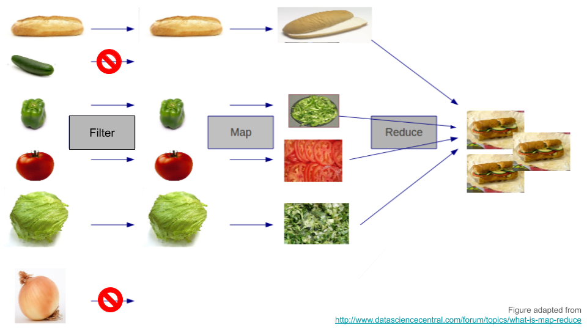
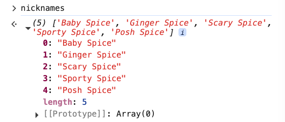
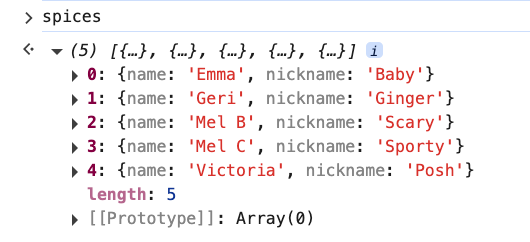
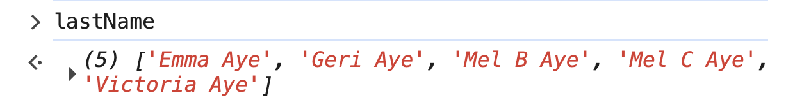
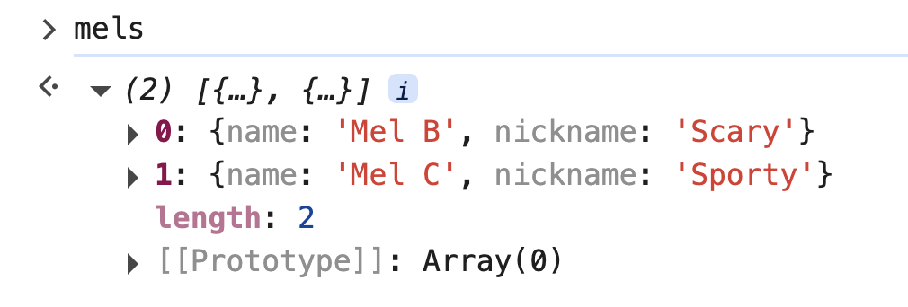
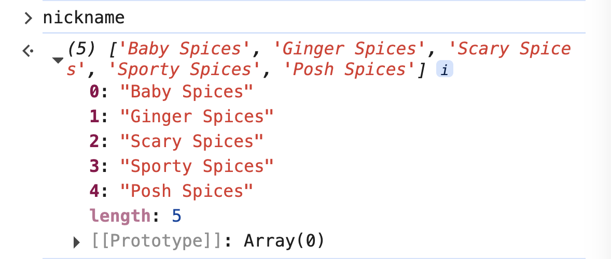
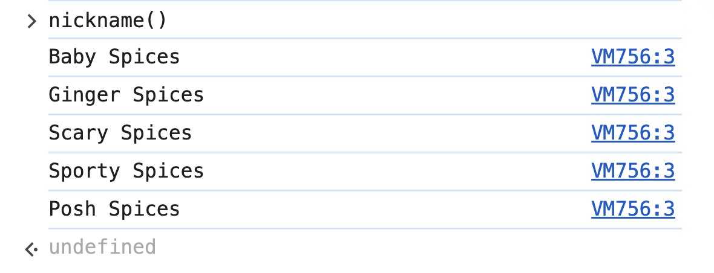
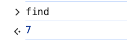
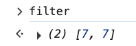

# 1. map & filter

Link: [https://frontendmasters.com/courses/javascript-first-steps/map-filter/](https://frontendmasters.com/courses/javascript-first-steps/map-filter/)

- MDN:
    - map: [https://developer.mozilla.org/en-US/docs/Web/JavaScript/Reference/Global_Objects/Array/map](https://developer.mozilla.org/en-US/docs/Web/JavaScript/Reference/Global_Objects/Array/map)
    - filter: [https://developer.mozilla.org/en-US/docs/Web/JavaScript/Reference/Global_Objects/Array/filter](https://developer.mozilla.org/en-US/docs/Web/JavaScript/Reference/Global_Objects/Array/filter)

The **map** & **filter** methods also let us process all the items in an array



- What they do
    - filter: Say we’re given an array of **ingredients**, filter will help us to filter out the ingredients we don’t want.
    - map: Use map to do something to each of the things that are left. For example, we have the **chop** function, we can then **chop** up the remaining of the ingredients.
    
    Furthermore, **reduce** is the third method that will be talked more in [**Functional JavaScript First Steps, v2**](https://frontendmasters.com/courses/functional-first-steps-v2/).
    

- **map** calls a function on each item in an array to create a new array
    - Sample
        
        ```jsx
        const spices = [
            {name: "Emma", nickname: "Baby"},
            {name: "Geri", nickname: "Ginger"},
            {name: "Mel B", nickname: "Scary"},
            {name: "Mel C", nickname: "Sporty"},
            {name: "Victoria", nickname: "Posh"}
        ];
        const nicknames = spices.map(s => s.nickname + " Spice");
        ```
        
        
        
        The **spices** array stays **unchanged**
        
        
        
    - Different ways to treat *strings*.
        
        The syntaxes we have been using with strings so far are
        
        ```jsx
        "stringy" // double quotes
        'stringy' // single quotes
        ```
        
        The third type of syntax is backticks ````
        
        ```jsx
        `stringy`
        ```
        
        USEFUL thing about backticks is that they allow us to *interpolate* different variables or other values inside of the string.
        
        ```jsx
        `The sum of 1 and 2 is ${1+2}` // "The sum of 1 and 2 is 3"
        ```
        
        These two strings are equivalent
        
        ```jsx
        s => `${s.nickname} Spice`;
        ```
        
        and
        
        ```jsx
        s => s.nickname + " Spice"
        ```
        
    - The equivalent function
        
        Arrow function (modify **nickname**)
        
        ```jsx
        const nicknames = spices.map(s => s.nickname + " Spice");
        ```
        
        Function declaration (modify **name**)
        
        ```jsx
        const lastName = spices.map(function (s) {
        	return s.name + " Aye"
        })
        ```
        
        
        

- [Filter](https://developer.mozilla.org/en-US/docs/Web/JavaScript/Reference/Global_Objects/Array/filter) calls a **true/false function** on each item and creates a **new array** with only the items where the **function returns true**
    
    ```jsx
    const mels = spices.filter(s => s.name.includes("Mel"));
    ```
    
    Given the object
    
    ```jsx
    const spices = [
        {name: "Emma", nickname: "Baby"},
        {name: "Geri", nickname: "Ginger"},
        {name: "Mel B", nickname: "Scary"},
        {name: "Mel C", nickname: "Sporty"},
        {name: "Victoria", nickname: "Posh"}
    ];
    ```
    
    Result:
    
    
    

- Question:
    
    These two programs can give the same output, do they do the same thing?
    
    ```jsx
    const nicknames = spices.map(s => s.nickname + " Spice");
    ```
    
    and
    
    ```jsx
    const nickname = function () {
        for (let s of spices) {
            console.log(s.nickname + " Spices")
        }
    }
    ```
    
    **Answer:**
    
    The short answer is: **no, those two programs don’t do the same thing**.
    
    - Program 1:
        
        ```jsx
        const nicknames = spices.map(s => s.nickname + " Spice");
        ```
        
        - It **creates a new array**.
        - Each element in the new array is a string like `"Baby Spice"`, `"Ginger Spice"`, etc.
        - That new array is stored in the variable `nicknames`.
        
        Result:
        
        ```jsx
        ["Baby Spice", "Ginger Spice", "Scary Spice", "Sporty Spice", "Posh Spice"]
        ```
        
        
        
    - Program 2:
        
        ```jsx
        const nickname = function () {
            for (let s of spices) {
                console.log(s.nickname + " Spices")
            }
        }
        ```
        
        - This **does not return or create a new array**.
        - Instead, it just logs each nickname to the console with `" Spices"` (note: plural).
        - Also, the parameter `s` in the function is never used — it’s overwritten inside the `for...of` loop.
        - And the function is never even *called*, so nothing will happen unless you call `nickname()`.
        
        Result: You have to call the function in order to see the result
        
        ```jsx
        nickname(); // logs the nicknames but does NOT return anything
        ```
        
        

- Bonus: find() vs filter()
    - [find()](https://developer.mozilla.org/en-US/docs/Web/JavaScript/Reference/Global_Objects/Array/find) - this method returns the **first** element in the provided array that **satisfies** the provided **testing** function. If no values satisfy the testing function, [`undefined`](https://developer.mozilla.org/en-US/docs/Web/JavaScript/Reference/Global_Objects/undefined) is returned.
        
        ```jsx
        const array = [1,5,7,8,9,7]
        
        const found = array1.find((element) => element === 7);
        
        console.log(found);
        // Expected output: 7
        ```
        
        
        
        Syntax
        
        ```jsx
        find(callbackFn)
        find(callbackFn, thisArg)
        ```
        
    - [filter()](https://developer.mozilla.org/en-US/docs/Web/JavaScript/Reference/Global_Objects/Array/filter) - this method creates a [shallow copy](https://developer.mozilla.org/en-US/docs/Glossary/Shallow_copy) of a **portion** of a given array, filtered down to just the elements from the given array that pass the test implemented by the provided function.
        
        ```jsx
        const array2 = [1,5,7,8,9,7]
        
        const filtered = array2.filter((element) => element === 7);
        
        console.log(filtered);
        // Expected output: [7,7]
        ```
        
        
        
        Syntax
        
        ```jsx
        filter(callbackFn)
        filter(callbackFn, thisArg)
        ```