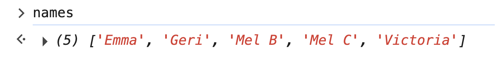
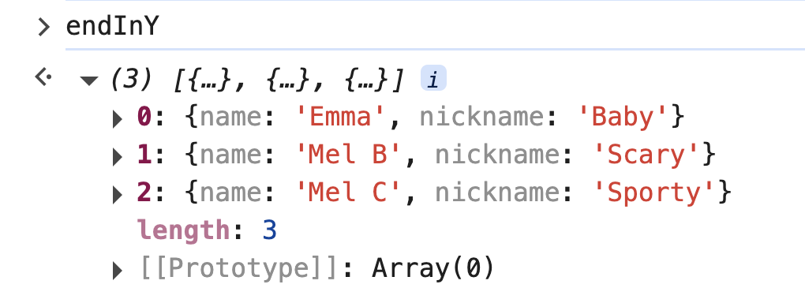

# 2. map & filter Exercise

Link: [https://frontendmasters.com/courses/javascript-first-steps/map-filter-exercise/](https://frontendmasters.com/courses/javascript-first-steps/map-filter-exercise/)

- **Exercise:**
    
    From the `spices` array, use `map` and `filter` to:
    
    - create a new array `names` with only the name of each girl
    - create a new array `endInY` with just the girls whose nickname ends in "y"

- **Solution:**
    
    Given the array
    
    ```jsx
    const spices = [
        {name: "Emma", nickname: "Baby"},
        {name: "Geri", nickname: "Ginger"},
        {name: "Mel B", nickname: "Scary"},
        {name: "Mel C", nickname: "Sporty"},
        {name: "Victoria", nickname: "Posh"}
    ];
    ```
    
    - create a new array `names` with only the name of each girl
        
        ```jsx
        const names = spices.map(s => s.name)
        ```
        
        
        
    - create a new array `endInY` with just the girls whose nickname ends in "y"
        
        ```jsx
        const endInY = spices.filter(s => s.nickname.endsWith("y"))
        ```
        
        
        
    - Write an equivalent program to create a new array `endInY` with just the girls whose nickname ends in "y". This time use *length*.
        
        ```jsx
        const endInY = spices.filter(s => s.nickname[s.nickname.length-1] === "y")
        ```