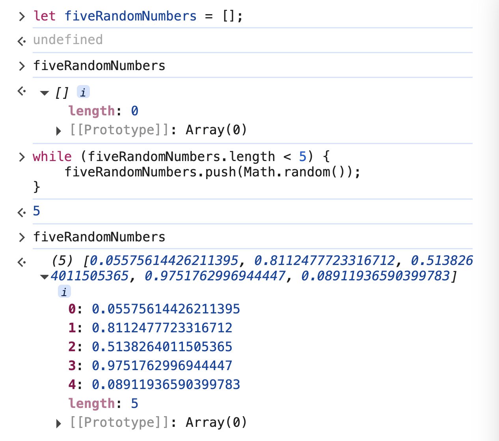
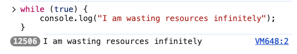

# 2. while Loops

Link: [https://frontendmasters.com/courses/javascript-first-steps/while-loops/](https://frontendmasters.com/courses/javascript-first-steps/while-loops/)

Loops …continued

[**while**](https://developer.mozilla.org/en-US/docs/Web/JavaScript/Reference/Statements/while) loops - loop on loops


let us run a chunk of code **over & over** if a **(condition)** is **true**

```jsx
let fiveRandomNumbers = [];
while (fiveRandomNumbers.length < 5) {
    fiveRandomNumbers.push(Math.random());
}
```



The **while** loop really cares about the condition, as long as the condition is true it will keep adding more numbers with *Math.random()* to the array **fiveRandomNumbers**.

The condition is `fiveRandomNumbers.length < 5`  , and when there are five numbers added to the array **fiveRandomNumbers**, the **while** loop will stop looping.

Don’t use **while(true)** unless you want to see your computer burn!

```jsx
while (true) {
    console.log("I am wasting resources infinitely");
}
```



