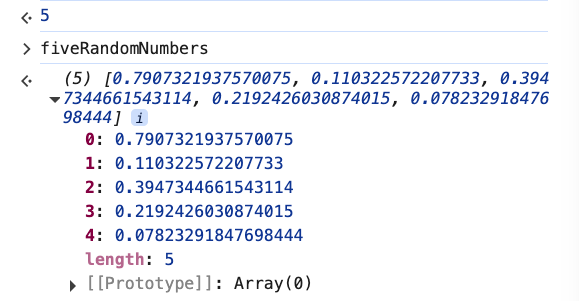
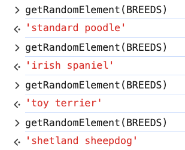
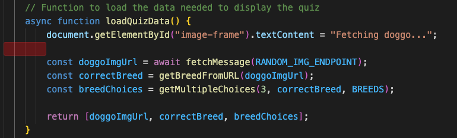

# 4. Doggo Quiz while Solution

Link: [https://frontendmasters.com/courses/javascript-first-steps/doggo-quiz-while-solution/](https://frontendmasters.com/courses/javascript-first-steps/doggo-quiz-while-solution/)

TODO 1
Given an array of possible answers, a correct answer value, and a number of choices to get,
return a list of that many choices, including the correct answer and others from the array

```jsx
function getMultipleChoices(n, correctAnswer, array) {
    // Use a while loop and the getRandomElement() function
    // Make sure there are no duplicates in the array
		
}
```

- Step 1: We need an array of multiple choices option, **n** multiple choice options, which is what we are going to return from the function, the first thing we need to do is to declare an array and make it empty for now.
    
    ```jsx
    function getMultipleChoices(n, correctAnswer, possibleChoices) {
        // Use a while loop and the getRandomElement() function
        // Make sure there are no duplicates in the array
    		const choices = [] // declare an empty array of multiple choices
    		
    		return choices; // return the array of multiple choices option
    }
    ```
    
- Step 2: Put stuff in the array
    
    ```jsx
    function getMultipleChoices(n, correctAnswer, possibleChoices) {
        // Use a while loop and the getRandomElement() function
        // Make sure there are no duplicates in the array
    		const choices = []
    		
    		// Put stuff in the array
    		while (choices.length < n) {
    			
    		}
    		
    		return choices;
    }
    ```
    
    `choices.length < n`  let’s say **n** is 3. We are going to do something until we have enough things in the array that the length of the array is 3, meaning it's not less than 3. Similar to how we added five random numbers in the array before.
    
- Step 3: Make sure that the answer is in the array
    
    We can push the correct answer inside the array.
    
    - Question: Do we wanna push the correct answer inside of this while loop?
    - Answer: No
    - Reason: We only wanna push the correct answer **one time**. We don't want three buttons that all say the correct answer.
    - Solution: We **push** the correct answer inside of the array **before** the while **loop**
    
    ```jsx
    function getMultipleChoices(n, correctAnswer, possibleChoices) {
        // Use a while loop and the getRandomElement() function
        // Make sure there are no duplicates in the array
    		const choices = []
    		
    		// Put stuff in the array
    		choices.push(correctAnswer) // push the correct answer inside the array
    		while (choices.length < n) {
    			
    		}
    		
    		return choices;
    }
    ```
    
- Step 4: Push in some wrong answers
    - **Attention:** In this case when we returned choices, The *first element* in **choices** will be the *first thing* that we pushed into it, which is the *correct answer*. So that would make it a little obvious say the first button is always going to be the correct answer.
        
        ```jsx
        function getMultipleChoices(n, correctAnswer, possibleChoices) {
            // Use a while loop and the getRandomElement() function
            // Make sure there are no duplicates in the array
        		const choices = []
        		
        		// Put stuff in the array
        		choices.push(correctAnswer) // push the correct answer inside the array
        		while (choices.length < n) {
        			
        		}
        		
        		return choices;
        }
        ```
        
    - Solution: We need to **shuffle** the array.
    - Resolution: Use the utility function, **shuffleArray**.
        
        ```jsx
        // Utility function to shuffle the order of items in an array in-place
        function shuffleArray(array) {
            return array.sort((a,b) => Math.random() - 0.5);
        }
        ```
        
        **Note:** Homework, try to delete and rewrite this function
        
        How the function works: It **shuffles** all of the items in an array, **in place**, so the array is mutated, and the order is randomized.
        
    - Before we even add other stuff, we know that we want to shuffle the array before returning it. Therefore, we add the **shuffleArray** as part of the **return** statement.
        
        ```jsx
        function getMultipleChoices(n, correctAnswer, possibleChoices) {
            // Use a while loop and the getRandomElement() function
            // Make sure there are no duplicates in the array
        		const choices = []
        		
        		// Put stuff in the array
        		choices.push(correctAnswer) // push the correct answer inside the array
        		while (choices.length < n) {
        			
        		}
        		
        		return shuffleArray(choices);
        }
        ```
        
    - Add a randomly selected element from our possible choices
        
        We can do that by using the utility function **getRandomElement**
        
        ```jsx
        // Utility function to get a randomly selected item from an array
        function getRandomElement(array) {
            const i = Math.floor(Math.random() * array.length);
            return array[i];
        }
        ```
        
        and pass in the BREED array as the argument in the **getRandomElement** function
        
        ```jsx
        const BREEDS = ["affenpinscher", "african", "airedale", "akita", "appenzeller", "shepherd australian", "basenji", "beagle", "bluetick", "borzoi", "bouvier", "boxer", "brabancon", "briard", "norwegian buhund", "boston bulldog", "english bulldog", "french bulldog", "staffordshire bullterrier", "australian cattledog", "chihuahua", "chow", "clumber", "cockapoo", "border collie", "coonhound", "cardigan corgi", "cotondetulear", "dachshund", "dalmatian", "great dane", "scottish deerhound", "dhole", "dingo", "doberman", "norwegian elkhound", "entlebucher", "eskimo", "lapphund finnish", "bichon frise", "germanshepherd", "italian greyhound", "groenendael", "havanese", "afghan hound", "basset hound", "blood hound", "english hound", "ibizan hound", "plott hound", "walker hound", "husky", "keeshond", "kelpie", "komondor", "kuvasz", "labradoodle", "labrador", "leonberg", "lhasa", "malamute", "malinois", "maltese", "bull mastiff", "english mastiff", "tibetan mastiff", "mexicanhairless", "mix", "bernese mountain", "swiss mountain", "newfoundland", "otterhound", "caucasian ovcharka", "papillon", "pekinese", "pembroke", "miniature pinscher", "pitbull", "german pointer", "germanlonghair pointer", "pomeranian", "medium poodle", "miniature poodle", "standard poodle", "toy poodle", "pug", "puggle", "pyrenees", "redbone", "chesapeake retriever", "curly retriever", "flatcoated retriever", "golden retriever", "rhodesian ridgeback", "rottweiler", "saluki", "samoyed", "schipperke", "giant schnauzer", "miniature schnauzer", "english setter", "gordon setter", "irish setter", "sharpei", "english sheepdog", "shetland sheepdog", "shiba", "shihtzu", "blenheim spaniel", "brittany spaniel", "cocker spaniel", "irish spaniel", "japanese spaniel", "sussex spaniel", "welsh spaniel", "english springer", "stbernard", "american terrier", "australian terrier", "bedlington terrier", "border terrier", "cairn terrier", "dandie terrier", "fox terrier", "irish terrier", "kerryblue terrier", "lakeland terrier", "norfolk terrier", "norwich terrier", "patterdale terrier", "russell terrier", "scottish terrier", "sealyham terrier", "silky terrier", "tibetan terrier", "toy terrier", "welsh terrier", "westhighland terrier", "wheaten terrier", "yorkshire terrier", "tervuren", "vizsla", "spanish waterdog", "weimaraner", "whippet", "irish wolfhound"];
        ```
        
        This is the function **getMultipleChoices** as we try to push in some wrong answers
        
        ```jsx
        function getMultipleChoices(n, correctAnswer, possibleChoices) {
            // Use a while loop and the getRandomElement() function
            // Make sure there are no duplicates in the array
        		const choices = []
        		
        		// Put stuff in the array
        		choices.push(correctAnswer) // push the correct answer inside the array
        		while (choices.length < n) {
        			choices.push(getRandomElement(BREEDS))
        		}
        		
        		return shuffleArray(choices);
        }
        ```
        
    - However, as we call the function **getMultipleChoices** with the variable **breedChoices** within the function **loadQuizData()**
        
        ```jsx
        const breedChoices = getMultipleChoices(3, correctBreed, BREEDS);
        ```
        
        
        
        BREEDS from
        
        `choices.push(getRandomElement(BREEDS))`  and
        
        `const breedChoices = getMultipleChoices(3, correctBreed, BREEDS);`
        
        are equivalent.
        
        - Problem: We will not be able to reuse the function **getMultipleChoices** for any other purposes or project because BREEDS is “hard-coded” and the function **getMultipleChoices** would always return us choices of dog breeds.
        - Solution: Since BREEDS is being passed into **breedChoices** as the third argument and the third argument in the function **getMultipleChoices** is *possibleChoices*, we may as well pass in that same name for the argument in **getRandomElement** as we push it to **choices** as well.
    - We will update the function **getMultipleChoices** as below
        
        ```jsx
        function getMultipleChoices(n, correctAnswer, possibleChoices) {
            // Use a while loop and the getRandomElement() function
            // Make sure there are no duplicates in the array
        		const choices = []
        		
        		// Put stuff in the array
        		choices.push(correctAnswer) // push the correct answer inside the array
        		while (choices.length < n) {
        			choices.push(getRandomElement(possibleChoices))
        		}
        		
        		return shuffleArray(choices);
        }
        ```
        
        **Note:** Often time when we're writing little utility functions like this, we want to keep them flexible as that will be better for reusability purposes.
        
- Step 5:
    - Concern 1: Make sure we are going to get the right number of choices
        - Question: Are we going to ignore this first value  `choices.push(correctAnswer)`  that we put into the array and add three more random choices and now have four total?
        - Answer:
            - Once we first declared the array **choices**, there is no item
                
                ```jsx
                const choices = []
                ```
                
            - As we push **correctAnswer** to the array, there is one item in the array
                
                ```jsx
                choices.push(correctAnswer)
                ```
                
            - So by the time we get to the **while** condition, **choices** length is already 1
                
                So if n is 3
                
                ```jsx
                choices.push(getRandomElement(possibleChoices))
                ```
                
                is going to run 2 times.
                
                So in this case, we are good!
                
                However, if we were to move down the line `choices.push(correctAnswer)`  to below the **while** condition
                
                ```jsx
                while (choices.length < n) {
                	choices.push(getRandomElement(possibleChoices))
                }
                choices.push(correctAnswer)
                ```
                
                then we would have been in trouble because we would have been pushing **choices** *three* *times* according to the **while** condition
                
                ```jsx
                choices.push(getRandomElement(possibleChoices))
                ```
                
                and then push the *fourth* *thing* which is
                
                ```jsx
                choices.push(correctAnswer)
                ```
                
    - Concern 2: Two of the same choice in the program (duplicated **correctAnswer**)
        - Question: What are the possibilities of pushing a random **choices** that is a duplicated of the **correctAnswer**?
            
            Even though it would take a bunch of times of regenerating another number, yet there will be a chance that there will be two of very similar numbers as “0.890” and “0.853”
            
            
            
            And when we look at the function **getRandomElement**, the method *floor()* is what we need
            
            ```jsx
            // Utility function to get a randomly selected item from an array
            function getRandomElement(array) {
                const i = Math.floor(Math.random() * array.length);
                return array[i];
            }
            ```
            
            - [Math.random()](https://developer.mozilla.org/en-US/docs/Web/JavaScript/Reference/Global_Objects/Math/random)
                
                `Math.random() * 3`  will give decimals between 0 and 3
                
                
                
            - [Math.floor()](https://developer.mozilla.org/en-US/docs/Web/JavaScript/Reference/Global_Objects/Math/floor)
                
                `Math.floor(Math.random() * 3)`  will round down and return the largest integer less than or equal to a given number
                
                
                
        - Answer: Check whether a random element is already in the **choices** array or not. We can use **includes()** for that
        - Solution:
            
            ```jsx
            function getMultipleChoices(n, correctAnswer, possibleChoices) {
                // Use a while loop and the getRandomElement() function
                // Make sure there are no duplicates in the array
            		const choices = []
            		
            		// Put stuff in the array
            		choices.push(correctAnswer) // push the correct answer inside the array
            		while (choices.length < n) {
            			// capture getRandomElement value as a "candidate"
            			let candidate = getRandomElement(possibleChoices)
            			
            			if (!choices.includes(candidate)) { // Check whether the random element is already in the array "choices" or not
            				choices.push() // If the random element does not already exist in the array, we push it to the array
            			}
            		}
            		
            		return shuffleArray(choices);
            }
            ```