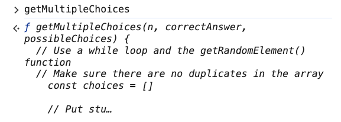
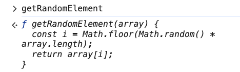
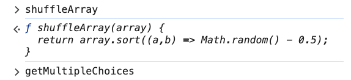

# 5. Doggo Quiz while Review

Link: [https://frontendmasters.com/courses/javascript-first-steps/doggo-quiz-while-review/](https://frontendmasters.com/courses/javascript-first-steps/doggo-quiz-while-review/)

- Full code
    
    ```jsx
    function getMultipleChoices(n, correctAnswer, possibleChoices) {
      // Use a while loop and the getRandomElement() function
      // Make sure there are no duplicates in the array
    	const choices = []
    	
    	// Put stuff in the array
    	choices.push(correctAnswer) // push the correct answer inside the array
    	while (choices.length < n) {
    		// capture getRandomElement value as a "candidate"
    		let candidate = getRandomElement(possibleChoices)
    		
    		if (!choices.includes(candidate)) { // Check whether the random element is already in the array "choices" or not
    			choices.push(candidate) // If the random element does not already exist in the array, we push it to the array
    		}
    	}
    	
    	return shuffleArray(choices);
    }
    ```
    
    
    
    - Things we use in this function
        - Array
        - Mutating array
        - While loop
        - Condition
        - Operators
        - Logical operator “not”
        - if loop
        - Randomness
        - Built-in methods: *includes()*, …..
    - Tests:
        - Test 1
            
            ```jsx
            getMultipleChoices(3, "string", ["object", "string", "boolean", "array", "undefined"])
            ```
            
            `(3) ['boolean', 'undefined', 'string']` 
            
            `*(3) ['string', 'object', 'array']`* 
            
            `(3) ['array', 'string', 'object']` 
            
            `(3) ['object', 'string', 'boolean']` 
            
        - Test 2
            
            ```jsx
            getMultipleChoices(4, "string", ["object", "string", "boolean", "array", "undefined"])
            ```
            
            `*(4) ['string', 'object', 'array', 'undefined']`* 
            
            `(4) ['array', 'object', 'boolean', 'string']` 
            
            `(4) ['array', 'string', 'undefined', 'object']` 
            
            `(4) ['object', 'array', 'boolean', 'string']` 
            
        - Test 3
            
            ```jsx
            getMultipleChoices(2, "boolean", ["object", "string", "boolean", "array", "undefined"])
            ```
            
            `(2) ['boolean', 'undefined']` 
            
            `(2) ['boolean', 'object']` 
            
            `*(2) ['object', 'boolean']`* 
            
            `(2) ['boolean', 'array']` 
            

- These two utility functions are the dependencies for **getMultipleChoices** to run properly
    - getRandomElement
        
        ```jsx
        // Utility function to get a randomly selected item from an array
        function getRandomElement(array) {
          const i = Math.floor(Math.random() * array.length);
          return array[i];
        }
        ```
        
        
        
    - shuffleArray
        
        ```jsx
        // Utility function to shuffle the order of items in an array in-place
        function shuffleArray(array) {
          return array.sort((a,b) => Math.random() - 0.5);
        }
        ```
        
        