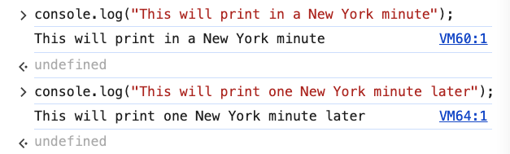
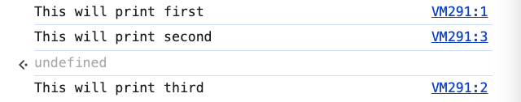

# 6. setTimeout

Link: [https://frontendmasters.com/courses/javascript-first-steps/settimeout/](https://frontendmasters.com/courses/javascript-first-steps/settimeout/)

Read more about [**setTimeout()**](https://developer.mozilla.org/en-US/docs/Web/API/Window/setTimeout)

- **(A)synchronous code**
    
    **Time & JS are ...frenemies**
    
    
    
    frenemies - a person with whom one is friendly despite a fundamental dislike or [rivalry](https://www.google.com/search?sca_esv=35dc981465dfcda7&sxsrf=AHTn8zqoUronnGQm2DlkwOd9Sxsg63CHHQ:1746550855346&q=rivalry&si=APYL9btezPaTUY7KecSEHRUsL7ychRORGZ5krwxpC30MBPoUYs1Zm-ZPdOq1HkIMhm3o7-9WKw-Ll_cwKzR1aVOlv2mPRnddLygrFlcp_9ZEP3T9k_rx-nA%3D&expnd=1&sa=X&sqi=2&ved=2ahUKEwjZt8L6qI-NAxUxkK8BHRzuCDEQyecJegQIQBAS)
    
    - Usually, our JS code does things that are very quick
        
        ```jsx
        console.log("This will print in a New York minute");
        console.log("This will print one New York minute later");
        ```
        
        
        
        So JS can usually run straight through our program *"synchronously"*.
        
        *synchronously* means one thing after another, one thing at a time.
        
        > JS can only do one task at a time ("single-threaded")
        > 
    - But when we need to do something that takes a long time
        
        
        
        we still want the web browser to keep working, so when we give JS a task that takes a while, it doesn't stop and wait
        
        ```jsx
        console.log("This will print first");
        setTimeout(() => console.log("This will print third"), 1000);
        console.log("This will print second");
        ```
        
        it adds the slow task to a "TODO list" and keeps on running our program
        
        The task runs some time later, "asynchronously"
        
        
        
        setTimeout(() => console.log("This will print third"), 1000) is added to the “TODO list”, an “internal” of JavaScript, where things are stored to be run later
        
        Explanation
        
        - `console.log("This will print first");`  will print first
        - JavaScript then added `setTimeout(() => console.log("This will print third"), 1000);`  to a to-do list somewhere and came back to it after one second.
        - JavaScript printed the final line of our code `console.log("This will print second");`  but the second thing to print.
        - JavaScript even came back and returned the value of this whole thing, which turned out to be *undefined*.
        - And then finally, the one second (1000 milliseconds) was up, it printed the third thing `console.log("This will print second");`
        
        The difference between *synchronous* versus *asynchronous* codes are
        
        - *synchronous* codes are going to run exactly as the order we see them in the program
        - *asynchronous* codes will run at some other points of time
        
        Some things that take time (things that work *asynchronously*)
        
        - Waiting for user events
        we gave JavaScript a function to go run at some point later when the user has clicked on the thing we care about, or when the user has moused over the thing.
        - Asking a user to pick a file
            - where does the user want to save a file
            - which file does the user want to upload into the website
        - Getting permission to access the camera/mic
        - *Loading data from the interwebs* (doggo game)
            
            Ask JavaScript to go find an image somewhere out there on the Internet
            
        
        > [**Philip Roberts: What the heck is the event loop anyway?](https://www.youtube.com/watch?v=8aGhZQkoFbQ)**
        [Introducing asynchronous JavaScript](https://developer.mozilla.org/en-US/docs/Learn_web_development/Extensions/Async_JS/Introducing)
        > 

- Question: How much time do you allow for asynchronous actions?
    
    Answer: It depends. there is not a fixed answer.
    
    Explanation: For example, for our `setTimeout(() => console.log("This will print third"), 1000);`, which we said we wanted this to wait 1,000 milliseconds or one second before it even *tries* to run our little anonymous function. JavaScript adds this **setTimeout** to a task list. But if there's a lot of other stuff on that task list, then it might take it even more than 1,000 milliseconds before it actually gets to run the code. So it might even take a little bit more than 1,000 milliseconds before JavaScript is able to get to it.