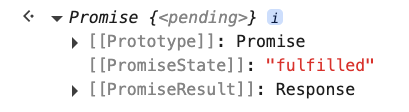

# 1. APIs & fetch

URL: [https://frontendmasters.com/courses/javascript-first-steps/apis-fetch/](https://frontendmasters.com/courses/javascript-first-steps/apis-fetch/)

**Fetching data**


We’re going to tell JavaScript to make the browser fetch the data that we need

- How we get data from the Internet
    - URLs point to resources on the web
        
        `https://images.dog.ceo/breeds/bluetick/n02088632_924.jpg`
        
        
        
    - APIs provide URLs that point at data we care about
        
        `https://dog.ceo/api/breed/hound/list`  is an endpoint from the [Dog CEO’s Dog API](https://dog.ceo/dog-api/) that provides random pictures and information about dog breeds.
        
        
        
        The resource at this endpoint is a JSON object, JSON stands for JavaScript Object Notation
        
        ```jsx
        {
            "message": [
              "afghan",
              "basset",
              "blood",
              "english",
              "ibizan",
              "plott",
              "walker"
            ],
            "status": "success"
          }
        ```
        
        API’s, or Application Programming Interfaces, are services that are exposing a whole bunch of data at certain URLs.
        
        An API is a whole big set of different URLs. An endpoint (of an API) is one of those URLs that gives a particular resource.
        
        So far we've been working with data that we either hard coded, we wrote it ourselves in our program. Or maybe we got it as the output of some built in function. But sometimes we need data from elsewhere, on the web, and we can do that by accessing these URLs that are API endpoints.
        
    - [**fetch()**](https://developer.mozilla.org/en-US/docs/Web/API/Fetch_API) lets us use JS to load data from APIs
        
        ```jsx
        fetch("https://dog.ceo/api/breed/hound/list")
        ```
        
        But if we run it in the console, we see something weird...
        
        