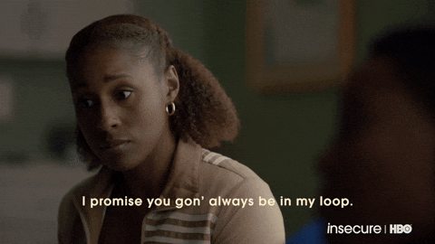
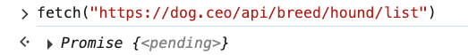
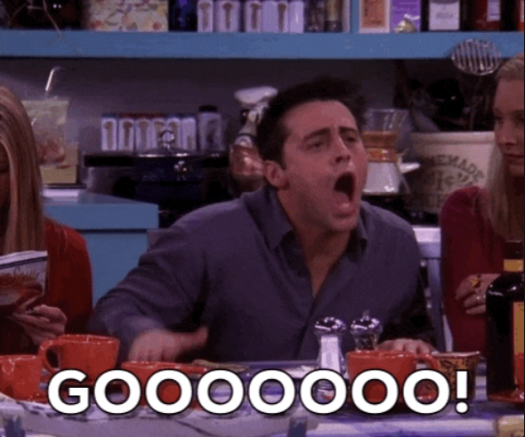
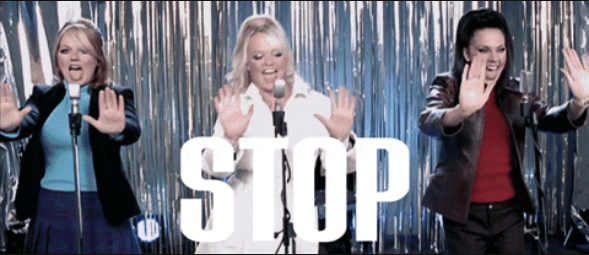

# 2. Working with Promises

Link: [https://frontendmasters.com/courses/javascript-first-steps/working-with-promises/](https://frontendmasters.com/courses/javascript-first-steps/working-with-promises/)



- Promises: When we are doing things that take a long time, or looking for things that we are going to need some time to find.
    - Event loop and the asynchronous code
    - Operations that take a long time like fetch, which it might take a long time to go talk to the dog API and come back with the data

> **It takes time to fetch data from the network**
> 
> 
> ```jsx
> fetch("https://dog.ceo/api/breed/hound/list")
> Promise { <state>: "pending" }
> ```
> 

So JS writes us an "IOU" (I owe you) for the data value it doesn't have yet - as known as a **Promise** of a value

> I promise I'm gonna go get you this value but I don't have it yet
> 

- Promises can be in 3 possible states:
    - **pending**: still waiting for the value, hang tight
    - **fulfilled** (aka "resolved"): finally got the value, all done
    - **rejected**: sorry couldn't get the value, all done
    
    It takes time for Promises to resolve, so they are "*asynchronous*"
    
    Example:
    
    
    
    **Note:** Sometimes, you'll hear the word *resolved* to mean *fulfilled*, and sometimes you'll hear the word resolved to mean either *fulfilled* or *rejected*.
    
- Question: Are promises only use with API call outs or will you see them and other long running processes?
    
    Answer: You can see promises in other cases too. Fetch is one example of an operation or a function that returns a promise, there's a lots of others.
    
- JS adds the task to the TODO list and keeps running our program
    
    
    
    For example, when we want the hound list
    
    [`https://dog.ceo/api/breed/hound/list`](https://dog.ceo/api/breed/hound/list) 
    
    ```jsx
    {
      "message": [
        "afghan",
        "basset",
        "blood",
        "english",
        "ibizan",
        "plott",
        "walker"
      ],
      "status": "success"
    }
    ```
    
    JavaScript will be like “okay, I got you, I'm adding this fetching, I'm gonna go do it, go get you that value. But meanwhile, let me keep trying to run your code.”
    
    JavaScript does not want to stop and wait to get the data before running through the rest of the code.
    
- await - Read more at [https://developer.mozilla.org/en-US/docs/Web/JavaScript/Reference/Operators/await](https://developer.mozilla.org/en-US/docs/Web/JavaScript/Reference/Operators/await)
    
    Sometimes, when you do want JavaScript to stop and wait in executing your code
    
    Even though most of the times you don't want to freeze the webpage, you let JS to keep running through the code, yet in this program you can not really do anything without the dog data so you want JavaScript to wait for that Promise to fulfill or to resolve before it goes on and tries to keep running your code. That is when you need **await**
    
    
    
    **await** lets us tell JS to *stop* and *wait* for an asynchronous operation to finish
    
    **await** tells JS to wait for the **Promise** to be *fulfilled*.