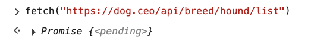
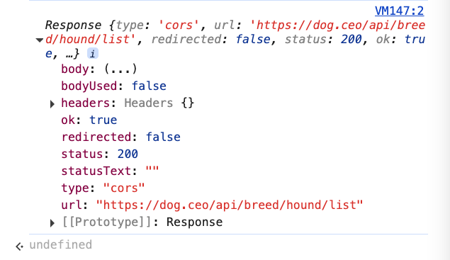
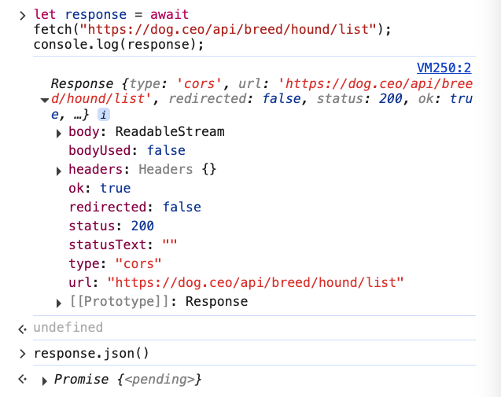
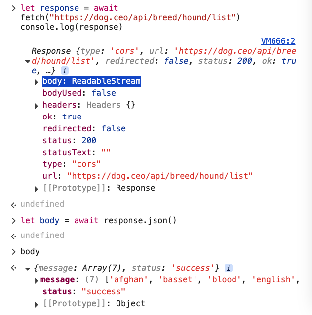
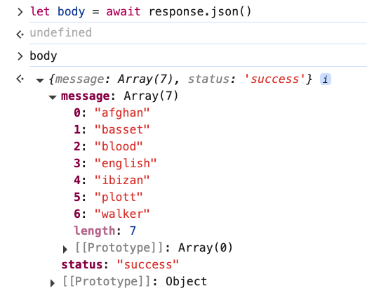
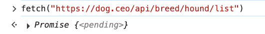
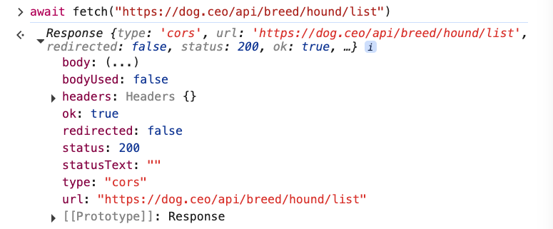
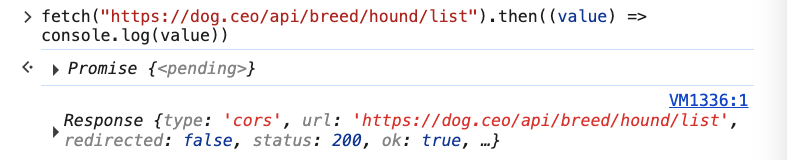

# 3. Using Await with Promises

Link: [https://frontendmasters.com/courses/javascript-first-steps/using-await-with-promises/](https://frontendmasters.com/courses/javascript-first-steps/using-await-with-promises/)

Promises - [https://developer.mozilla.org/en-US/docs/Web/JavaScript/Reference/Global_Objects/Promise](https://developer.mozilla.org/en-US/docs/Web/JavaScript/Reference/Global_Objects/Promise)

- [await](https://developer.mozilla.org/en-US/docs/Web/JavaScript/Reference/Operators/await) - lets us tell JS to stop and wait for an asynchronous operation to finish
    
    
    
    Instead of having the *pending* status from Promise as JS didn’t stop to wait for a resolved Promise as before
    
    
    
    In the case of a Promise, **await** lets you tell JS to stop and *wait* for a *resolved* Promise before continue running the next code in the program
    
    ```jsx
    let response = await fetch("https://dog.ceo/api/breed/hound/list");
    console.log(response);
    ```
    
    
    
    The **Promise** we get from **fetch()** resolves to a **Response object**
    
    **Note:** It does not matter what variable you assign the Promise to, the Promise is always going to return a Response object.
    
    It's **body** contains the data we care about
    
    
    
    But we have to read the body somehow
    
    When you click on the **body** it will show “ReadableStream”, which is apparently a readable stream of data, so there must be someway to read it.
    
    This is the data format we want
    
    ```jsx
    {
      "message": [
        "afghan",
        "basset",
        "blood",
        "english",
        "ibizan",
        "plott",
        "walker"
      ],
      "status": "success"
    }
    ```
    
    Calling the [**.json()**](https://developer.mozilla.org/en-US/docs/Web/API/Response/json) method on the response parses its body as a JSON object
    
    ```jsx
    response.json()
    ```
    
    But this gives us another Promise!
    
    
    
    **response.json()** is an example of what we were talking about in the last lesson, another operation that does not involve in any network activity, it doesn't involve in making a telephone call to the dog API either. It does, however, take some time for JavaScript to go reading through all of those bytes and then making sense of them as a JSON object.
    
    **.json** on a **response** object is also something that gives an “IOU” for a value in *asynchronous* operation, that gives a Promise. But maybe it doesn't take as much time as talking to the network.
    
    And once again, just like how we used “**await**” to tells JS to stop and wait for the Response from the Promise from *fetching* the “*hound*” list. We can use “**await**” again to tell JS to stop and wait until we have the data from the Promise body when calling **.json()** on **response**.
    
    ```jsx
    let response = await fetch("https://dog.ceo/api/breed/hound/list")
    let body = await response.json();
    ```
    
    
    
    Now we can read the data that the body contains
    
    
    
    Success!
    
    
    
- Question:
    
    For this code snippet of **fetch()**
    
    ```jsx
    fetch("https://dog.ceo/api/breed/hound/list")
    ```
    
    which outputs a *pending* Promise
    
    
    
    Is it going to be just *pending* forever?
    
    ---
    
    Answer:
    
    *“pending*” was the state of the Promise that JS gave us in the console when the line **fetch** evaluated to that Promise.
    
    In the background, somewhere, that Promise has gone ahead in its life time and maybe it is in a different state now, maybe not, but we don’t have any way to ask about its current state since we didn't capture the value at all, we didn't assign it to a variable - we don't have any way of pointing at the Promise.
    
    Solutions:
    
    1. **await** - this is the easiest way to tell JS to stop, and pretend that the asynchronous operation (Promise) is a synchronous operation, and wait for that synchronous operation to be done before continue with the code.
        
        ```jsx
        await fetch("https://dog.ceo/api/breed/hound/list")
        ```
        
        
        
    2. **then** - the earlier way of dealing with Promises - tell JS that when the Promise is done, either *fulfilled* or *rejected*, do something with it.
        
        Read more: [https://developer.mozilla.org/en-US/docs/Web/JavaScript/Reference/Global_Objects/Promise/then](https://developer.mozilla.org/en-US/docs/Web/JavaScript/Reference/Global_Objects/Promise/then)
        
        - Syntax
            
            ```jsx
            then(onFulfilled)
            then(onFulfilled, onRejected)
            ```
            
            takes up to two arguments: callback functions for the fulfilled and rejected cases of the `Promise`. It stores the callbacks within the Promise it is called on and immediately returns another [`Promise`](https://developer.mozilla.org/en-US/docs/Web/JavaScript/Reference/Global_Objects/Promise) object, allowing you to [chain](https://developer.mozilla.org/en-US/docs/Web/JavaScript/Guide/Using_promises#chaining) calls to other promise methods.
            
        - Using **then** with **fetch**
            
            ```jsx
            fetch("https://dog.ceo/api/breed/hound/list").then((value) => console.log(value))
            ```
            
            
            
            Explanation of the anonymous function
            
            The anonymous function that comes within **then** is a *callback* function which is going to execute some time later.
            
            The *callback* takes in whatever the value that the Promise resolves to.
            
            We are telling JS to take this function and *call* it *back* to us whenever this thing happens. It is the same thing we did with *event handler* where we also passed in a *callback* function.
            
            Explanation of the code
            
            JS is going to wait until it sees that this Promise has resolved or fulfilled, and then it is going to take whatever the value that the Promise fulfilled to pass it in the anonymous function we declared and then do whatever we told it to do, which is to log the value out - in this case.
            
            When the Promise was evaluated in the console, it was in *“pending*” mode.
            
            And then, a few instances later, JS got the fulfilled value and called the callback which console.log the Response.
            
    
    Summary of **await** and **then**
    
    - **then** - I'm gonna give you a function you're gonna wait to call it when you're done with the Promise
    - **await** - We can pretend that the *asynchronous* operation like **fetch**, which returns a Promise, is just a regular function call that returns a value instead of an *asynchronous* “I owe you” a value.