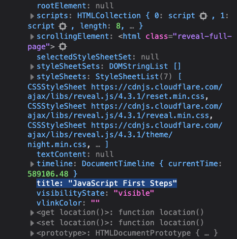

# 1. Destructuring Objects & Arrays

URL: [https://frontendmasters.com/courses/javascript-first-steps/destructuring-objects-arrays/](https://frontendmasters.com/courses/javascript-first-steps/destructuring-objects-arrays/)

- JavaScript **destructuring** syntax: a syntax that we can use to break down an object
    
    Read more at [https://developer.mozilla.org/en-US/docs/Web/JavaScript/Reference/Operators/Destructuring](https://developer.mozilla.org/en-US/docs/Web/JavaScript/Reference/Operators/Destructuring)
    
    
    
- Destructuring in object
    
    Imagine we are given this array **spices** of object which contains one object
    
    ```jsx
    const spices = [
    	{name: "Emma", nickname: "Baby"}
    ]
    ```
    
    Destructuring is a fancy way of *declaring* multiple variables at once, by "*extracting*" values from an object with their property names
    
    ```jsx
    let {name, nickname} = spices[0];
    ```
    
    Explanation:
    
    - The syntax `{name, nickname}`  on the left hand side of the “assignment” operator is **not** an object
    - The syntax is an indication of a shape of an object, a property of an object. It tells JS to take the object at index 0 in the **spices** array,
        - Pull out the value of its *name* property and assign that to a new variable, *name*
        - Same thing go for *nickname*. Pull out the value of its *nickname* property and assign that to a new variable, *nickname*.
    
    Full code
    
    
    
    > Destructuring is handy when you have an object with lots of different properties and maybe you only care about one of them or a couple of them
    > 
    
    If we only care about some of the properties, we can omit the others
    
    ```jsx
    let {nickname} = spices[0];
    ```
    
    
    
    Question: Why *name* returns an empty string?
    
    Answer: By using this destructuring `let {nickname} = spices[0]` , you are telling JavaScript that you don't care about the other properties on this object, you just care about that *nickname* property *within* the *object*.
    
    > Destructuring lets us kind of quickly only grab certain properties we care about out of an object.
    > 
    
    **Note**: This is **only** for **Firefox**, since we already used destructuring to pull out the data for “name” and “nickname”
    
    ```jsx
    let {name, nickname} = spices[0]
    ```
    
    If we were to use destructuring, again, to pull out the information for “name” and “nickname”. JS will throw an error
    
    ```jsx
    let {nickname} = spices[0]
    ```
    
    
    
    Solution:
    
    Either `let {name, nickname} = spices[0];`  or `let {nickname} = spices[0]` . NOT both!
    
    Question: Does the order inside the curly braces need to match with the order inside the object?
    
    Answer: There is no order of object property(ies) in JS
    
    
    
    > There is not actually a concept of ordering to object properties in JavaScript. So as far as destructuring is concerned, it does not know or care what order they were originally in. Nor does it know or care what order you put them in in your destructuring assignment because all it cares about is it has to assign a new variable to each of those things.
    Similar thing goes for variable in our scope.
    > 
- Destructuring in array
    
    ```jsx
    const [baby, ginger, scary, sporty, posh] = spices;
    ```
    
    
    
    > The order DOES matter in the array, however!
    > 
    
    Regardless of the fact that JavaScript does not have any property names to map them to the new array. Properties are mapped to the array based on the indices.
    
    - We can ignore the values in the array we don't need
        - Sample
            
            ```jsx
            const [emma, geri] = spices;
            ```
            
        - Example:
            
            ```jsx
            let [ten, twenty] = [10, 20, 30, 40]
            ```
            
            
            
            And now 10 and 20 are the first two things, but 30 and 40 just got ignored, they didn't get pulled out into our destructuring.
            
    - We can use commas to "skip" values
        - Sample
            
            ```jsx
            const [,,melB] = spices;
            ```
            
        - Example:
            
            ```jsx
            let [,,thirty] = [10,20,30,40]
            ```
            
            
            
        - Practical example:
            
            Say we want to get “title” out of the “document”
            
            Note: “document” is the *property* of “window” *object* in Chrome. We can obtain “document” by accessing “window”
            
            - Chrome
                
                
                
                “title” is a property inside “document” object which is also a property inside “window” object
                
                
                
                In order to destructure `title` from `window.document`.
                
                ```jsx
                let {title} = window.document
                ```
                
                
                
                Alternative way to destructure `title` from `window.document` 
                
                - Option 1
                    
                    ```jsx
                    let {title} = document
                    ```
                    
                    
                    
                - Option 2:
                    
                    ```jsx
                    let { document: { title } } = window;
                    ```
                    
                    
                    
            - Firefox
                
                
                
                
                
                ```jsx
                let {title} = document
                ```
                
                
                
            - Attention:
                
                Even though the way to look for “title” is a bit different between Chrome and Firefox - “title” can be found within the “document” object in Firefox, but in Chrome you will have to look for it inside the “document” object within the “window” object.
                
            - Question: Why this way does not work?
                
                ```jsx
                let {document} = window
                let {title} = document
                ```
                
                
                
                What is the reason for that error?
                
                In a browser environment (like Chrome DevTools), certain global variables such as `document`, `window`, and `location` are **implicitly declared** and **read-only** in the global scope — meaning you **can’t redeclare them using `let`, `const`, or `var`** in the same scope.
                
                In this case:
                
                - `document` is **already a globally defined variable**, provided by the browser.
                - When you try to use `let { document } = window`, you're trying to **declare a new variable named `document`**, which clashes with the existing global.
- Using **spread** and **destructuring** together
    
    We can use **...** to collect remaining values
    
    - Sample
        
        ```jsx
        const [babySpice, ...adultSpices] = spices;
        ```
        
    - Example
        
        ```jsx
        let [uno, ...otros] = [1,2,3,4]
        ```
        
        
        
        This can be useful as when you only want a specific data at the moment and you don't care about the rest just yet but maybe you will want to work on them later.