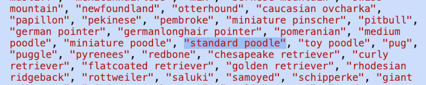

# 2. Destructuring Exercises

URL: [https://frontendmasters.com/courses/javascript-first-steps/destructuring-exercise/](https://frontendmasters.com/courses/javascript-first-steps/destructuring-exercise/)

- In your Doggo Fetch file, follow TODO 2 to complete the `getBreedFromURL` function with destructuring
    
    The string method [`.split()`](https://developer.mozilla.org/en-US/docs/Web/JavaScript/Reference/Global_Objects/String/split) will be useful - it returns an *array* of *substrings* by splitting a string at a certain character:
    
    ```jsx
    // TODO 2
    // Given a URL such as "https://images.dog.ceo/breeds/poodle-standard/n02113799_2280.jpg" => "standard poodle"
    // return the breed name string as formatted in the breed list, e.g. "standard poodle"
    function getBreedFromURL(url) {
        // The string method .split(char) may come in handy
        // Try to use destructuring as much as you can
        
    }
    ```
    
    - Examples with using **split()**
        
        
        
    - Example with using **destructuring** and **split()**
        
        ```jsx
        let [first, middle, last] = "Anjana-Sofia-Vakil".split("-");
        ```
        
        
        
- Question: Why do we need to use **split()**?
    
    Answer:
    
    This is the sample URL in which we get the image for the dog breed from
    
    `https://images.dog.ceo/breeds/poodle-standard/n02113799_2280.jpg` 
    
    The name of the dog breed is made up of either one or two words, in this case “poodle-standard” is a two words name separated by a dash “-”, we only want to get the name for the dog breed without the “dash”
    
- Question: Why do we need to use **destructuring**?
    
    Answer:
    
    We use destructuring to pull the information we need, out of the array (in this case)
    
    The name of the dog breed in the array **breed** is in reversed order from the name of the dog breed in the URL
    
    - The *breed* array
        
        
        
    - The URL
        
        `https://images.dog.ceo/breeds/**poodle-standard**/n02113799_2280.jpg`