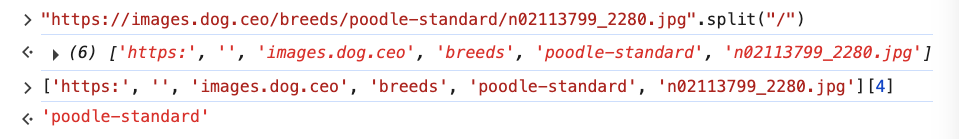
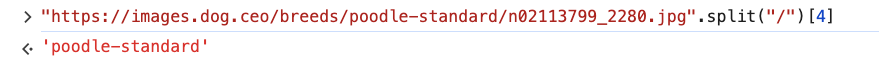
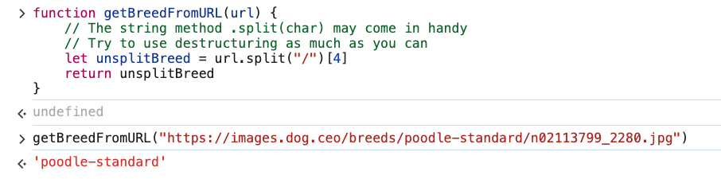

# 3. Destructuring Solution: Return Breed

URL: [https://frontendmasters.com/courses/javascript-first-steps/destructuring-solution-return-breed/](https://frontendmasters.com/courses/javascript-first-steps/destructuring-solution-return-breed/)

- This is the result we want:
    
    `poodle-standard` 
    
    This is the URL
    
    `https://images.dog.ceo/breeds/poodle-standard/n02113799_2280.jpg` 
    
    Tools:
    
    - split()
    - destructuring
    
    Code from the program
    
    ```jsx
    function getBreedFromURL(url) {
        // The string method .split(char) may come in handy
        // Try to use destructuring as much as you can
        
    }
    ```
    
    Code for the result we want
    
    ```jsx
    let urlParts = url.split("/")
    let splitter = url[4]
    ```
    
    
    
    Combining the code and give it a new variable name
    
    ```jsx
    let unsplitBreed = url.split("/")[4]
    ```
    
    
    
    We got the modified program
    
    ```jsx
    function getBreedFromURL(url) {
        // The string method .split(char) may come in handy
        // Try to use destructuring as much as you can
        let unsplitBreed = url.split("/")[4]
    }
    ```
    
    Test it: add the “*return*” statement so that the program can evaluate and return a value
    
    ```jsx
    function getBreedFromURL(url) {
        // The string method .split(char) may come in handy
        // Try to use destructuring as much as you can
        let unsplitBreed = url.split("/")[4]
        return unsplitBreed
    }
    ```
    
    
    
    We got “poodle-standard” for the output of the program.
    
- We can split the array to different portions, which might be more efficient in this case
    
    Sample code
    
    - First, split on the “breeds/”
        
        ```jsx
        "https://images.dog.ceo/breeds/poodle-standard/n02113799_2280.jpg".split("breeds/")
        ```
        
        Output:
        
        ```jsx
        (2) ['https://images.dog.ceo/', 'poodle-standard/n02113799_2280.jpg']
        ```
        
    - And then split it again on the dash for the second portion
        
        ```jsx
        ['https://images.dog.ceo/', 'poodle-standard/n02113799_2280.jpg'][1].split("/")
        ```
        
        Output:
        
        ```jsx
        (2) ['poodle-standard', 'n02113799_2280.jpg']
        ```