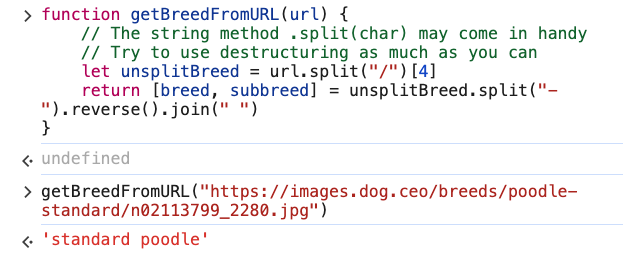

# 4. Destructuring Solution: Format String

URL: [https://frontendmasters.com/courses/javascript-first-steps/destructuring-solution-format-string/](https://frontendmasters.com/courses/javascript-first-steps/destructuring-solution-format-string/)

- For breed names that are made up of two words, this is the result we want
    
    `standard poodle` 
    
    This is the URL
    
    [`https://images.dog.ceo/breeds/poodle-standard/n02113799_2280.jpg`](https://images.dog.ceo/breeds/poodle-standard/n02113799_2280.jpg) 
    
    There are a couple of ways that can be done
    
    - Option 1: destructuring order
    - Option 2: reverse()
    
    Whichever option can be chosen depending on your need for the output
    
    - Option 1: destructuring order
        
        ```jsx
        function getBreedFromURL(url) {
            // The string method .split(char) may come in handy
            // Try to use destructuring as much as you can
            let unsplitBreed = url.split("/")[4]
            let [breed, subbreed] = unsplitBreed.split("-")
            return [subbreed, breed].join(" ")
        }
        ```
        
        Output:
        
        
        
    - Option 2: [**reverse()**](https://developer.mozilla.org/en-US/docs/Web/JavaScript/Reference/Global_Objects/Array/reverse)
        
        ```jsx
        function getBreedFromURL(url) {
            // The string method .split(char) may come in handy
            // Try to use destructuring as much as you can
            let unsplitBreed = url.split("/")[4]
            return [breed, subbreed] = unsplitBreed.split("-").reverse().join(" ")
        }
        ```
        
        Output:
        
        
        
- For single word name for dog breed, we want this
    
    `beagle` 
    
    This is the URL
    
    `https://images.dog.ceo/breeds/beagle/n32u9302hdsj3.jpg` 
    
    The program we used for two words breed name will not give the proper result
    
    ```jsx
    function getBreedFromURL (url) {
        let unsplitBreed = url.split("/")[4]
        let [breed, subbreed] = unsplitBreed.split("-")
        return [subbreed, breed].join(" ")
    }
    ```
    
    Output:
    
    
    
    There is a space (white space) before “beagle”
    
    The way to fix this problem is by using [**trim()**](https://developer.mozilla.org/en-US/docs/Web/JavaScript/Reference/Global_Objects/String/trim)
    
    ```jsx
    function getBreedFromURL (url) {
        let unsplitBreed = url.split("/")[4]
        let [breed, subbreed] = unsplitBreed.split("-")
        return [subbreed, breed].join(" ").trim()
    }
    ```
    
- Quick note:
    - split() - method of [`String`](https://developer.mozilla.org/en-US/docs/Web/JavaScript/Reference/Global_Objects/String) values takes a pattern and divides this string into an ordered list of substrings by searching for the pattern, puts these substrings into an **array**, and returns the **array**.
    - join() - method of [`Array`](https://developer.mozilla.org/en-US/docs/Web/JavaScript/Reference/Global_Objects/Array) instances creates and returns a new string by concatenating all of the elements in this **array**, separated by commas or a specified separator string. If the array has only one item, then that item will be returned without using the separator.
    - reverse() - method of [`Array`](https://developer.mozilla.org/en-US/docs/Web/JavaScript/Reference/Global_Objects/Array) instances reverses an array [*in place*](https://en.wikipedia.org/wiki/In-place_algorithm) and returns the **reference** to the same **array**, the first array element now becoming the last, and the last array element becoming the first. In other words, elements order in the array will be turned towards the direction opposite to that previously stated.
    - trim() - method of [`String`](https://developer.mozilla.org/en-US/docs/Web/JavaScript/Reference/Global_Objects/String) values removes whitespace from both ends of this string and returns a **new string**, without modifying the original string.