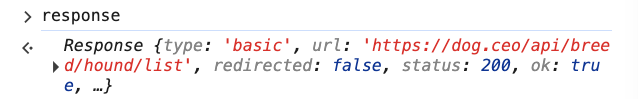
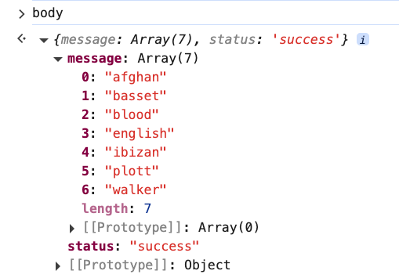
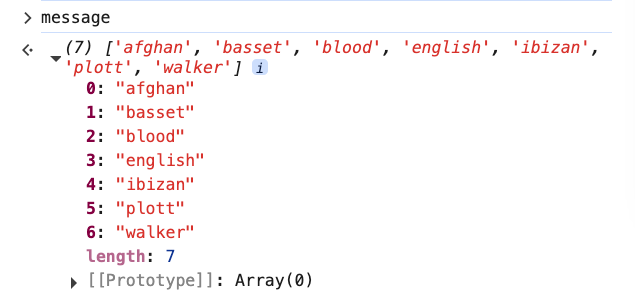
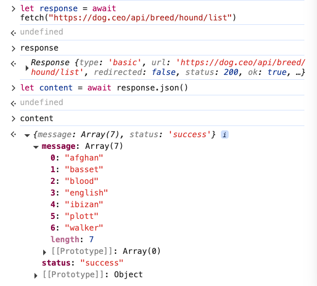
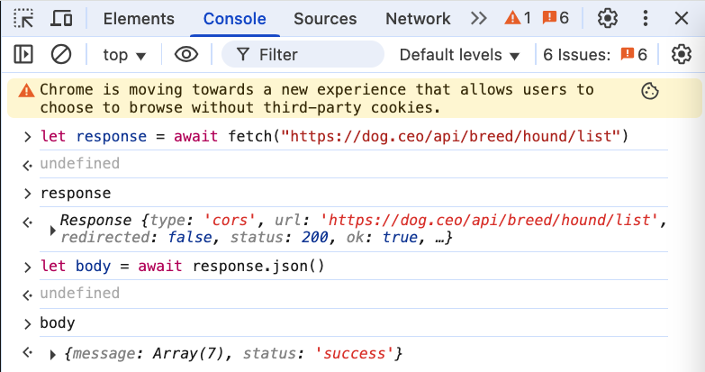
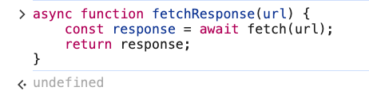
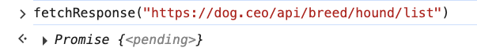
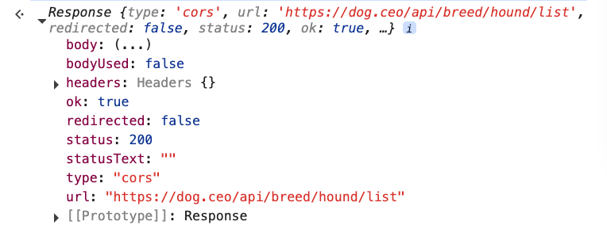

# 1. Async Functions

URL: [https://frontendmasters.com/courses/javascript-first-steps/async-functions/](https://frontendmasters.com/courses/javascript-first-steps/async-functions/)

Let's wrap all our **async** *fetching* & *parsing* code up into a **function**!


- Back to our *fetched* data...
    
    Let's destructure the data we fetched so that we can use it!
    
    ```jsx
    let { message } = body;
    ```
    
    We only really care about the **message**
    
    - This is the URL where we can get the **message** from
        
        ```jsx
        https://dog.ceo/api/breed/hound/list
        ```
        
    - This is the **message**
        
        ```jsx
        "message": [
          "afghan",
          "basset",
          "blood",
          "english",
          "ibizan",
          "plott",
          "walker"
        ],
        ```
        
    - Code
        - Step 1: Get *response* from *URL*
            
            ```jsx
            let response = await fetch("https://dog.ceo/api/breed/hound/list")
            ```
            
            
            
        - Step 2: Get *body* from *response* in *json* format
            
            ```jsx
            let body = await response.json()
            ```
            
            
            
        - Step 3: Destructure *message* from *body*
            
            ```jsx
            let {message} = body
            ```
            
            
            
    - Note:
        
        We don’t always have to use *response* and *body* for the variable names, any name will just work just fine.
        
        
        
- *await* in a *regular function*
    - We cannot use *await* in a regular function
        
        ```jsx
        function fetchResponse(url) {
            const response = await fetch(url);
            return response;
        }
        ```
        
        JavaScript will throw an **error**
        
        
        
        **JS doesn't allow it**
        
    
    > We cannot just drop *await* anywhere, JavaScript has specific rules about where await is allowed
    > 
    
    There are only two places where *await* is allowed
    
    - In the dev console
        
        ```jsx
        let response = await fetch("https://dog.ceo/api/breed/hound/list")
        let body = await response.json()
        ```
        
        
        
    - A special *async function*
        
        ```jsx
        async function fetchResponse(url) {
            const response = await fetch(url);
            return response;
        }
        ```
        
        
        
        With the “async” keyword in front of the function, JavaScript does not throw any error anymore.
        
        This tells JavaScript that this is going to be a function that is carrying out some kind of potentially long-running *asynchronous operation*.
        
        > *asynchronous* code is only allowed in *async* functions
        > 
        - fetching the URL
            
            ```jsx
            fetchResponse("https://dog.ceo/api/breed/hound/list")
            ```
            
            Output:
            
            
            
        - await the fetch Response
            
            ```jsx
            await fetchResponse("https://dog.ceo/api/breed/hound/list")
            ```
            
            Output:
            
            
            

> *async* functions are going to be *promisy* (Promise). In order to get the output value (Response) from a Promise we will need to *await*
> 

Summary:

In order to use *async operation*, you will need to wrap them up in an *async function*, which then becomes an *async operation* itself.

Once you start with *asynchronous*, everything else is meant to be dealt as *asynchronous*.