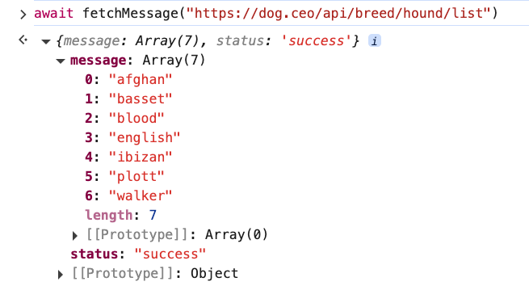

# 2. Async Function Exercise

URL: [https://frontendmasters.com/courses/javascript-first-steps/async-function-exercise/](https://frontendmasters.com/courses/javascript-first-steps/async-function-exercise/)

- Doggo Fetch - TODO 3
    
    ```jsx
    // TODO 3
    // Given a URL, fetch the resource at that URL, 
    // then parse the response as a JSON object,
    // finally return the "message" property of its body
    async function fetchMessage(url) {
      // Given a URL, fetch the resource at that URL,
      let response = await fetch(url)
      // then parse the response as a JSON object,
      let body = await response.json()
      // finally return the "message" property of its body
      return {message} = body
    }
    await fetchMessage("https://dog.ceo/api/breed/hound/list")
    ```
    
    
    
- Question:
    
    Since JavaScript is single threaded natively and since it has outgrown the expectations of the original designer, isn't it more performant and easier if it were multithreaded without adding the fake multithreaded of asynchronous?
    
    Answer:
    
    What JavaScript was originally intended to do and what it's doing now are two very different things. There is a big delta, a big difference between what JavaScript is doing right now and the structure of JavaScript that was created back in the day.