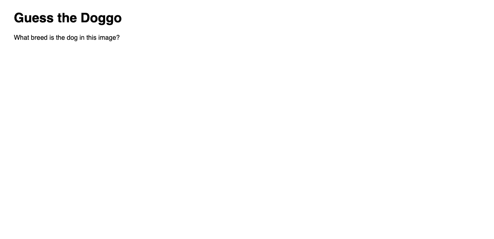
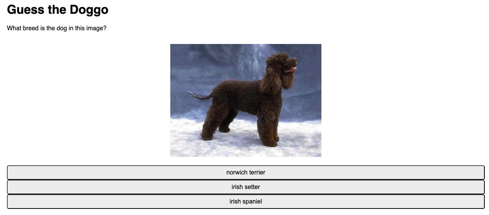
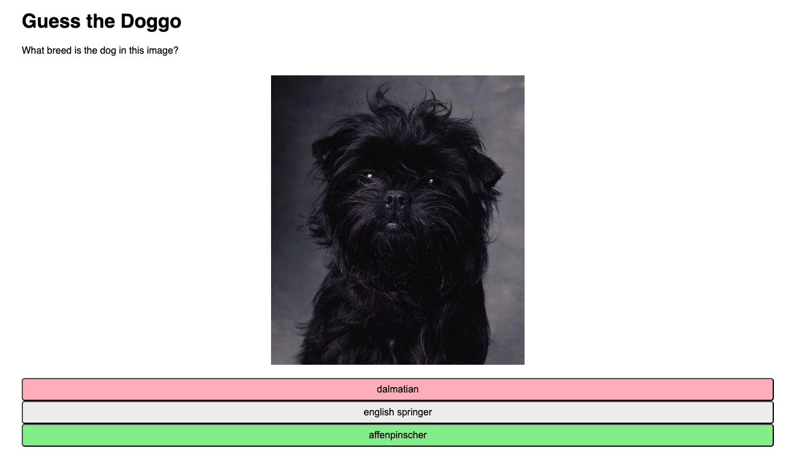
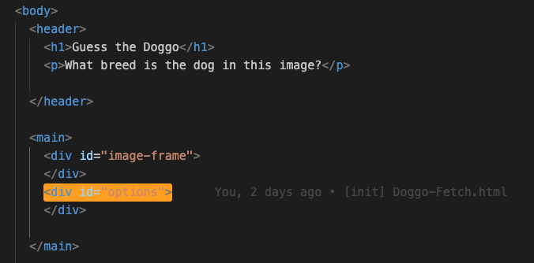

# 3. Adding Choice Buttons Exercise

URL: [https://frontendmasters.com/courses/javascript-first-steps/adding-choice-buttons-exercise/](https://frontendmasters.com/courses/javascript-first-steps/adding-choice-buttons-exercise/)

Putting our doggos to bed

Let's finish up the last TODOs, 4 & 5

They require you to practice skills you've learned so far

- Reviewing the way we’ve been writing our code
    
    ```jsx
    // TODO 1
    // Given an array of possible answers, a correct answer value, and a number of choices to get,
    // return a list of that many choices, including the correct answer and others from the array
    function getMultipleChoices(n, correctAnswer, possibleChoices) {
      // Use a while loop and the getRandomElement() function
      // Make sure there are no duplicates in the array
      const choices = []
    
      // Put stuff in the array
      choices.push(correctAnswer) // push the correct answer inside the array
      while (choices.length < n) {
        // capture getRandomElement value as a "candidate"
        let candidate = getRandomElement(possibleChoices)
    
        if (!choices.includes(candidate)) { // Check whether the random element is already in the array "choices" or not
          choices.push() // If the random element does not already exist in the array, we push it to the array
        }
      }
    
      return shuffleArray(choices);
    }
    
    // TODO 2
    // Given a URL such as "https://images.dog.ceo/breeds/poodle-standard/n02113799_2280.jpg"
    // return the breed name string as formatted in the breed list, e.g. "standard poodle"
    function getBreedFromURL(url) {
      // The string method .split(char) may come in handy
      // Try to use destructuring as much as you can
      let unsplitBreed = url.split("/")[4] // get "poodle-standard" out from the url string
      return [breed, subbreed] = unsplitBreed.split("-").reverse().join(" ").trim() // return the formatted string and remove unnecessary white spaces (if any)
    }
    
    // TODO 3
    // Given a URL, fetch the resource at that URL, 
    // then parse the response as a JSON object,
    // finally return the "message" property of its body
    async function fetchMessage(url) {
      // Given a URL, fetch the resource at that URL,
      let response = await fetch(url)
      // then parse the response as a JSON object,
      let body = await response.json()
      // finally return the "message" property of its body
      return {message} = body
    }
    await fetchMessage("https://dog.ceo/api/breed/hound/list")
    ```
    
    The style of writing code is the **functional** style where you try to do everything with functions and make them as independent from values in the rest of the programs that might be changing over time as possible. Learn more: [https://frontendmasters.com/courses/functional-first-steps-v2/](https://frontendmasters.com/courses/functional-first-steps-v2/)
    This is the type of code that you will often see in JavaScript frameworks such as React.
    
- Analysis of the **renderButtons** function
    
    ```jsx
    // Function to add the multiple-choice buttons to the page
    function renderButtons(choicesArray, correctAnswer) {
    
      // Event handler function to compare the clicked button's value to correctAnswer
      // and add "correct"/"incorrect" classes to the buttons as appropriate
      function buttonHandler(e) {
        if (e.target.value === correctAnswer) {
          e.target.classList.add("correct");
        } else {
          e.target.classList.add("incorrect");
          document.querySelector(`button[value="${correctAnswer}"]`).classList.add("correct");
        }
      }
    
      const options = document.getElementById("options"); // Container for the multiple-choice buttons
    
      // TODO 4
      // For each of the choices in choicesArray,
      // Create a button element whose name, value, and textContent properties are the value of that choice,
      // attach a "click" event listener with the buttonHandler function,
      // and append the button as a child of the options element
    
    }
    ```
    
    - The word/keyword *render* as in **renderButtons** pops up a lot in JavaScript development, or in web development in general. It is often the word we use when we want to compute lots of stuff, bunch of data we need, and then we want to render/display it on the screen in the webpage for the viewer to see.
    - Unlike in our Quiz project example where we were computing the data we needed and rendering it to the text elements at the same time. Here in this new program, we're splitting up that work a little bit. We do the data *fetching* and the *transformations* on the data, turning a string into some other strings or getting a list of choices, in one part of our program. And then we display that on the page in another part of our program.
    
    > We're starting to move towards more of the vibe that you get when you're writing JavaScript with a framework like React, where these are separated.
    > 
    - How we would get the buttons to work
        - At the start of the Doggo Fetch page, there is no button
            
            
            
        - By the end, the finish result will look like this
            
            
            
        - As you choose the answer (click on the button) there will be colors for the “*correct*” and “*incorrect*” answer
            
            
            
    - For the **buttonHandler** function
        
        ```jsx
        // Event handler function to compare the clicked button's value to correctAnswer
        // and add "correct"/"incorrect" classes to the buttons as appropriate
        function buttonHandler(e) {
          if (e.target.value === correctAnswer) {
            e.target.classList.add("correct");
          } else {
            e.target.classList.add("incorrect");
            document.querySelector(`button[value="${correctAnswer}"]`).classList.add("correct");
          }
        }
        ```
        
        Explanation:
        
        - the *correct* and *incorrect* *classes*, based on a comparison to the correct answer.
        - adding one *incorrect button* and one *correct button*, if we need to show that the correct answer was somewhere else
    - Container
        
        ```jsx
        const options = document.getElementById("options"); // Container for the multiple-choice buttons
        ```
        
        We've got now a *container* in our document, somewhere, a div that's got `id="options"`, which is where our button elements are gonna go.
        
        
        
        Unlike in our previous example, we don't actually have any button elements on the page.
        
        ⇒ We are going to add the buttons to the DOM using JavaScript
        
        ⇒ with JavaScript, we can do whatever we want to the DOM
        
        > With the use of JavaScript, we can even create entirely new elements that didn't exist before in the page
        > 
- The next things we got to do
    - TODO 4
        
        ```jsx
        // TODO 4
        // For each of the choices in choicesArray,
        // Create a button element whose name, value, and textContent properties are the value of that choice,
        // attach a "click" event listener with the buttonHandler function,
        // and append the button as a child of the options element
        ```
        
    - TODO 5
        
        ```jsx
        // TODO 5
        // Asynchronously call the loadQuizData() function,
        // Then call renderQuiz() with the returned imageUrl, correctAnswer, and choices
        ```