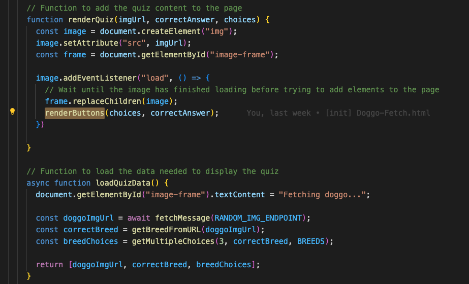

# 5. Render Quiz Exercise

URL: [https://frontendmasters.com/courses/javascript-first-steps/render-quiz-exercise/](https://frontendmasters.com/courses/javascript-first-steps/render-quiz-exercise/)

- So far there is still nothing in the page
    
    
    
    The reason is we’re still declaring functions, no function has been called
    
    **renderButtons** is the function that shows the button to the screen, however, it is now still a function declaration and it has not gotten called
    
    
    
    **renderButtons** gets called inside of the **renderQuiz**
    
    
    
    Yet **renderQuiz**…..is NOT yet called ⇒ We need to call the function to render the quiz
    
    
    
    The function **renderQuiz** comes with 3 requirements (parameters) - *imgURL*, *correctAnswer*, and *choices*.
    
    ```jsx
    function renderQuiz(imgUrl, correctAnswer, choices) {
    	...
    }
    ```
    
    We need those information so that we can render the quiz.
    
    We are going to get those information from **loadQuizData** using destructuring
    
    ```jsx
    async function loadQuizData() {
    	...
    	return [doggoImgUrl, correctBreed, breedChoices];
    }
    ```
    
    The all caps letters RANDOM_IMG_ENDPOINT and BREEDS are meant for hard-coded code
    
- Let’s write TODO 5
    
    ```jsx
    // TODO 5
    // Asynchronously call the loadQuizData() function,
    // Then call renderQuiz() with the returned imageUrl, correctAnswer, and choices
    const [imgUrl, correctAnswer, choices] = await loadQuizData()
    renderQuiz(imgUrl, correctAnswer, choices)
    ```
    
    `const [imgUrl, correctAnswer, choices] = await loadQuizData()` 
    
    - *imgUrl* receives information from *doggoImgUrl*
    - *correctAnswer* receives information from *correctBreed*
    - *choices* receives information from *breedChoices*
    
    We use *const* because we want to capture the result of awaiting the asynchronous **loadQuizData()** function
    
    > The order of the array element is important when destructuring. The name can be just anything.
    >